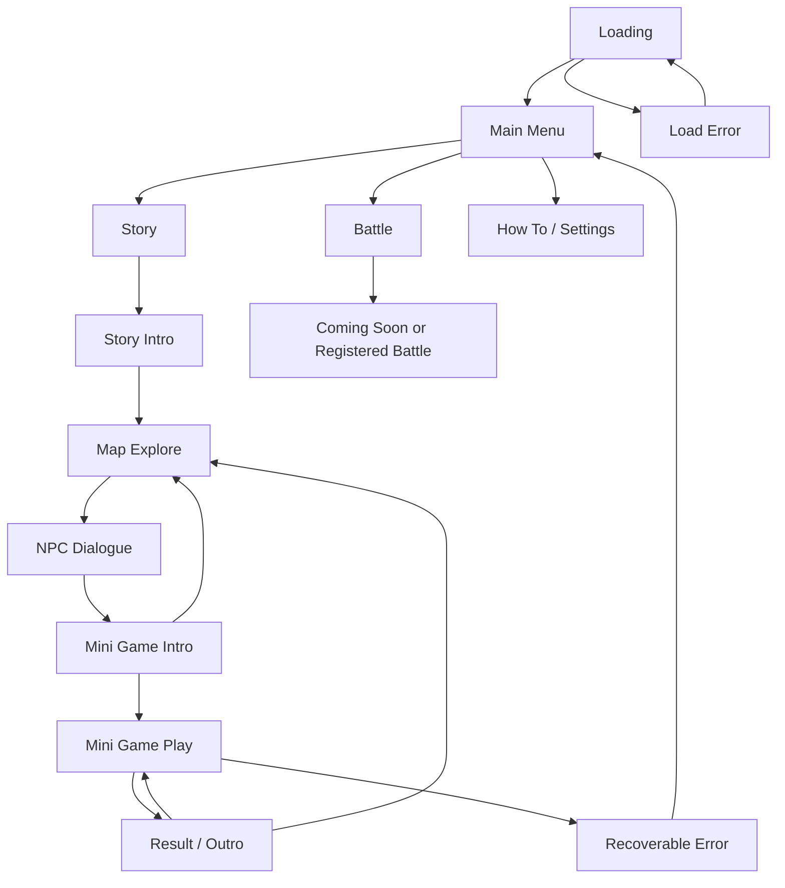

# ai-change MVP 개발 계획서

> 문서 상태: 구현 전 통합 개발 계획서  
> 작성 기준일: 2026년 8월 16일  
> 프로젝트 슬러그: `ai-change`  
> 기준 문서: `docs/기획안.md`, `docs/기능명세서.md`

## 0. 문서 목적

이 문서는 인공지능대학 축제 홍보 웹게임 **ai-change**의 기획과 5개 미니게임 명세를 실제 개발 가능한 단위로 연결한 MVP 계획서입니다.

게임의 목표, MVP 범위, 기술 구조, scene 전환, 공통 input과 mini game contract, 데이터와 저장 구조, 각 미니게임의 구현 기준, 반응형·접근성·배포·검증 순서를 한 문서에서 관리합니다.

> 핵심 문장: **축제 맵을 탐색하고, 학과를 만나고, 직접 플레이하며 인공지능대학을 경험합니다.**

이 문서는 아직 구현되지 않은 기능을 완료된 것으로 기록하지 않습니다. 구현이 시작된 뒤에는 실제 코드와 검증 결과만 날짜별 반영 이력으로 추가합니다.

## 0.1 최종 반영 사항

현재 기획안과 기능 명세를 통합해 다음 기준을 반영합니다.

- 영문 프로젝트 및 파일 기준 이름을 `ai-change`로 통일합니다.
- 최종 노출 게임명과 로고는 확정 전까지 `TBD`로 유지합니다.
- 설치 없이 정적 배포 URL로 실행되는 HTML5·CSS3·JavaScript 웹게임으로 개발합니다.
- Canvas 기반 도트 맵·게임 영역과 DOM 기반 메뉴·대화·HUD를 함께 사용합니다.
- PC, 태블릿, 모바일의 키보드·마우스·터치·가상 패드 입력을 공통 명령으로 변환합니다.
- 기본 콘텐츠는 `스토리` 모드이며, `배틀` 모드는 메뉴와 확장 지점만 제공하고 1차 배포에서는 `추후 공개`로 표시할 수 있습니다.
- 스토리 모드의 기본 진입 흐름은 `인트로 → 맵 탐색 → NPC 대화 → 미니게임 인트로 → 미니게임 → 결과·아웃트로 → 맵 복귀`로 고정합니다.
- 대화, 맵, NPC, 미니게임 metadata, balance parameter는 코드와 분리된 데이터로 관리합니다.
- 5개 미니게임은 서로 독립된 module로 구현하고 `init`, `start`, `pause`, `resume`, `restart`, `destroy`, `onComplete` contract를 공유합니다.
- 미니게임 결과는 공통 result object로 상위 scene에 반환하고, 게임별 세부 기록은 `metrics`에 저장합니다.
- 완료한 NPC·미니게임, 최고 기록, 음량 설정은 browser `localStorage`에 version을 포함해 저장합니다.
- 공통 필수 asset은 초기 로딩하고, 미니게임별 asset은 해당 게임 진입 전에 지연 로딩합니다.
- resize와 orientation change는 진행 상태를 초기화하지 않고 Canvas와 DOM UI만 다시 배치합니다.
- 화면 전환·대화·제출·판정 과정의 중복 입력을 차단하고, page가 비활성화되면 진행 중인 게임을 자동 pause합니다.
- 색상 외에 icon·text를 함께 사용하고, 무음 상태에서도 필수 판정 정보를 확인할 수 있게 합니다.
- 외부 asset은 파일명, 제공처, 원본 URL, license, 수정 여부, 사용 위치를 기록합니다.

## 0.2 문서 통합 기준과 미확정 사항

### 0.2.1 Source of truth

문서 간 책임은 다음 순서로 적용합니다.

1. 전체 사용자 흐름, 화면, 반응형, 배포 방식은 `기획안.md`를 기준으로 합니다.
2. 각 미니게임의 규칙, 고유 명칭, parameter, 성공·실패 조건은 `기능명세서.md`를 기준으로 합니다.
3. 두 문서에 없는 module contract, result schema, scene state, 저장 key, error handling은 이 PLAN의 구현 기준을 따릅니다.
4. 원문에서 `TBD`, `[작성 필요]`, `별도 정의 필요`인 내용은 이 문서에서도 임의로 확정하지 않습니다.
5. 서로 충돌하는 요구사항은 아래 decision item이 승인된 뒤 final rule로 승격합니다.

이 문서에서는 항목의 상태를 다음과 같이 구분합니다.

| 상태 | 의미 |
| --- | --- |
| 확정 | 두 기준 문서에서 일치하거나 명시적으로 정해진 요구사항 |
| 구현 기준 | 통합 개발을 위해 이 PLAN에서 정한 technical contract |
| 초안 | 원문에 수치가 있으나 playtest 후 조정 가능한 값 |
| `TBD` | 기획·아트·운영 판단이 필요해 아직 확정할 수 없는 값 |

### 0.2.2 착수 전·구현 중 결정 항목

| ID | 결정 항목 | 현재 상태 | 확정 시점 |
| --- | --- | --- | --- |
| D-01 | 최종 노출 게임명, logo, festival name | `TBD` | 공통 UI final asset 작업 전 |
| D-02 | 메인 세계관, player character, map 크기·구역, NPC 위치와 대사 | `TBD` | map·story content 통합 전 |
| D-03 | `하트`, `정화된 알`, `수호알`을 공통 보상으로 통합할지 여부 | `TBD` | result·save schema final 고정 전 |
| D-04 | `CLICK to PURIFY`의 Perfect·Good별 정화도 계산과 100% clear 공식 | `TBD` | cyber game final 판정 구현 전 |
| D-05 | cyber game 동시 판정 우선순위와 ransomware lock 중 다른 적 처리 | `TBD` | cyber game playtest 전 |
| D-06 | `Code Heart: Unlock!`의 주문 수, 시간, penalty, clear 기준, 제출 버튼 명칭 | `TBD` | computer game play 가능한 build 전 |
| D-07 | `AI Ball Classification Game`의 최초 뚜껑 상태, 속도·간격, clear 시점, image 목록 | `TBD` | AI game balance 적용 전 |
| D-08 | 숫자 야구의 선행 0, 삭제 방식, 제한시간, 재도전 규칙 | `TBD` | data science game UI 확정 전 |
| D-09 | 인지알·데사알의 생성 확률, 낙하 속도, 동시 종료 우선순위, 재도전 규칙 | `TBD` | AI·data science game balance 적용 전 |
| D-10 | 최종 BGM·SFX, volume default, art asset | `TBD` | final QA 전 |
| D-11 | browser별 최소 지원 version과 기준 test device | `TBD` | 호환성 QA 계획 확정 전 |
| D-12 | 팀 일정, 담당자, 배포 host와 public URL | `TBD` | 배포 작업 전 |

`D-01`, `D-02`, `D-10`, `D-12`가 미정이어도 공통 engine과 game logic 개발은 진행할 수 있습니다. 반면 `D-04`~`D-09`는 해당 미니게임의 최종 완료 판정 전에 반드시 결정해야 합니다.

## 0.3 구현 원칙

실제 구현 단계에서는 아래 원칙을 적용합니다.

```txt
1. 배포 산출물은 정적 HTML, CSS, JavaScript, JSON, asset만으로 실행합니다.
2. dialogue, map, NPC, recipe, balance 값을 game logic에 하드코딩하지 않습니다.
3. 다섯 미니게임은 서로의 내부 state나 DOM을 직접 참조하지 않습니다.
4. 모든 미니게임은 공통 lifecycle과 result contract를 지킵니다.
5. keyboard, mouse, touch 입력은 InputManager에서 공통 action으로 정규화합니다.
6. game world 계산은 viewport pixel이 아닌 기준 좌표계를 사용합니다.
7. timer와 timing 판정은 performance.now() 기반 game clock을 사용하고 pause 시간을 제외합니다.
8. scene이나 mini game 종료 시 event listener, timer, animation frame, audio를 반드시 정리합니다.
9. 미확정 parameter는 임의의 final 값으로 문서화하지 않고 config의 TBD 상태로 관리합니다.
10. 임시 geometry나 placeholder asset은 final asset과 구분하고 최종 제출 전에 교체 여부를 검증합니다.
11. localStorage data는 version과 schema를 검증하고 손상 시 안전한 기본 상태로 복구합니다.
12. 외부 resource는 사용 전에 license를 확인하고 출처 문서에 기록합니다.
13. 색상·소리만으로 정답, 실패, 완료 상태를 전달하지 않습니다.
14. 구현 완료 표시는 code, automated check, browser QA 중 해당 검증 근거가 있을 때만 추가합니다.
```

---

## 16. 개발 단계별 계획

공통 기반이 없는 상태에서 5개 game을 먼저 각각 구현하면 input, pause, result, resize 방식이 달라질 위험이 큽니다. 따라서 공통 contract를 먼저 고정한 뒤 game module을 병렬 개발하고 마지막에 story flow에 통합합니다.

```txt
Step 0 결정 gate
  -> Step 1 project·data 기반
  -> Step 2 AppShell·core service
  -> Step 3 map·dialogue
  -> Step 4 mini game contract·save
       ├── Step 5 숫자 야구
       ├── Step 6 CLICK to PURIFY
       ├── Step 7 Code Heart
       ├── Step 8 AI Ball Classification
       └── Step 9 인지알·데사알
  -> Step 10 전체 content·asset 통합
  -> Step 11 QA·배포·제출
```

## Step 0. 기획 결정과 release gate 정리

### 목표

구현 가능한 항목과 기획 확정이 필요한 항목을 분리해 임시 값이 final rule로 굳어지는 것을 막습니다.

### 작업 항목

- D-01~D-12 owner와 확정 기한 지정
- 5개 학과·전공의 공식 표기 확인
- final game title·logo·festival name의 제공 일정 확인
- story, player, map, NPC content 제공 형식 결정
- 공통 reward 도입 여부 결정
- 각 game의 blocking balance·priority question을 담당자와 확인
- target browser와 test device 목록 확정
- 배포 host, public base path, 공개 일정 확정
- 임시 geometry·asset 사용 범위와 final 교체 기준 합의

### 산출물

- 이 문서의 D-01~D-12 상태 갱신
- 승인된 game parameter 표
- content·asset 제공 checklist
- test device matrix

### 완료 기준

- 각 `TBD`에 owner와 decision date가 있습니다.
- game별 final 완료를 막는 blocking item이 구분되어 있습니다.
- 임시 값과 승인 값이 data에서 식별됩니다.
- 구현팀과 기획팀이 같은 mini game ID와 공식 이름을 사용합니다.

---

## Step 1. Project 구조와 data schema 구축

### 목표

정적 application의 directory, module entry, JSON schema, naming rule을 구성합니다.

### 작업 항목

- `index.html`, CSS, JS entry 생성
- `core`, `scenes`, `map`, `story`, `minigames`, `data`, `assets` directory 생성
- `app-config.json`, `minigames.json`, `map-data.json` schema 정의
- dialogue와 game별 config schema 정의
- stable mini game ID 5개 등록
- asset manifest format 정의
- UTF-8, lowercase kebab-case, relative path rule 적용
- invalid JSON·missing reference를 검출하는 validator 작성
- `README.md`에 local static server 실행 방식 정리

### 산출물

- project directory structure
- `js/app.js`, `js/router.js`
- `js/core/config-validator.js`
- `data/app-config.json`
- `data/minigames.json`
- 최소 schema fixture와 validation test

### 완료 기준

- `index.html`이 direct file이 아닌 local HTTP server에서 정상 load됩니다.
- 모든 JSON이 parse되고 required reference가 검증됩니다.
- 5개 registry entry가 unique ID를 가집니다.
- missing module·script·asset reference가 명확한 error로 검출됩니다.
- 배포 code에 secret이나 machine absolute path가 없습니다.

---

## Step 2. AppShell, loading, input, resize 구현

### 목표

모든 scene과 mini game이 공유할 runtime service와 responsive shell을 구현합니다.

### 작업 항목

- SceneRouter와 transition lock 구현
- LoadingScene과 AssetLoader 구현
- GameLoop와 pause 가능한 game clock 구현
- InputManager의 keyboard·pointer·touch normalization 구현
- mobile virtual pad와 interaction button 구현
- ResizeManager, logical coordinate, device pixel ratio 처리
- safe-area와 portrait·landscape layout 구현
- AudioManager의 최초 gesture unlock, mute, channel 구조 구현
- Page Visibility 자동 pause 구현
- global error boundary와 recovery scene 구현

### 산출물

- `js/core/game-loop.js`
- `js/core/input-manager.js`
- `js/core/resize-manager.js`
- `js/core/asset-loader.js`
- `js/core/audio-manager.js`
- `js/scenes/loading-scene.js`
- 공통 menu·modal·touch control CSS

### 완료 기준

- common asset 진행률과 실패 retry가 동작합니다.
- key, mouse, touch가 같은 common action을 만듭니다.
- resize·orientation change 뒤 scene state가 유지됩니다.
- hidden tab에서 clock이 멈추고 resume 뒤 시간이 건너뛰지 않습니다.
- transition 중 중복 route가 실행되지 않습니다.
- 최초 사용자 입력 전 audio failure가 app을 중단하지 않습니다.

---

## Step 3. Story map과 dialogue 구현

### 목표

Story intro부터 map 탐색, NPC 대화, mini game intro 진입까지의 공통 flow를 완성합니다.

### 작업 항목

- StoryIntroScene 구현
- tile map·sprite renderer 구현
- player 이동과 normalized diagonal speed 구현
- bounds·building·decoration collision 구현
- NPC와 interaction radius 구현
- 느낌표 기본·nearby·completed 상태 구현
- click·touch·key NPC interaction 구현
- DialogueManager와 data-driven script 구현
- 이전·다음·skip, 최초·재방문 script 구현
- `nextAction.openMiniGame` route 연결
- map 위치와 NPC context 복원 구현

### 산출물

- `js/map/*`
- `js/story/dialogue-manager.js`
- `js/scenes/story-intro-scene.js`
- `js/scenes/map-scene.js`
- `js/scenes/dialogue-scene.js`
- `data/map-data.json`
- story·NPC script JSON

### 완료 기준

- PC와 mobile에서 player가 통행 가능 영역만 이동합니다.
- range 안과 밖의 NPC interaction이 서로 다르게 처리됩니다.
- dialogue 중 player가 움직이지 않습니다.
- 연타해도 line이 중복으로 넘어가지 않습니다.
- skip과 정상 완료가 올바른 next action을 한 번만 실행합니다.
- mini game을 나갔다 돌아와도 map 위치와 NPC 상태가 유지됩니다.

---

## Step 4. Mini game contract, result, save 구현

### 목표

5개 module이 같은 방식으로 시작·pause·종료·재시작되고 결과가 progression에 반영되는 기반을 만듭니다.

### 작업 항목

- mini game factory와 lifecycle contract 구현
- state transition guard 구현
- shared clock, input lock, result builder 구현
- registry dynamic module load 구현
- MiniGameIntroScene, MiniGameScene, ResultScene 구현
- common `MiniGameResult` validation 구현
- `onComplete` once guard와 `destroy` cleanup 검증 구현
- SaveManager read·validate·migrate·write·reset 구현
- NPC completion과 game result mapping 구현
- development test harness에서 game ID 직접 실행 지원

### 산출물

- `js/minigames/registry.js`
- `js/minigames/shared/*`
- `js/scenes/minigame-intro-scene.js`
- `js/scenes/minigame-scene.js`
- `js/scenes/result-scene.js`
- `js/core/save-manager.js`
- lifecycle contract test

### 완료 기준

- 최소 test game이 full lifecycle을 통과합니다.
- pause·resume·restart·destroy가 idempotent rule을 지킵니다.
- terminal result는 session당 한 번만 전달됩니다.
- result 뒤 NPC completion과 play count가 한 번만 저장됩니다.
- corrupt save에서 app이 safe default로 복구합니다.
- module error 후 menu 또는 map으로 복귀할 수 있습니다.

---

## Step 5. 숫자 야구 구현

### 목표

3자리 추론과 9 Epoch, Fit·Shift·Outlier 기록을 완성합니다.

### 작업 항목

- unique digit answer generator 구현
- digit input·duplicate prevention·delete·submit 구현
- Fit·Shift·Outlier pure function 구현
- history와 scroll UI 구현
- Epoch progress와 9회 종료 구현
- clear·fail result와 answer 공개 정책 구현
- D-08 결정값을 config와 help에 반영
- exhaustive 또는 충분한 조합 판정 unit test 작성

### 산출물

- `js/minigames/number-baseball/index.js`
- `data/minigames/number-baseball.json`
- game UI style과 asset
- 판정·validation test

### 완료 기준

- 11.1.8의 완료 기준을 모두 만족합니다.
- PC·mobile 세로 panel에서 9개 history를 확인할 수 있습니다.
- invalid input이 Epoch를 소비하지 않습니다.
- result가 common schema를 통과합니다.

---

## Step 6. CLICK to PURIFY 구현

### 목표

14 wave와 4종 malware 고유 rule, timing judge, purification·Miss flow를 완성합니다.

### 작업 항목

- 8방향 spawn과 target timestamp 기반 approach 구현
- learning·mixed wave scheduler 구현
- Perfect·Good·Miss judge 구현
- Trojan disguise·reveal 구현
- Worm split depth와 child placement 구현
- Ransom input lock과 unlock 구현
- Spyware opacity reveal 구현
- purification formula와 terminal priority를 D-04·D-05 기준으로 구현
- 지정 event hook 11개 구현
- pause·resume, input cooldown, simultaneous scenario test 작성

### 산출물

- `js/minigames/click-to-purify/index.js`
- `data/minigames/click-to-purify.json`
- malware geometry 또는 final asset
- timing·wave·type-specific test

### 완료 기준

- 11.2.11의 완료 기준을 모두 만족합니다.
- frame rate가 달라도 같은 timestamp input은 같은 판정을 만듭니다.
- pause 중 모든 관련 timer가 정지합니다.
- D-04·D-05 승인 없이 release 완료로 표시하지 않습니다.

---

## Step 7. Code Heart: Unlock! 구현

### 목표

data-driven order·recipe와 순서 있는 ingredient 조합, customer·timer 결과를 구현합니다.

### 작업 항목

- ingredient catalog와 category schema 작성
- order·recipe data 작성과 reference validation
- customer·X알·order UI 구현
- recipe book modal 구현
- 최대 4개 staged slot과 초기화 구현
- exact recipe judge와 Build Error 구현
- patience·total timer·penalty를 D-06 기준으로 구현
- Open Heart·reward result를 D-03·D-06 기준으로 연결
- 비전공자 recipe 이해도 playtest 수행

### 산출물

- `js/minigames/code-heart/index.js`
- `data/minigames/code-heart.json`
- ingredient·order data
- recipe matching·timeout test

### 완료 기준

- 11.3.9의 완료 기준을 모두 만족합니다.
- 4개 대표 recipe의 재료가 catalog에 존재합니다.
- slot overflow와 duplicate submit이 차단됩니다.
- D-03·D-06 승인값 없이 release 완료로 표시하지 않습니다.

---

## Step 8. AI Ball Classification Game 구현

### 목표

목표 image, 30개 ball queue, OPEN/CLOSE lid, strict 즉시 실패 rule을 구현합니다.

### 작업 항목

- target class와 image catalog schema 구현
- 정답 5·오답 25 queue 생성과 count validation
- 3초 countdown 구현
- 좌→우 movement와 spawn scheduler 구현
- lid toggle state·animation·capture region 구현
- target collect, target lost, non-target pass·collect judge 구현
- fail 즉시 freeze와 result 구현
- D-07의 speed·interval·initial state·clear priority 반영
- rapid toggle·boundary·simultaneous test 작성

### 산출물

- `js/minigames/ai-ball-classification/index.js`
- `data/minigames/ai-ball-classification.json`
- target·ball·bin·lid asset
- queue·collision·terminal state test

### 완료 기준

- 11.4.9의 완료 기준을 모두 만족합니다.
- queue 수량과 즉시 실패 조건이 반복 play에서도 바뀌지 않습니다.
- lid UI와 collision state가 항상 일치합니다.
- D-07 승인값 없이 release 완료로 표시하지 않습니다.

---

## Step 9. 인지알·데사알 분류 구현

### 목표

45초 동안 가속되는 spawn, 0.2초 platform 전환, 두 box 분류와 life를 구현합니다.

### 작업 항목

- egg type generator와 spawn scheduler 구현
- fall과 platform collision 구현
- left·right target과 0.2초 transition 구현
- 충돌 순간 route lock 구현
- two box overlap judge와 screen lost 처리 구현
- timer 45초, life 5, 10초 warning 구현
- 구간별 3.5·2.5·1.5초 interval 구현
- D-09의 probability·speed·collision·terminal priority 반영
- duplicate judge·same-frame input test 작성

### 산출물

- `js/minigames/ai-data-egg-sort/index.js`
- `data/minigames/ai-data-egg-sort.json`
- egg·platform·box asset
- timer·spawn·collision test

### 완료 기준

- 11.5.9의 완료 기준을 모두 만족합니다.
- 한 egg가 life를 두 번 차감하지 않습니다.
- pause와 orientation change 뒤 fall·timer state가 유지됩니다.
- D-09 승인값 없이 release 완료로 표시하지 않습니다.

---

## Step 10. 전체 content와 asset 통합

### 목표

공통 flow와 5개 game을 final story, map, dialogue, art, audio로 연결합니다.

### 작업 항목

- final title·logo·festival name 적용
- main story, player, map, NPC data 적용
- 각 NPC와 정확한 mini game ID 연결
- first·revisit·intro·clear·fail script 작성
- common·game별 image, sprite, font 적용
- BGM·SFX event mapping 적용
- Battle Coming Soon menu와 registry seam 적용
- map 진행 HUD와 완료 indicator 적용
- asset compression과 lazy group 조정
- resource source·license 문서 갱신
- 임시 text·geometry·asset 검색과 승인 여부 확인

### 산출물

- final content JSON
- final map·sprite·portrait·game asset
- audio mapping
- `docs/리소스_출처_목록.md`
- content integration check 결과

### 완료 기준

- 5개 NPC가 올바른 game으로 연결됩니다.
- clear·fail outro가 결과에 맞게 실행됩니다.
- 없는 script·asset·ingredient·class reference가 없습니다.
- final 배포에 blocking `TBD`, `[작성 필요]`, 승인 없는 placeholder가 없습니다.
- 모든 외부 resource의 license와 사용 위치가 기록됩니다.

---

## Step 11. 최적화, QA, 배포, 제출

### 목표

지원 device와 browser에서 전체 story flow를 검증하고 정적 배포와 제출 자료를 완성합니다.

### 작업 항목

- unit·contract·integration test 실행
- Chrome·Safari PC·mobile manual QA
- tablet, mobile portrait·landscape layout QA
- keyboard·mouse·touch·virtual pad 전체 조작 QA
- resize·orientation·visibility pause QA
- loading failure·invalid save·runtime error recovery QA
- 5개 game의 clear·fail·retry·map return QA
- frame time, memory, listener·timer cleanup 검사
- image·audio compression과 path case 검사
- production base path에서 static deploy smoke test
- `README.md`, 실행·조작 문서, source list 작성
- final 기획·기능·PLAN과 실제 rule 대조

### 산출물

- 전체 source code와 data·asset
- production URL
- test result와 known issue
- `README.md`
- `docs/실행_및_조작_방법.md`
- `docs/리소스_출처_목록.md`
- final 기획안·기능 명세·PLAN

### 완료 기준

- 21장의 release checklist가 모두 통과하거나 승인된 예외가 기록됩니다.
- 배포 URL 접속만으로 별도 설치 없이 실행됩니다.
- 5개 game의 end-to-end flow에 치명적인 오류가 없습니다.
- source, 실행 URL, resource 출처, 조작 방법이 함께 제출됩니다.

---

## 17. MVP 이후 확장 계획

## Phase 2. Story와 balance 고도화

- NPC 선택지와 분기 dialogue
- 학과별 추가 story와 재방문 event
- game 난이도 선택 또는 단계별 level
- playtest data를 바탕으로 timing·speed·interval 재조정
- 완료 collection과 reward 표현 고도화
- 접근성 setting과 motion reduction option 고도화

## Phase 3. Battle mode

- 독립 Battle registry와 entry flow
- boss battle, score attack, 반복 play형 game 검토
- Story module을 수정하지 않고 Battle module 등록으로 연결
- mode별 result와 ranking 필요 여부 검토

## Phase 4. 저장과 공유

- 사용자 동의 기반 cloud save
- 기기 간 progression sync
- score share card
- server leaderboard와 abuse prevention
- account·privacy·retention 정책

## Phase 5. 운영 도구

- content version 관리
- error monitoring
- 개인정보를 최소화한 익명 play analytics
- 학과별 completion funnel
- 운영자가 code 수정 없이 content 공개 상태를 바꾸는 관리 도구

Phase 4·5는 backend와 개인정보 설계를 새로 요구하므로 MVP static architecture에 임의로 포함하지 않습니다.

---

## 18. 예상 리스크와 대응

| 리스크 | 설명 | 대응 |
| --- | --- | --- |
| 기획 `TBD` 지연 | game별 terminal rule과 content 통합이 멈출 수 있음 | D-01~D-12 owner·기한 지정, blocking 여부 분리 |
| 공통 reward 불일치 | 하트·정화된 알·수호알이 game마다 다름 | MVP progression은 completion 중심, D-03 후 reward schema 확장 |
| cyber clear 공식 모순 | Good 일부 가중치와 purification 100% 조건이 충돌 | D-04에서 수식과 sample scenario 승인 후 구현 |
| same-frame 판정 | clear·fail, input·collision이 동시에 발생할 수 있음 | game별 terminal priority function과 deterministic test |
| timing 기기 차이 | frame drop에 따라 timing game 결과가 달라질 수 있음 | `performance.now()` game clock, frame-independent judge, device playtest |
| resize state 손실 | orientation change로 object 위치·timer가 초기화될 수 있음 | logical coordinate 유지, renderer만 resize, state regression test |
| touch 오입력 | scroll·double tap·ghost click으로 입력이 중복될 수 있음 | Pointer Event normalization, `touch-action`, cooldown, once guard |
| listener·timer 누수 | mini game 재도전 뒤 input과 loop가 중복 실행될 수 있음 | lifecycle contract, centralized cleanup, destroy contract test |
| mobile 성능 저하 | 여러 sprite·effect·DOM update로 frame이 떨어질 수 있음 | lazy asset, object count 관리, DOM write batch, 기준 device profile |
| audio autoplay 차단 | 첫 화면에서 BGM이 재생되지 않을 수 있음 | 첫 gesture 이후 unlock, mute UI, visual cue 유지 |
| local save 손실 | browser data 삭제·private mode·quota로 진행이 사라짐 | 한계 안내, schema validation, write failure warning |
| static path 404 | subpath와 file case 차이로 asset이 누락될 수 있음 | base path 단일화, case-sensitive deploy smoke test |
| asset license 누락 | final 제출이나 공개 배포에 문제가 생길 수 있음 | source list를 asset 추가 PR의 완료 기준으로 사용 |
| content 과다 loading | 모든 game asset을 첫 진입에 load하면 대기시간 증가 | common preload와 game lazy load 분리 |
| scope 확대 | Battle, account, ranking이 MVP 일정을 침범할 수 있음 | 3.3 제외 범위 유지, change request로 별도 승인 |
| browser 차이 | Safari audio·viewport·touch 동작이 Chrome과 다를 수 있음 | 실제 device matrix로 조기 검증, 마지막 단계에만 미루지 않음 |

---

## 19. 현재 개발 우선순위

1. D-04~D-09의 game별 blocking rule에 owner와 확정 시점을 지정합니다.
2. static data schema, stable game ID, lifecycle·result contract를 먼저 고정합니다.
3. InputManager, game clock, pause, resize, destroy 같은 공통 runtime을 구현합니다.
4. Story intro → map → NPC → mini game intro까지의 vertical slice를 만듭니다.
5. test mini game으로 result·save·map return contract를 검증합니다.
6. 5개 game module을 독립적으로 구현하되 common contract test를 동일하게 적용합니다.
7. 가장 많은 `TBD`를 가진 Code Heart와 timing 복잡도가 높은 CLICK to PURIFY를 조기에 playtest합니다.
8. final story·map·art·audio를 data와 manifest에 통합합니다.
9. Chrome·Safari와 mobile actual device QA를 진행합니다.
10. static production URL, source list, 실행·조작 문서를 함께 마감합니다.

---

## 20. 운영 적용 순서

Production 배포는 다음 순서를 따릅니다.

```txt
1. D-01~D-12 중 release blocking 항목이 모두 확정되었는지 확인
2. JSON parse와 schema·reference validation 실행
3. unit·contract·integration test 실행
4. 임시 text, [작성 필요], blocking TBD, 승인 없는 placeholder 검색
5. asset source·license 목록과 실제 file 대조
6. image·audio 최적화와 case-sensitive path 검사
7. local production-equivalent static server에서 전체 smoke test
8. versioned static artifact 생성 또는 배포 대상 directory 확정
9. HTTPS static host의 staging path에 업로드
10. subpath·MIME·cache·security header 확인
11. Chrome·Safari PC·mobile smoke test
12. Story intro부터 5개 game 결과·map 복귀까지 end-to-end 확인
13. production URL 공개
14. 공개 직후 loading, audio, local save, 각 game 진입 재확인
15. 배포 version과 known issue 기록
```

문제가 발생하면 직전 검증 완료 static artifact로 되돌릴 수 있게 이전 배포본을 보존합니다. Save schema가 바뀌는 배포는 rollback 시 이전 data와의 호환성도 확인합니다.

---

## 21. 최종 검증 체크리스트

## 21.1 기획·data gate

- [ ] Project slug가 file, ID prefix, 문서에서 `ai-change`로 일치합니다.
- [ ] Final 노출 game명, logo, festival name이 승인되었습니다.
- [ ] Main story, player, map, NPC, dialogue가 승인되었습니다.
- [ ] 5개 학과·전공의 공식 명칭이 확인되었습니다.
- [ ] D-03~D-09의 blocking rule이 모두 확정되었습니다.
- [ ] Final config에 blocking `TBD`, `[작성 필요]`, 잘못된 `null`이 없습니다.
- [ ] Registry, script, map, ingredient, image class reference가 모두 유효합니다.

## 21.2 Loading·menu·story

- [ ] 공통 필수 asset load 전에는 main menu가 열리지 않습니다.
- [ ] Loading progress가 text와 bar로 표시됩니다.
- [ ] 필수 asset 실패 시 retry할 수 있습니다.
- [ ] Main menu에서 Story와 Battle이 분리되어 있습니다.
- [ ] Battle 미공개 상태가 명확히 안내됩니다.
- [ ] Story intro의 이전·다음·skip이 정상 작동합니다.
- [ ] Skip 뒤 잘못된 scene으로 이동하거나 action이 두 번 실행되지 않습니다.

## 21.3 Map·NPC·dialogue

- [ ] 방향키와 WASD가 같은 속도로 player를 이동시킵니다.
- [ ] Mobile virtual pad로 연속 이동할 수 있습니다.
- [ ] 대각선 이동이 직선보다 빨라지지 않습니다.
- [ ] Map 경계, 건물, 장식물 collision이 정상입니다.
- [ ] NPC interaction range 안에서 느낌표가 강조됩니다.
- [ ] 범위 밖 NPC 선택 시 강제 이동하지 않고 접근 안내를 표시합니다.
- [ ] Mouse click, touch, interaction key로 대화를 시작할 수 있습니다.
- [ ] Dialogue 중 player 이동과 NPC 중복 interaction이 차단됩니다.
- [ ] 최초·재방문 dialogue가 완료 상태에 맞게 나옵니다.
- [ ] 완료 NPC는 color 외 icon·text로도 구분됩니다.

## 21.4 공통 mini game contract

- [ ] 5개 module이 `init/start/pause/resume/restart/destroy`를 제공합니다.
- [ ] `onComplete`는 session당 정확히 한 번 호출됩니다.
- [ ] Result가 `MiniGameResult` schema를 통과합니다.
- [ ] Pause 중 game timer, spawn, animation, penalty가 흐르지 않습니다.
- [ ] Hidden tab에서 자동 pause됩니다.
- [ ] Restart가 모든 이전 state와 listener를 정리합니다.
- [ ] Map 복귀 전에 `destroy()`가 완료됩니다.
- [ ] Result 뒤 완료·play count·best metric이 중복 저장되지 않습니다.
- [ ] Corrupt save와 storage unavailable 상황에서 app이 복구됩니다.

## 21.5 숫자 야구

- [ ] Answer와 input은 중복 없는 3개 digit입니다.
- [ ] 3개 미만·중복 input은 submit되지 않고 Epoch를 소비하지 않습니다.
- [ ] Fit·Shift·Outlier 계산 unit test가 통과합니다.
- [ ] 유효 guess와 판정이 history에 순서대로 누적됩니다.
- [ ] `EPOCH n/9`와 progress가 정확합니다.
- [ ] 9회 안의 `3 Fit` clear와 9번째 fail이 정확합니다.
- [ ] Fail에서 answer가 공개됩니다.
- [ ] D-08의 leading zero, delete, timer, retry가 UI·rule에 일치합니다.

## 21.6 CLICK to PURIFY

- [ ] Learning 4 wave가 Trojan → Worm → Ransomware → Spyware 순서입니다.
- [ ] Mixed 10 wave와 후반 난이도 변화가 config와 일치합니다.
- [ ] Perfect·Good boundary가 timestamp 기준으로 정확합니다.
- [ ] Trojan 위장 중 click은 무효이고 reveal 후에만 판정됩니다.
- [ ] Worm은 최대 1회 split하고 child가 안전한 위치에 생성됩니다.
- [ ] Ransom Miss 뒤 지정 시간 동안 input이 lock됩니다.
- [ ] Spyware가 마지막 30~40% 구간에서 reveal됩니다.
- [ ] Double click이 판정을 두 번 소비하지 않습니다.
- [ ] Miss 3회, time over, purification clear의 priority가 승인 rule과 일치합니다.
- [ ] 11개 지정 event hook이 정확한 횟수로 발생합니다.
- [ ] D-04·D-05의 공식과 예외 scenario test가 통과합니다.

## 21.7 Code Heart: Unlock!

- [ ] Customer, X알, order, patience가 현재 data와 일치합니다.
- [ ] Recipe book이 현재 order의 정확한 순서를 보여 줍니다.
- [ ] Ingredient 선택 순서가 최대 4개 slot에 표시됩니다.
- [ ] Slot overflow와 submit 연타가 차단됩니다.
- [ ] 초기화가 승인 rule에 맞게 동작합니다.
- [ ] Exact recipe만 success이고 누락·오재료·순서 오류는 Build Error입니다.
- [ ] Timeout과 penalty가 D-06과 일치합니다.
- [ ] 4개 대표 recipe의 모든 ingredient가 catalog에 있습니다.
- [ ] Clear 기준, submit label, reward가 D-03·D-06과 일치합니다.

## 21.8 AI Ball Classification Game

- [ ] 목표 image가 시작 전에 고정 표시됩니다.
- [ ] 3초 countdown 전에는 공이 움직이지 않습니다.
- [ ] Queue가 정답 5개, 오답 25개를 정확히 포함합니다.
- [ ] 공이 왼쪽에서 오른쪽으로 승인된 속도·간격으로 이동합니다.
- [ ] Lid가 내부 방향으로 열리고 OPEN/CLOSE state가 UI와 일치합니다.
- [ ] 정답 수집과 오답 통과가 정상 진행됩니다.
- [ ] 정답 유실 또는 오답 수집 1회에 즉시 fail합니다.
- [ ] Fail 뒤 movement·spawn·input이 즉시 정지합니다.
- [ ] Retry가 target, queue, counter, lid state를 초기화합니다.
- [ ] D-07의 initial state, collision, clear 시점, same-frame priority가 반영되었습니다.

## 21.9 인지알·데사알 분류 게임

- [ ] Timer 45초, life 5, platform LEFT로 시작합니다.
- [ ] 0~10, 10~25, 25~45초 구간의 spawn interval이 승인 boundary와 일치합니다.
- [ ] Left·right input마다 platform이 0.2초 동안 전환됩니다.
- [ ] Platform collision 순간 route가 확정되고 이후 input으로 바뀌지 않습니다.
- [ ] 인지알은 왼쪽, 데사알은 오른쪽 box에서 correct입니다.
- [ ] 반대 box와 screen exit는 life를 1만 차감합니다.
- [ ] 10초 이하 warning이 text와 visual로 표시됩니다.
- [ ] Life 0 fail과 timer 0 clear priority가 D-09와 일치합니다.
- [ ] Pause와 orientation change 뒤 timer, egg, platform state가 유지됩니다.

## 21.10 반응형·접근성·audio

- [ ] PC, notebook, tablet, mobile에서 주요 UI가 잘리지 않습니다.
- [ ] Mobile portrait와 landscape에서 pause·map 복귀가 가능합니다.
- [ ] Browser UI, notch, home bar가 control을 가리지 않습니다.
- [ ] Resize·orientation change가 game을 restart하지 않습니다.
- [ ] Dot graphic의 비율이 찌그러지지 않습니다.
- [ ] Touch target과 간격이 충분합니다.
- [ ] Keyboard focus가 보이고 modal 안에서 올바르게 이동합니다.
- [ ] Color 없이도 clear·fail·완료·danger를 구분할 수 있습니다.
- [ ] Mute 상태에서도 모든 필수 정보를 확인할 수 있습니다.
- [ ] 첫 사용자 gesture 뒤 audio가 시작되며 실패해도 play할 수 있습니다.
- [ ] 과도한 flash·screen shake가 없습니다.

## 21.11 Browser·performance·배포

- [ ] Chrome PC·mobile에서 전체 flow가 동작합니다.
- [ ] Safari PC·mobile에서 전체 flow가 동작합니다.
- [ ] 반복 진입·retry 뒤 RAF, timer, listener가 누적되지 않습니다.
- [ ] 기준 device에서 조작 지연과 심한 frame 저하가 없습니다.
- [ ] Initial asset과 mini game lazy asset이 분리되어 있습니다.
- [ ] 모든 production path의 대소문자와 MIME type이 올바릅니다.
- [ ] Domain root와 결정된 subpath에서 asset 404가 없습니다.
- [ ] HTTPS URL 접속만으로 game이 실행됩니다.
- [ ] 새로고침 뒤 progression과 setting이 복원됩니다.
- [ ] 이전 검증 완료 배포본으로 rollback할 수 있습니다.

## 21.12 제출 자료

- [ ] 최종 기획안이 실제 game rule과 일치합니다.
- [ ] 전체 source code, JSON data, asset이 포함되어 있습니다.
- [ ] 실행 가능한 production URL이 있습니다.
- [ ] `README.md`에 local 실행과 project 구조가 정리되어 있습니다.
- [ ] PC·mobile 실행 및 조작 방법 문서가 있습니다.
- [ ] 외부 image·audio·font의 source, URL, license, 수정, 사용 위치가 기록되어 있습니다.
- [ ] 자체 제작 resource도 `자체 제작`으로 구분되어 있습니다.
- [ ] Known issue와 승인된 예외가 기록되어 있습니다.

위 checklist를 모두 만족하면 ai-change의 1차 MVP 배포가 완료된 것으로 봅니다.

## 12. Frontend 화면 설계

## 12.1 주요 scene

ai-change는 하나의 `index.html` 안에서 scene을 전환하는 single-page game으로 구성합니다. 아래 이름은 내부 route ID이며 별도 server URL을 뜻하지 않습니다.

| Scene ID | 화면 | 핵심 기능 |
| --- | --- | --- |
| `loading` | Loading | 공통 asset 진행률, 실패 file, retry |
| `main-menu` | 초기 대기 | logo, Story, Battle, 게임 방법, 설정 |
| `how-to` | 게임 방법 | 공통 조작과 game별 안내 진입 |
| `settings` | 설정 | BGM·SFX·mute, 진행 초기화 |
| `story-intro` | Story intro | 화자·portrait·대사, 이전·다음·skip |
| `map` | Dot map 탐색 | player, collision, NPC, 느낌표, 진행 HUD |
| `dialogue` | NPC 대화 | NPC명·portrait·대사, 다음·종료·game 시작 |
| `minigame-intro` | Mini game intro | 학과·game명, 목표, 규칙, 기기별 조작 |
| `minigame-play` | Mini game play | game 영역, HUD, pause, mute |
| `result` | 결과·outro | clear·fail, metrics, script, retry·map 복귀 |
| `battle-coming-soon` | Battle 안내 | `추후 공개` 상태와 menu 복귀 |
| `error` | 복구 안내 | retry, map 또는 main menu 복귀 |

## 12.2 Loading 화면

- project 또는 festival logo를 표시합니다. Final logo 전에는 `ai-change` text mark를 임시로 사용하되 final asset으로 오인되지 않게 관리합니다.
- 필수 common asset의 완료 수와 전체 수로 진행률을 계산합니다.
- progress를 percentage text와 progress bar로 함께 표시합니다.
- loading 완료 전에 main menu로 전환하지 않습니다.
- 실패 시 단순 무한 spinner 대신 실패 안내와 `다시 시도`를 제공합니다.
- mini game lazy load는 같은 component를 간소화해 mini game intro 위에서 사용합니다.

## 12.3 초기 대기 화면

- game logo와 festival name
- `스토리` primary button
- `배틀` secondary button과 `추후 공개` badge 또는 안내 popup
- `게임 방법` button
- `설정` button
- mute 또는 volume quick control

Battle content가 없을 때 button을 아무 반응 없이 disabled하지 않습니다. focus 가능한 안내 button 또는 명확한 disabled 설명을 제공해 향후 공개 상태를 알립니다.

## 12.4 Story intro

- background image 또는 짧은 dot animation
- speaker name, dialogue text, optional portrait
- 이전·다음 button
- 전체 skip button
- 현재 line progress를 알 수 있는 indicator
- 종료 뒤 map으로 이어지는 단일 action

skip 여부와 상관없이 story intro를 완료한 것으로 저장할지는 content 정책으로 확정합니다. 기본 구현 contract는 skip도 정상 종료로 처리할 수 있게 합니다.

## 12.5 Map 탐색

Canvas layer:

- tile map과 background object
- collision object
- player sprite와 direction animation
- NPC sprite
- NPC 위 interaction indicator

DOM layer:

- 설정, 게임 방법, main menu
- optional 학과별 진행 HUD
- PC interaction key 안내 또는 mobile interaction button
- mobile virtual pad
- 접근 안내와 오류 toast

NPC interaction range에 들어오면 느낌표를 강조합니다. 완료 NPC는 다른 icon, check label 또는 상태 문구로 구분합니다.

## 12.6 NPC 대화

- NPC name과 portrait
- 짧은 dialogue text
- 다음 line button
- 대화 종료 또는 `미니게임 시작` action
- 최초 대화와 재방문 대화 구분
- dialogue 중 map 이동·NPC 중복 선택 차단

NPC가 화면 밖으로 이동하거나 map scene이 사라진 뒤에도 dialogue가 남지 않도록 route 종료 시 overlay와 focus를 정리합니다.

## 12.7 Mini game intro와 play

Intro 화면은 모든 game에서 다음 내용을 같은 순서로 표시합니다.

1. 학과·전공명과 game명
2. 짧은 story 배경
3. game 목표
4. clear 조건
5. fail 조건
6. PC 조작
7. mobile 조작
8. `게임 시작`
9. `맵으로 돌아가기`

Play 화면은 game canvas 또는 DOM play area 외에 공통 pause와 mute control을 제공합니다. Game별 HUD는 명세의 위치를 따르되 small screen에서는 play area를 가리지 않게 재배치합니다.

## 12.8 결과 및 outro

- `CLEAR`, `FAIL`, 필요 시 `QUIT` 상태를 text와 visual로 구분합니다.
- game별 핵심 metrics를 사람이 이해할 수 있는 label로 표시합니다.
- clear·fail에 맞는 별도 outro script를 실행합니다.
- `다시 하기`, `맵으로 돌아가기`를 제공합니다.
- 다음 학과 안내는 content가 확정된 경우에만 표시합니다.
- reward CTA는 D-03이 확정되기 전 공통 보상 지급을 주장하지 않습니다.

`다시 하기`는 result overlay를 닫고 새 mini game instance 또는 완전히 reset된 session을 시작합니다. `맵으로 돌아가기`는 먼저 `destroy()` 완료를 기다린 뒤 map을 복원합니다.

## 12.9 UI layer와 focus

```txt
Layer 0: page background / letterbox
Layer 1: game Canvas
Layer 2: in-game HUD
Layer 3: touch controls
Layer 4: dialogue / guide / pause / result modal
Layer 5: loading / fatal error
```

- 한 번에 하나의 top-level modal만 active합니다.
- modal open 시 첫 의미 있는 control로 focus를 옮깁니다.
- modal close 시 이전 focus target이 유효하면 복원합니다.
- Canvas 안 정보 중 진행에 필수인 값은 DOM HUD에도 제공합니다.
- icon button에는 accessible name을 제공합니다.

## 12.10 반응형 화면 원칙

- logical game aspect ratio를 유지하고 남는 영역은 background 또는 여백으로 처리합니다.
- map과 mini game은 viewport에 맞게 uniform scale합니다.
- text와 action UI는 Canvas에 bake하지 않고 DOM으로 유지해 작은 화면에서도 읽을 수 있게 합니다.
- mobile browser의 address bar 변화에는 dynamic viewport unit과 resize observer를 사용합니다.
- notch, rounded corner, home indicator는 safe-area inset으로 피합니다.
- orientation change 뒤 game을 restart하지 않습니다.
- pixel asset을 비정수 배율로 키워야 할 때는 왜곡보다 충분한 가시 영역과 조작성을 우선합니다.

## 12.11 기기별 layout

| 환경 | Layout·input |
| --- | --- |
| PC·notebook | 중앙 game stage, keyboard 이동, mouse interaction, 좌우 여백에 help·HUD 배치 가능 |
| Tablet | 확대된 stage, touch와 keyboard 모두 지원, 방향에 따라 HUD 재배치 |
| Mobile landscape | 넓은 game area, 왼쪽 virtual pad, 오른쪽 interaction·action button |
| Mobile portrait | map 가시 영역 유지, control과 dialogue를 상하 배치하거나 필요한 game에서 landscape 권장 안내 |

가로 권장 안내가 나오더라도 사용자가 portrait에서 menu, pause, map 복귀를 할 수 있어야 합니다.

## 12.12 접근성 및 사용성

- text와 background의 충분한 contrast를 확보합니다.
- clear·fail·완료를 color만으로 구분하지 않습니다.
- touch target은 권장 최소 44 CSS pixel과 충분한 간격을 확보합니다.
- keyboard focus가 보이도록 focus style을 제거하지 않습니다.
- 빠른 animation, 과도한 screen shake, 반복 flash를 피합니다.
- mute 상태에서도 timing과 danger를 text·shape·animation으로 전달합니다.
- countdown과 time warning은 숫자 text를 함께 표시합니다.
- 움직임 감소 설정을 감지하면 decorative animation을 줄이는 방향으로 구현합니다.
- game 방법은 play 전뿐 아니라 pause menu에서도 다시 열 수 있게 합니다.

---

## 13. 인프라 및 배포 설계

## 13.1 실행 환경

| 항목 | 값 |
| --- | --- |
| Application type | 정적 browser game |
| Server runtime | 없음 |
| Database | 없음 |
| Hosting | 정적 file hosting provider `TBD` |
| Transport | HTTPS |
| Entry point | `index.html` |
| Public project path | `ai-change` |
| Browser | Chrome·Safari PC·mobile |

## 13.2 Path 정책

- asset과 data URL은 배포 root가 domain root 또는 `/ai-change/` subpath인 경우 모두 대응할 수 있게 base path를 한 곳에서 관리합니다.
- source file 안에서 `/assets/...` 같은 domain-root absolute path를 무분별하게 사용하지 않습니다.
- filename은 lowercase kebab-case를 사용합니다.
- 한글 content는 UTF-8로 저장하고 hosting의 `Content-Type` charset을 확인합니다.
- internal scene 전환만 사용하므로 server의 SPA fallback에 의존하지 않습니다.

## 13.3 HTTPS와 response header

- production URL은 HTTPS로 제공합니다.
- 가능하면 hosting에서 `Content-Security-Policy`, `X-Content-Type-Options`, `Referrer-Policy`를 설정합니다.
- remote script CDN을 사용하지 않는 것을 기본으로 하며 필요한 경우 version과 integrity 정책을 검토합니다.
- audio, image, font의 실제 source domain이 추가되면 CSP allowlist와 license 문서를 함께 갱신합니다.

## 13.4 Cache 정책

- `index.html`, registry, config JSON은 짧은 cache 또는 revalidation 대상으로 둡니다.
- version hash가 포함된 image·audio·JS·CSS는 장기 cache할 수 있습니다.
- build tool을 사용하지 않는 경우 `app-config.json`의 asset version이나 query version을 일관되게 갱신합니다.
- 새 배포에서 HTML과 오래된 JSON·JS가 섞이지 않도록 배포 단위를 원자적으로 교체합니다.
- Service Worker는 MVP 범위에서 제외해 stale cache 복잡도를 줄입니다.

## 13.5 Static hosting 실패 대응

- direct URL로 `index.html`이 열리는지 확인합니다.
- JSON, font, audio의 MIME type이 올바른지 확인합니다.
- file name의 대소문자가 다른 path를 local Windows 환경에서 놓치지 않도록 production과 같은 case-sensitive path 검증을 수행합니다.
- subpath 배포에서 asset 404가 없는지 확인합니다.
- network가 느릴 때 loading progress와 timeout·retry가 작동하는지 확인합니다.

---

## 14. Configuration 설계

## 14.1 환경 변수 사용 범위

MVP는 secret, backend URL, API key가 없으므로 `.env`를 요구하지 않습니다. 배포 경로나 공개 build metadata처럼 secret이 아닌 값만 static config로 관리합니다.

실제 외부 service가 추가되기 전에는 임의 API key나 fake endpoint를 만들지 않습니다.

## 14.2 App config

```json
{
  "appId": "ai-change",
  "contentVersion": 1,
  "initialScene": "loading",
  "mainMapId": "festival-main-map",
  "defaultLocale": "ko-KR",
  "audio": {
    "masterVolume": null,
    "bgmVolume": null,
    "sfxVolume": null
  },
  "features": {
    "story": true,
    "battle": false,
    "localSave": true
  }
}
```

volume의 `null`은 D-10 미확정을 나타내는 문서 예시입니다. Runtime에 `null`을 그대로 전달하지 않고 config validation 단계에서 승인된 default가 있는지 확인합니다.

## 14.3 Balance config 원칙

- rule code와 balance number를 분리합니다.
- 확정값과 초안값을 data review에서 구분합니다.
- `TBD`를 숫자 `0`으로 대체하지 않습니다.
- 필수 parameter가 `TBD`인 game은 final release mode로 시작하지 못하게 validation합니다.
- playtest build에서 사용한 임시 값은 별도 change log에 기록합니다.
- help text는 같은 config 또는 content source에서 값을 읽어 실제 rule과 다르지 않게 합니다.

## 14.4 Config validation

App 시작 시 다음을 검증합니다.

```txt
app-config
├── appId = ai-change
├── contentVersion supported
├── initial scene registered
├── main map registered
└── feature flag type valid

mini game config
├── required fields present
├── number is finite and within allowed range
├── referenced asset exists in manifest
├── referenced script / ingredient / class exists
└── release build has no blocking TBD
```

개발 mode의 schema fixture와 production content를 분리합니다. Fixture는 logic test를 위한 최소 data이며 사용자에게 final content처럼 노출하지 않습니다.

## 14.5 공개 상태

| Status | Menu·map 처리 |
| --- | --- |
| `published` | 정상 진입 가능 |
| `locked` | unlock condition과 안내를 함께 표시 |
| `coming-soon` | 향후 공개 안내 후 진입 차단 |
| invalid·load error | unavailable 안내와 retry·menu 복귀 제공 |

Story MVP에 필요한 5개 mini game은 final 배포 시 모두 `published`여야 합니다. `coming-soon`은 Battle content 또는 MVP 이후 항목에만 사용합니다.

---

## 15. 보안·안정성·품질 계획

## 15.1 Content 보안

- dialogue와 label은 `innerHTML` 대신 `textContent` 기반으로 출력합니다.
- JSON 안의 action은 allowlist enum만 실행하고 arbitrary function name이나 `eval`을 사용하지 않습니다.
- registry module path는 project 내부 allowlist와 일치하는 항목만 import합니다.
- 외부 URL을 추가할 경우 protocol과 host를 검증하고 새 tab link에는 적절한 `rel`을 설정합니다.
- user input은 숫자·button selection 중심이며 실행 가능한 code로 해석하지 않습니다.

## 15.2 Local data와 privacy

- MVP는 name, email, phone, account identifier를 수집하지 않습니다.
- local save에는 progression과 setting만 저장합니다.
- console log에 전체 dialogue, answer, device identifier를 지속적으로 남기지 않습니다.
- 향후 analytics를 넣으려면 수집 항목, 보존 기간, consent를 별도 설계합니다.
- reset은 `ai-change` key만 정확히 삭제합니다.

## 15.3 Runtime 안정성

- scene 전환 중 중복 click을 차단합니다.
- `onComplete`와 `onError`는 session당 한 번만 terminal state를 만들 수 있습니다.
- mini game 종료 시 key·pointer·visibility listener, timer, RAF를 해제합니다.
- page visibility change에서 자동 pause하고 사용자가 명시적으로 resume하게 합니다.
- 예상하지 못한 exception은 global boundary에서 잡아 error scene 또는 main menu 복구를 제공합니다.
- 복구 과정에서도 current mini game의 `destroy()`를 best-effort로 실행합니다.
- save 실패는 play를 중단하지 않지만 결과가 저장되지 않았음을 알립니다.

## 15.4 Performance

- 초기에는 common asset만 load하고 game asset은 lazy load합니다.
- image와 audio를 web용으로 압축하고 원본보다 큰 display size로 무리하게 사용하지 않습니다.
- object 생성·삭제가 잦은 game은 필요 시 object pool을 사용합니다.
- 매 frame DOM layout을 읽고 쓰는 작업을 피합니다.
- Canvas redraw 범위와 active object 수를 game별로 측정합니다.
- 개발 QA에서 frame time, long task, memory 증가, listener count를 확인합니다.
- 목표는 지원 device에서 조작 지연을 느끼지 않는 안정적인 animation이며, 기준 device와 수치 목표는 D-11에서 확정합니다.

## 15.5 호환성

- Chrome desktop·mobile에서 모든 필수 flow를 검수합니다.
- Safari desktop·mobile에서 touch, audio unlock, viewport resize, localStorage를 검수합니다.
- mouse가 없는 device에서 모든 menu와 game을 완료할 수 있어야 합니다.
- keyboard가 없는 device에서도 pause, dialogue, retry, map 복귀가 가능해야 합니다.
- browser autoplay 제한 때문에 audio가 재생되지 않아도 game state는 정상 진행해야 합니다.

## 15.6 Test 전략

| Layer | 대상 | 예시 |
| --- | --- | --- |
| Unit | 순수 판정·schema·timer helper | Fit·Shift 계산, recipe exact match, spawn queue 수량 |
| Contract | mini game lifecycle·result | `onComplete` 1회, `destroy` 후 listener 0 |
| Integration | scene·registry·save 연결 | NPC → intro → game → result → map |
| Visual | responsive·safe area·pixel ratio | PC, tablet, mobile portrait·landscape |
| Browser | Chrome·Safari | keyboard, touch, audio, visibility, storage |
| Playtest | 난이도·이해도 | timing window, speed, interval, help comprehension |

Automated test runner는 구현 repository의 개발 tooling을 확정할 때 선택합니다. 배포 결과는 test runner 없이도 static file로 실행되어야 합니다.

---

## 11.4 인공지능학부 - AI Ball Classification Game

### 11.4.1 기본 정보

| 항목 | 내용 |
| --- | --- |
| Mini game ID | `ai-ball-classification` |
| 게임명 | AI Ball Classification Game (가칭) |
| 담당 학과·전공 | 인공지능학부 |
| 작성자 | 원문 미기재 |
| 장르 | image 분류 기반 timing·toggle game |
| 조작 | `OPEN/CLOSE` 1-button toggle |

### 11.4.2 목표와 상태 흐름

상단의 목표 image와 같은 정답 공 5개만 분류통에 담고, 다른 image의 오답 공 25개는 통과시킵니다.

```txt
GUIDE
  -> TARGET_SELECT
  -> COUNTDOWN: 3s
  -> SPAWN / MOVE / TOGGLE / JUDGE
  -> FAIL immediately, if wrong ball collected
  -> FAIL immediately, if target ball lost
  -> CLEAR, after final required condition
  -> RESULT
```

마지막 required condition이 `5번째 정답 수집 즉시`인지, `30개 공을 모두 처리한 뒤`인지는 원문 표현을 함께 검토해 D-07에서 확정합니다. 확정 전에는 두 조건을 config와 test scenario로 분리합니다.

### 11.4.3 Spawn queue

1. game 시작 시 목표 image 1개를 선택합니다.
2. target과 같은 정답 object 5개, 다른 image의 오답 object 25개를 생성합니다.
3. 총 30개 object를 shuffle해 spawn queue를 만듭니다.
4. random interval 범위와 같은 type의 연속 등장 제한은 D-07에서 확정합니다.
5. queue 생성 뒤 정답·오답 수량을 다시 검증합니다.
6. countdown 종료 전에는 공을 이동시키지 않습니다.

### 11.4.4 이동과 판정

- 공은 logical world의 왼쪽 spawn point에서 오른쪽으로 일정 속도로 이동합니다.
- lid는 `OPEN`, `CLOSED`, 필요 시 `TRANSITIONING` state를 가집니다.
- button input은 state를 한 번만 toggle하고 label·color·ARIA state를 즉시 동기화합니다.
- lid는 공이 튀지 않도록 분류통 내부 방향으로 열리는 animation을 사용합니다.
- 정답 수집은 공의 center point가 정의된 bin capture region 안에 진입했을 때 확정합니다.
- 정답 공이 capture되지 않은 채 오른쪽 despawn line을 넘으면 즉시 fail합니다.
- 오답 공이 capture region에 들어가면 즉시 fail합니다.
- 오답 공이 오른쪽 despawn line을 넘으면 정상 처리 수를 증가시킵니다.
- 한 공이 capture와 despawn으로 중복 판정되지 않도록 `resolved` flag를 사용합니다.

### 11.4.5 화면 구성

| 영역 | 구성 | 처리 |
| --- | --- | --- |
| Guide overlay | rule, clear·fail 조건, start | 중앙 하단 start button |
| 상단 중앙 | 목표 image card | 3초 countdown 전부터 고정 표시 |
| 상단 | `성공: n/5`, help | target 수집 진행과 rule 재확인 |
| 중앙 | 좌→우 rail·track, moving balls | spawn, 이동, type별 image 표시 |
| 하단 우측 | bin과 내부 방향 lid | capture 영역과 OPEN/CLOSED 시각화 |
| Lid 옆 | `OPEN/CLOSE` button | 현재 state text와 color 동기화 |
| Result | clear 또는 fail 사유 | retry와 map 복귀, reward CTA는 D-03 적용 |

### 11.4.6 핵심 state

```js
{
  phase: "GUIDE",
  targetClassId: null,
  spawnQueue: [],
  activeBalls: [],
  lidState: "TBD",
  targetCollected: 0,
  targetMissed: 0,
  wrongCollected: 0,
  ballsResolved: 0,
  countdownMs: 3000,
  inputLocked: true
}
```

`lidState` 초기값은 D-07 확정 후 `OPEN` 또는 `CLOSED`로 고정합니다.

### 11.4.7 주요 parameter

| Parameter | 값 | 상태 |
| --- | --- | --- |
| target class | game당 1개 | 확정 |
| target balls | 5개 | 확정 |
| non-target balls | 25개 | 확정 |
| total balls | 30개 | 확정 |
| countdown | 3초 | 확정 |
| control | 1-button toggle | 확정 |
| ball speed | `TBD` | D-07 |
| spawn interval | random range `TBD` | D-07 |
| initial lid state | `TBD` | D-07 |
| target image catalog | `TBD` | D-07 |
| time limit | 적용 여부 `TBD` | D-07 |

### 11.4.8 예외 처리

- 빠른 연타에서도 lid state, animation target, button label이 서로 어긋나지 않아야 합니다.
- lid animation 중 추가 toggle을 queue할지 마지막 input만 적용할지 D-07에서 확정합니다.
- 공 center가 capture boundary에 정확히 놓인 경우 포함 여부를 collision helper 한 곳에서 처리합니다.
- 실패 확정 즉시 spawn, movement, countdown, input을 정지합니다.
- result overlay가 열린 뒤 background game input을 차단합니다.
- 여러 공이 동시에 존재할 수 있다면 최소 간격과 겹침 rule을 D-07에서 확정합니다.
- 5번째 target 수집과 다른 공의 fail 판정이 같은 frame에 발생할 때 priority를 D-07에서 확정합니다.

### 11.4.9 완료 기준

- 목표 image가 game 시작마다 허용 catalog 안에서 선택되고 상단에 고정됩니다.
- 3초 countdown 뒤에만 공이 움직입니다.
- queue에는 정답 5개와 오답 25개가 정확히 들어 있습니다.
- OPEN/CLOSE를 mouse, touch, keyboard로 조작할 수 있고 UI state와 실제 collision state가 일치합니다.
- 정답 수집, 정답 유실, 오답 통과, 오답 수집 판정이 object당 한 번만 발생합니다.
- fail 발생 후 모든 공과 입력이 즉시 정지합니다.
- retry는 target, queue, count, lid, timer를 모두 초기화합니다.
- D-07의 speed, interval, initial state, clear priority가 config·help·test에 일치합니다.

---

## 11.5 인공지능데이터사이언스학부 - 인지알·데사알 분류 게임

### 11.5.1 기본 정보

| 항목 | 내용 |
| --- | --- |
| Mini game ID | `ai-data-egg-sort` |
| 게임명 | 인지알·데사알 분류 게임 (가칭) |
| 담당 학과·전공 | 인공지능데이터사이언스학부 |
| 작성자 | 허다연 |
| 장르 | 낙하 object 분류·순발력 game |
| 조작 | 좌·우 button 2개 |
| play time | 45초 |

### 11.5.2 목표와 상태 흐름

무작위로 떨어지는 인지알과 데사알을 판별하고 발판을 좌우로 기울여 인지알은 왼쪽 인지 box, 데사알은 오른쪽 데사 box로 보냅니다.

```txt
START
  -> timer = 45s, lives = 5, platform = LEFT
  -> SPAWN
  -> FALL
  -> PLATFORM_COLLISION
  -> ROLL_LEFT or ROLL_RIGHT
  -> BOX_JUDGE or LOST
  -> next SPAWN
  -> CLEAR, if timer reaches 0 with lives >= 1
  -> FAIL, if lives reaches 0
```

### 11.5.3 Spawn와 난이도

| 경과 시간 | Spawn interval | 상태 |
| --- | --- | --- |
| 0~10초 | 3.5초 | 확정 수치, boundary D-09 |
| 10~25초 | 2.5초 | 확정 수치, boundary D-09 |
| 25~45초 | 1.5초 | 확정 수치, boundary D-09 |

- 인지알·데사알 type은 config의 probability로 선택합니다.
- 정확한 probability와 fall speed는 D-09에서 확정합니다.
- 동시에 존재 가능한 egg 수와 spawn 직후 준비시간도 D-09에서 정합니다.
- spawn scheduler는 pause duration을 제외한 elapsed game time을 사용합니다.

### 11.5.4 발판과 판정

- 발판은 game 시작 시 왼쪽 방향입니다.
- 좌·우 input은 목표 방향을 바꾸고 0.2초 transition을 시작합니다.
- transition 중 추가 input이 오면 마지막 입력 기준으로 목표 상태를 갱신합니다.
- egg가 발판에 충돌하는 순간 사용할 방향은 D-09에서 `현재 물리 각도` 또는 `마지막 목표 방향` 중 하나로 확정합니다.
- 충돌 뒤 egg의 route를 확정해 같은 egg가 이후 발판 input의 영향을 받지 않게 합니다.
- 인지알이 왼쪽, 데사알이 오른쪽 box에 도착하면 correct입니다.
- 반대 box에 도착하거나 어느 box에도 들어가지 않고 화면을 벗어나면 wrong으로 처리하고 life를 1 줄입니다.
- box 접촉 50% 기준이 면적, 폭, center 중 무엇인지 D-09에서 collision rule로 확정합니다.

### 11.5.5 화면 구성

| 영역 | 구성 | 처리 |
| --- | --- | --- |
| 상단 좌측 | 45초 timer | 10초 이하에서 blink + text warning |
| 상단 우측 | heart 5개 | wrong마다 1개 감소, 남은 수 text 제공 |
| 상단 중앙 | spawn pipe | egg가 한 개씩 등장하는 기준 위치 |
| 중앙 | 0.2초 전환 platform | 좌·우 target과 current state 표현 |
| 하단 좌측 | 인지 box | 인지알 정답 위치, 고유 색+pattern+label |
| 하단 우측 | 데사 box | 데사알 정답 위치, 고유 색+pattern+label |
| 하단 control | 좌·우 button | touch·click·keyboard 대응 |

### 11.5.6 핵심 state

```js
{
  phase: "RUNNING",
  elapsedMs: 0,
  remainingMs: 45000,
  lives: 5,
  platformDirection: "LEFT",
  platformTargetDirection: "LEFT",
  platformTransitionMs: 0,
  activeEggs: [],
  correctCount: 0,
  wrongCount: 0,
  lostCount: 0,
  nextSpawnAt: 0
}
```

### 11.5.7 주요 parameter

| Parameter | 값 | 상태 |
| --- | --- | --- |
| total time | 45초 | 확정 |
| initial lives | 5 | 확정 |
| warning threshold | 남은 10초 이하 | 확정 |
| platform transition | 0.2초 | 확정 |
| initial direction | LEFT | 확정 |
| spawn interval | 3.5 → 2.5 → 1.5초 | 확정 수치, 경계 D-09 |
| box hit | 50% 이상 접촉 | 확정 표현, 계산 방식 D-09 |
| type probability | `TBD` | D-09 |
| fall speed | `TBD` | D-09 |
| retry | `TBD` | D-09 |

### 11.5.8 예외 처리

- transition 중 input과 collision이 같은 frame에 발생해도 한 번 정한 direction rule을 일관되게 적용합니다.
- 두 box의 collision region이 겹치지 않게 map validation을 수행합니다.
- egg는 `resolved` 뒤 box와 screen exit에서 다시 판정되지 않습니다.
- timer 0과 life 0이 같은 update에 도달했을 때 우선순위는 D-09에서 확정합니다.
- timer가 끝날 때 화면에 남은 미판정 egg를 즉시 폐기할지 마지막 판정을 기다릴지 D-09에서 확정합니다.
- pause 동안 timer, spawn schedule, fall, platform transition을 모두 정지합니다.
- warning blink는 motion 민감 사용자를 위해 text·color 변화와 함께 제공하고 과도한 flash를 피합니다.

### 11.5.9 완료 기준

- 45초, life 5, platform LEFT로 항상 같은 초기 state를 만듭니다.
- elapsed time 구간별 spawn interval이 정확히 바뀝니다.
- 좌·우 input 후 platform이 0.2초에 걸쳐 전환됩니다.
- collision 순간 확정된 route가 이후 input으로 바뀌지 않습니다.
- correct, wrong box, screen lost가 egg당 한 번만 판정됩니다.
- wrong마다 life가 정확히 1 감소하고 0에서 fail을 한 번 반환합니다.
- 남은 10초 이하에서 visual·text warning이 표시됩니다.
- pause·resume 후 timer와 spawn이 건너뛰지 않습니다.
- D-09의 probability, speed, collision, simultaneous result, retry rule이 config·help·test에 일치합니다.

---

## 11.6 공통 연결 matrix

| Mini game | Story 진입 | 주요 input | Clear outro | Fail outro | Retry |
| --- | --- | --- | --- | --- | --- |
| 숫자 야구 | 데이터사이언스 NPC | digit, delete, submit | `data-number-baseball-clear` | `data-number-baseball-fail` | D-08 반영 |
| CLICK to PURIFY | 사이버보안 NPC | primary action | `cyber-click-to-purify-clear` | `cyber-click-to-purify-fail` | 즉시 재시작, penalty 여부 D-05 |
| Code Heart | 컴퓨터공학 NPC | ingredient select, reset, submit | `computer-code-heart-clear` | `computer-code-heart-fail` | D-06 반영 |
| AI Ball Classification | 인공지능 NPC | OPEN/CLOSE toggle | `ai-ball-classification-clear` | `ai-ball-classification-fail` | 처음부터 재시작 |
| 인지알·데사알 | 인공지능데이터사이언스 NPC | left, right | `ai-data-egg-sort-clear` | `ai-data-egg-sort-fail` | D-09 반영 |

Script ID는 계획상의 stable ID입니다. 실제 JSON을 작성할 때 registry와 dialogue reference validation을 통과해야 합니다.

## 11.7 Game별 asset checklist

| Mini game | 필수 asset·시각 요소 |
| --- | --- |
| 숫자 야구 | 남색·neon panel, digit keypad, input slot, Epoch bar, Fit·Shift·Outlier record row |
| CLICK to PURIFY | SECURITY CORE, ring, 4종 malware와 label, Trojan 2상태, Worm split, Ransom lock, Spyware opacity, purification wave, Miss icon, gauge |
| Code Heart | customer·X알, order bubble, patience, recipe book, 4 slot, ingredient icon, reset·submit, Build Error·Open Heart effect |
| AI Ball | target card, 정답·오답 ball, track, inward lid, bin, OPEN/CLOSE state, countdown, result popup |
| 인지알·데사알 | 두 egg, pipe, platform, 두 box의 color·pattern·label, left·right button, timer·heart, correct·wrong effect |

Final image가 준비되지 않은 단계에서는 layout과 logic 검증을 위한 semantic geometry를 사용할 수 있습니다. 다만 final QA에서는 임시 표시가 남았는지 확인하고, 남겨야 한다면 기획 승인과 source 표기를 받습니다.

---

## 11. 미니게임별 구현 계획

이 장은 5개 미니게임을 동일한 형식으로 정리합니다. 원문에서 확정된 rule은 그대로 유지하고, 통합에 필요한 technical contract는 구현 기준으로 명시하며, 기획 판단이 필요한 값은 `TBD`로 남깁니다.

## 11.1 데이터사이언스전공 - 숫자 야구

### 11.1.1 기본 정보

| 항목 | 내용 |
| --- | --- |
| Mini game ID | `data-number-baseball` |
| 게임명 | 숫자 야구 |
| 담당 학과·전공 | 데이터사이언스전공 |
| 작성자 | 오지우 |
| 장르 | 숫자 야구 기반 추론 mini game |
| 핵심 표현 | Strike → Fit, Ball → Shift, Out → Outlier, 시도 → Epoch |

### 11.1.2 목표와 상태 흐름

0~9에서 생성한 중복 없는 3개 숫자와 각 위치를 9 Epoch 안에 맞힙니다.

```txt
GUIDE
  -> INITIALIZE_ANSWER
  -> INPUT
  -> VALIDATE
  -> JUDGE
  -> RECORD
  -> CLEAR, if Fit = 3
  -> INPUT, if Fit < 3 and Epoch < 9
  -> FAIL, if Fit < 3 and Epoch = 9
```

### 11.1.3 핵심 state

```js
{
  answer: [],
  currentInput: [],
  history: [],
  epoch: 0,
  maxEpochs: 9,
  phase: "INPUT",
  inputLocked: false
}
```

`answer`는 game 종료 전 renderer, DOM, common event, save data에 노출하지 않습니다.

### 11.1.4 입력과 판정

1. game 시작 시 0~9에서 중복 없는 값 3개를 배열로 생성합니다.
2. 화면 keypad, keyboard number row, numpad를 같은 digit action으로 처리합니다.
3. 이미 선택한 digit은 추가하지 않고 중복 안내를 표시합니다.
4. 3개보다 적게 입력한 상태에서 `검증`을 누르면 제출을 막습니다.
5. 유효한 입력만 Epoch를 1 증가시킵니다.
6. 각 index가 같은 값은 Fit으로 계산합니다.
7. answer에 포함되지만 index가 다른 값은 Shift로 계산합니다.
8. `Outlier = 3 - Fit - Shift`로 계산합니다.
9. `Fit = 3`이면 즉시 clear합니다.
10. 9번째 유효 제출에서도 `Fit < 3`이면 answer를 공개하고 fail합니다.

판정 pseudo code:

```js
const fit = guess.filter((digit, index) => digit === answer[index]).length;
const shift = guess.filter(
  (digit, index) => digit !== answer[index] && answer.includes(digit)
).length;
const outlier = 3 - fit - shift;
```

answer와 input 모두 unique라는 validation을 통과한 뒤에만 위 식을 사용합니다.

### 11.1.5 화면 구성

| 영역 | 구성 | 처리 |
| --- | --- | --- |
| 상단 | `EPOCH n/9`, progress bar | 유효 검증 후 갱신 |
| 중앙 상단 | 3개 입력 slot | 입력 순서와 빈 slot 표시 |
| 중앙 | 과거 guess와 Fit·Shift·Outlier | Wordle형 누적, overflow 시 scroll |
| 하단 | 0~9 keypad | 선택·disabled·focus 상태 표시 |
| 하단 action | 지우기, 검증 | input validation과 중복 submit lock |

시각 원칙:

- 세로형 panel을 PC와 mobile 모두에서 유지합니다.
- background는 짙은 남색, 정보 강조는 neon 계열을 사용합니다.
- Fit은 초록, Shift는 노랑, Outlier는 분홍을 사용하되 text label과 icon을 함께 표시합니다.
- history가 추가돼도 input과 action button이 화면 밖으로 밀리지 않게 중앙 영역만 scroll합니다.

### 11.1.6 주요 parameter

| Parameter | 값 | 상태 |
| --- | --- | --- |
| digit range | 0~9 | 확정 |
| answer length | 3 | 확정 |
| duplicate | 허용하지 않음 | 확정 |
| max Epoch | 9 | 확정 |
| clear | `3 Fit` | 확정 |
| leading zero | `TBD` | D-08 |
| delete action | 마지막 digit 삭제 또는 전체 초기화 `TBD` | D-08 |
| time limit | 적용 여부 `TBD` | D-08 |
| retry penalty | `TBD` | D-08 |

### 11.1.7 예외 처리

- 빈 input이나 1~2자리 input은 Epoch를 소비하지 않습니다.
- 4번째 digit 입력은 무시하고 현재 3자리를 유지합니다.
- 중복 digit은 input 단계에서 차단하고 어느 숫자가 중복인지 알려 줍니다.
- 판정 animation 중 keypad, 검증, keyboard submit을 잠급니다.
- fail 결과에서만 answer를 공개합니다. clear에서는 player input이 answer와 같으므로 별도 비밀값 노출 문제가 없습니다.
- restart는 answer, input, history, Epoch, scroll position, input lock을 모두 초기화합니다.

### 11.1.8 완료 기준

- unique 3-digit answer를 생성합니다.
- 모든 가능한 answer·guess 조합에서 Fit·Shift·Outlier 합이 3입니다.
- invalid submit은 history와 Epoch를 변경하지 않습니다.
- 유효 결과가 순서대로 누적되고 9개까지 scroll로 확인됩니다.
- 9회 안의 `3 Fit`은 `CLEAR`, 9번째 실패는 answer 공개와 `FAIL`을 정확히 한 번 반환합니다.
- mouse, touch, keyboard digit input이 같은 state를 만듭니다.
- restart와 map 복귀 후 이전 listener가 남지 않습니다.
- D-08 결정값이 config와 help text에 일치합니다.

---

## 11.2 사이버보안학과 - CLICK to PURIFY

### 11.2.1 기본 정보

| 항목 | 내용 |
| --- | --- |
| Mini game ID | `cyber-click-to-purify` |
| 게임명 | CLICK to PURIFY (가칭) |
| 담당 학과·전공 | 사이버보안학과 |
| 작성자 | 강초현 |
| 장르 | timing click형 defense game |
| 방어 대상 | `SECURITY CORE` |
| 악성코드 | `TROJAN`, `WORM`, `RANSOM`, `SPYWARE` |

### 11.2.2 목표와 상태 흐름

외곽 8방향에서 접근하는 악성코드를 고유 rule에 맞춰 판정 ring에서 정화하고 SECURITY CORE를 지킵니다.

```txt
READY: SYSTEM STATUS: SECURED
  -> WAVE_SPAWN
  -> APPROACH
  -> JUDGE_WINDOW
  -> RESOLVE
  -> next WAVE, while wave < 14
  -> FINAL_JUDGE
  -> CLEAR or FAIL

Any running state
  -> FAIL, if Miss >= 3
  -> FAIL, if elapsed > time limit
```

### 11.2.3 Wave 구성

| 구간 | Wave | 구성 |
| --- | --- | --- |
| 학습 | 1 | Trojan 단독 |
| 학습 | 2 | Worm 단독 |
| 학습 | 3 | Ransomware 단독 |
| 학습 | 4 | Spyware 단독 |
| 혼합 | 5~14 | 4종 random 조합, 후반에 속도 증가·간격 축소·Worm/Ransom 비중 증가 |

혼합 wave의 동시 object 수, type weight, Ransom 총 등장 1~2회 보장 방식은 config로 관리합니다. 최종 값은 playtest 전에 확정합니다.

### 11.2.4 Timing 판정

판정 시점은 malware가 ring 중심 판정 위치에 도달하는 target timestamp와 `PRIMARY_ACTION` timestamp의 차이로 계산합니다.

```txt
absolute error <= 0.2s        -> Perfect
0.2s < absolute error <= 0.5s -> Good
otherwise                     -> Miss or no target
```

경계 중복을 피하기 위해 Perfect 조건을 먼저 검사합니다. 위 수치는 초안이며 playtest 결과에 따라 config에서 조정합니다.

정화도 계산은 `D-04` 확정 전까지 final rule로 구현하지 않습니다. 다음 항목을 함께 결정해야 합니다.

- Perfect와 Good의 base weight
- 모든 유효 threat의 최대 점수 합과 0~100 normalization
- Worm split child가 분모에 포함되는지 여부
- Good이 포함되어도 100% clear가 가능한지 여부
- 14 wave 종료 후 100% 미만이지만 Miss 3회 미만일 때의 결과

### 11.2.5 악성코드별 rule

| Type | 시각·상태 | 고유 처리 |
| --- | --- | --- |
| Trojan | 녹색 정상 파일 위장 → ring 약 0.5초 전 빨간색 reveal | 위장 중 click은 무효이며 판정 없음, reveal 후 공통 판정 |
| Worm | 진한 녹색 | Miss 시 2개로 split, split 최대 1회, child Miss 후 소멸 |
| Ransomware | 보라색과 lock icon | Miss 시 약 1.5초간 CLICK input 완전 lock |
| Spyware | 회청색, 낮은 opacity | 접근 마지막 30~40%에서 점차 reveal, 공통 timing 판정 |

Worm child는 화면 밖 또는 서로 겹치는 위치에 만들지 않습니다. Ransom lock timer는 pause 동안 흐르지 않습니다.

### 11.2.6 핵심 state

```js
{
  phase: "READY",
  waveIndex: 0,
  activeThreats: [],
  purification: 0,
  perfectCount: 0,
  goodCount: 0,
  missCount: 0,
  clickLockedUntil: null,
  elapsedMs: 0,
  inputCooldownUntil: 0
}
```

각 threat는 unique ID, type, spawn direction, spawnedAt, targetAt, revealed, splitDepth, resolved 상태를 가집니다.

### 11.2.7 화면 구성

| 영역 | 구성 | 처리 |
| --- | --- | --- |
| 상단 좌측 | purification bar와 percentage | 판정 결과 후 갱신 |
| 상단 우측 | Miss icon 3개 | Miss마다 1개 소모, 색+문구 병행 |
| 중앙 | SECURITY CORE, judgement ring | 접근 target과 위험 상태 표시 |
| 외곽→중앙 | 4종 malware와 영문 label | 8방향 spawn과 고유 effect |
| 하단 | `CLICK` button | click·touch·keyboard primary action |
| Overlay | Ransom lock | 남은 lock 상태와 disabled 이유 표시 |

MVP logic 단계에서는 명세에 따라 단색 도형, 단순 원 ring, 기본 button으로 검증할 수 있습니다. final 제출 시 art team asset 적용 여부를 source list와 함께 확인합니다.

### 11.2.8 주요 parameter

| Parameter | 값 | 상태 |
| --- | --- | --- |
| total waves | 14, 학습 4 + 혼합 10 | 초안 |
| learning interval | 약 3초 | 초안 |
| mixed interval | 2.0~2.7초, 후반 축소 | 초안 |
| approach duration | 약 2.0초 | 초안 |
| Perfect window | ±0.2초 | 초안 |
| Good outer window | ±0.5초 | 초안 |
| Worm split max | 1회 | 확정 |
| Ransom lock | 약 1.5초 | 초안 |
| Spyware reveal | 경로 마지막 30~40% | 초안 |
| Miss limit | 3회 | 확정 |
| total time limit | 약 55초 | 초안 |
| clear | purification 100% | 확정, 계산 공식 D-04 |

### 11.2.9 Event hook

다음 hook을 정확한 state transition에서 한 번씩 발생시킵니다.

| Event | 조건 |
| --- | --- |
| `OnWaveSpawn` | threat 생성과 active list 등록 완료 |
| `OnTrojanReveal` | Trojan이 최초 reveal 상태로 바뀜 |
| `OnWormSplit` | parent resolve와 child 2개 생성 완료 |
| `OnRansomLock` | input lock 시작 |
| `OnRansomUnlock` | lock timer 종료 |
| `OnClickInput` | 유효한 click action 수신, lock 중 입력은 별도 disabled feedback |
| `OnJudgePerfect` | Perfect 확정 |
| `OnJudgeGood` | Good 확정 |
| `OnJudgeMiss` | Miss 확정 |
| `OnGameClear` | clear result 확정 |
| `OnGameOver` | fail result 확정 |

### 11.2.10 예외 처리

- 위장 중 Trojan click은 `Miss`도 `Perfect`도 아닌 무효 입력입니다.
- target이 없는 조기 click을 Miss로 볼지 무효로 볼지는 `D-05`에서 확정합니다.
- 동시에 여러 threat가 window에 들어온 경우 target selection policy를 `D-05`에서 확정합니다.
- Ransom lock 중 도달한 다른 threat 처리도 `D-05`에서 확정합니다.
- double click·연타는 cooldown 안에서 한 판정만 소비합니다.
- 한 threat는 `resolved=true`가 된 뒤 다시 판정하지 않습니다.
- pause 시 wave spawn, approach, judge window, Ransom lock, total timer를 모두 정지합니다.
- Miss 3회와 time over, purification 100%가 같은 update에서 발생할 때 priority를 한 함수로 결정하고 test합니다.

### 11.2.11 완료 기준

- 학습 4 wave가 지정 순서로 등장합니다.
- 혼합 10 wave가 config의 수량·weight·interval 조건을 만족합니다.
- target timestamp 기준 Perfect·Good·Miss boundary test가 통과합니다.
- Trojan 위장 입력, Worm 1회 split, Ransom lock, Spyware opacity transition이 명세대로 동작합니다.
- Miss 3회와 time limit fail이 중복 result 없이 처리됩니다.
- pause·resume 후 wave와 판정 시간이 건너뛰지 않습니다.
- 지정된 11개 event hook이 정확한 시점과 횟수로 발생합니다.
- D-04와 D-05가 확정되어 clear formula와 동시 처리 test가 통과합니다.
- clear·fail 후 모든 object, timer, input listener를 정리합니다.

---

## 11.3 컴퓨터공학과 - Code Heart: Unlock!

### 11.3.1 기본 정보

| 항목 | 내용 |
| --- | --- |
| Mini game ID | `computer-code-heart` |
| 게임명 | Code Heart: Unlock! (가칭) |
| 부제 | 꼬여버린 마음의 코드 정화소 |
| 담당 학과·전공 | 컴퓨터공학과 |
| 작성자 | 이지안 |
| 장르 | 요리·제작 simulation형 조합 game |
| 핵심 표현 | `git add`, `git push` 또는 `UNLOCK`, `Build Error`, `Open Heart` |

### 11.3.2 목표와 상태 흐름

손님의 program 주문에 필요한 개발 재료를 recipe에 적힌 순서대로 최대 4개 slot에 담고 제출해 꼬인 마음의 code를 정화합니다.

```txt
CUSTOMER_IN
  -> ORDER
  -> RECIPE / SELECT
  -> STAGE
  -> SUBMIT
  -> JUDGE
  -> SUCCESS -> next CUSTOMER or FINAL_CLEAR
  -> BUILD_ERROR -> penalty -> SELECT or CUSTOMER_TIMEOUT
  -> FAIL, if total time over
```

### 11.3.3 Order와 recipe data

```json
{
  "id": "mobile-game-easy",
  "difficulty": "EASY",
  "customerId": "customer-01",
  "request": "인기 모바일 게임을 만들고 싶어!",
  "recipe": ["unity", "csharp", "sprite-asset"],
  "allowDuplicateIngredients": false,
  "patienceMs": null,
  "rewardId": null
}
```

`patienceMs`와 `rewardId`는 D-06과 D-03이 확정되기 전 `null`로 유지합니다. final content에서는 `null`을 허용할지 schema rule을 다시 정합니다.

대표 recipe 초안:

| 난이도 | 주문 | 순서가 있는 recipe |
| --- | --- | --- |
| Easy | 인기 모바일 게임을 만들고 싶어! | Unity → C# → Sprite asset |
| Normal | 지능형 AI chatbot 서비스를 런칭할래! | FastAPI → Python → PyTorch |
| Normal | 안전한 web shopping mall을 구축해줘! | Spring Boot → Java → MySQL |
| Hard(Git) | 꼬인 branch를 풀고 배포해줘! | `git fetch` → `git merge` → `commit` |

화면 시안에 언급된 Unity, Unreal, React, Spring, Python, C++, C#, Java, PyTorch, MySQL, Shader, API와 recipe에 추가로 등장하는 FastAPI, Spring Boot, Sprite asset, git command를 하나의 ingredient catalog에서 관리합니다. 실제 포함 목록과 4개 category 이름은 D-06에서 확정합니다.

### 11.3.4 조합 판정

- 선택한 ingredient ID 배열과 recipe ID 배열의 길이와 순서를 모두 비교합니다.
- 정확히 일치하면 order success입니다.
- 누락, 잘못된 재료, 순서 오류, 허용되지 않은 중복은 Build Error입니다.
- 최대 4개 slot을 초과하는 입력은 제출 전 차단합니다.
- `초기화`는 현재 staged ingredient만 비우고 customer와 timer는 유지합니다.
- Build Error 뒤 staged slot을 유지할지 비울지는 D-06에 포함해 확정합니다.

### 11.3.5 화면 구성

| 영역 | 구성 | 처리 |
| --- | --- | --- |
| 상단 header | title, stage, 정화된 알 수 후보, 남은 시간 | 전체 진행과 time over 표시 |
| 좌측 상단 | customer, X알, order bubble, patience | 현재 주문과 개별 제한 표시 |
| 우측 상단 | recipe book | order별 조합과 순서를 popup으로 표시 |
| 중앙 | 최대 4개 workbench slot, 초기화 | 선택 순서 번호와 재료 이름 표시 |
| 하단 | ingredient grid | category별 재료 선택 |
| 우측 하단 | `git push` 또는 `UNLOCK` | submit과 중복 입력 lock |

전체 시각은 분홍·연두 계열의 casual 제작소를 기준으로 하되, common app theme과 final palette는 D-01의 brand 결정을 따릅니다.

### 11.3.6 핵심 state

```js
{
  phase: "CUSTOMER_IN",
  orderIndex: 0,
  activeOrderId: null,
  stagedIngredientIds: [],
  completedOrders: 0,
  failedOrders: 0,
  buildErrorCount: 0,
  customerPatienceMs: null,
  totalRemainingMs: null,
  inputLocked: false
}
```

### 11.3.7 주요 parameter

| Parameter | 값 | 상태 |
| --- | --- | --- |
| workbench slot | 최대 4개 | 확정 |
| ingredient category | 4개 영역 | 개수만 확정, 명칭 D-06 |
| order count | `TBD` | D-06 |
| customer patience | `TBD` | D-06 |
| total time | `TBD` | D-06 |
| Build Error penalty | 시간 또는 patience 차감 `TBD` | D-06 |
| clear condition | 완료 order·정화된 알·heart 중 `TBD` | D-06 |
| submit label | `git push` 또는 `UNLOCK` | D-06 |
| reward | heart·정화된 알·경험치 등 `TBD` | D-03·D-06 |

### 11.3.8 예외 처리

- 4개 slot이 차면 추가 ingredient input을 막고 이유를 표시합니다.
- recipe 길이보다 적은 상태에서 submit을 막을지 Build Error로 처리할지 D-06에서 정합니다.
- 동일 ingredient의 중복 허용은 order data의 명시적 flag로만 허용합니다.
- recipe book을 열었을 때 customer patience와 total time을 멈출지 D-06에서 정합니다.
- 초기화·submit 연타는 한 action만 처리합니다.
- customer timeout과 submit이 같은 frame에 발생할 때 priority를 확정해 test합니다.
- Build Error effect 중 다음 submit을 차단합니다.
- order data의 ingredient가 catalog에 없으면 game 시작 전에 config error로 처리합니다.

### 11.3.9 완료 기준

- customer와 order data가 순서대로 load됩니다.
- recipe book에서 현재 order의 재료와 순서를 확인할 수 있습니다.
- ingredient 선택 순서가 최대 4개 slot에 정확히 반영됩니다.
- 초기화가 slot만 안전하게 비웁니다.
- exact array match만 success이고 누락·오재료·순서 오류는 Build Error입니다.
- timer와 patience가 D-06에서 확정한 pause·penalty rule을 따릅니다.
- customer timeout, total timeout, final clear가 중복 result를 만들지 않습니다.
- 비전공자 사용자가 recipe book만 보고 대표 order를 완료할 수 있는지 usability test를 수행합니다.
- D-03·D-06의 이름, 수치, 보상, clear 기준이 UI·data·result에 일치합니다.

---

## 7. Client data 및 저장 설계

ai-change MVP는 database를 사용하지 않습니다. 따라서 template의 database 설계 영역은 static content schema, runtime state, local save schema로 대체합니다.

## 7.1 핵심 entity

| Entity | 책임 |
| --- | --- |
| `AppState` | 현재 scene, 이전 scene, loading·transition 상태, active mini game 관리 |
| `PlayerState` | map 좌표, 방향, 이동 가능 여부, animation 상태 관리 |
| `NpcDefinition` | NPC ID, 위치, interaction range, script, mini game 연결 정보 관리 |
| `DialogueScript` | 화자, portrait, text, 순서, skip, 종료 action 관리 |
| `MiniGameDefinition` | 학과, 표시 이름, module, config, asset, 공개 상태 등록 |
| `MiniGameSession` | 현재 mini game lifecycle, pause, timer, metrics 관리 |
| `MiniGameResult` | clear·fail·quit·error와 공통·game별 결과 반환 |
| `SaveData` | 완료 상태, 최고 기록, 설정, schema version 저장 |
| `AssetManifest` | preload 대상, lazy load group, 필수 여부, source path 관리 |

## 7.2 App runtime state

runtime state는 memory에만 존재하며 scene 전환의 single source of truth로 사용합니다.

```json
{
  "scene": "map",
  "previousScene": "dialogue",
  "transitioning": false,
  "paused": false,
  "activeMiniGameId": null,
  "player": {
    "x": 320,
    "y": 240,
    "direction": "down",
    "canMove": true
  },
  "pendingNpcId": null,
  "lastResult": null
}
```

적용 규칙:

- scene 변경은 `SceneRouter`만 수행합니다.
- `transitioning=true`인 동안 추가 route 요청을 무시합니다.
- dialogue, menu, pause overlay가 열리면 `player.canMove=false`로 설정합니다.
- mini game 내부 state를 `AppState`에 복제하지 않습니다.
- map 복귀에 필요한 player 위치와 NPC ID만 route context로 보존합니다.

## 7.3 Mini game registry schema

```json
{
  "id": "data-number-baseball",
  "department": "데이터사이언스전공",
  "title": "숫자 야구",
  "introScript": "data-number-baseball-intro",
  "clearOutroScript": "data-number-baseball-clear",
  "failOutroScript": "data-number-baseball-fail",
  "module": "./js/minigames/number-baseball/index.js",
  "config": "./data/minigames/number-baseball.json",
  "thumbnail": "./assets/minigames/number-baseball/thumbnail.webp",
  "assetGroup": "data-number-baseball",
  "status": "published"
}
```

필수 field와 validation은 다음과 같습니다.

| Field | Rule |
| --- | --- |
| `id` | unique kebab-case, 배포 후 변경 금지 |
| `department` | 사용자에게 표시할 공식 학과·전공명 |
| `title` | 표시 이름, 가칭이면 content metadata에 표시 가능 |
| `introScript` | 존재하는 script ID여야 함 |
| `clearOutroScript` | clear result에 연결할 script ID |
| `failOutroScript` | fail result에 연결할 script ID |
| `module` | project 내부의 등록된 ES module 경로 |
| `config` | 해당 game schema를 만족하는 JSON 경로 |
| `thumbnail` | load 가능한 image 경로와 alt text metadata 필요 |
| `assetGroup` | `AssetLoader` manifest에 존재하는 group ID |
| `status` | `published`, `locked`, `coming-soon` 중 하나 |

registry를 읽을 때 잘못된 항목 하나 때문에 전체 app이 멈추지 않도록 해당 game만 disabled 처리하고 error detail을 개발 console과 사용자 안내에 분리합니다.

## 7.4 Dialogue schema

```json
{
  "id": "department-intro-01",
  "type": "dialogue",
  "skippable": true,
  "lines": [
    {
      "speaker": "[작성 필요]",
      "portrait": "./assets/images/portraits/npc-default.webp",
      "text": "[작성 필요]"
    }
  ],
  "nextAction": {
    "type": "openMiniGame",
    "target": "data-number-baseball"
  }
}
```

지원해야 하는 action은 다음과 같습니다.

| Action | 처리 |
| --- | --- |
| `returnToMap` | dialogue를 닫고 이전 map state 복원 |
| `openMiniGame` | target registry를 확인하고 mini game intro로 이동 |
| `openDialogue` | 다른 script를 이어서 실행 |
| `goToMenu` | 확인 dialog 후 main menu로 이동 |
| `none` | 현재 scene에서 dialogue만 닫기 |

대화 text는 HTML로 해석하지 않고 text node로 출력합니다. 줄바꿈 등 필요한 표현은 별도 token이나 안전한 renderer로 처리합니다.

## 7.5 Map 및 NPC data

```json
{
  "id": "festival-main-map",
  "worldSize": { "width": 1280, "height": 720 },
  "startPosition": { "x": 160, "y": 520 },
  "collisionLayers": ["bounds", "buildings", "decorations"],
  "npcs": [
    {
      "id": "npc-data-science",
      "x": 300,
      "y": 240,
      "interactionRadius": 56,
      "firstScript": "data-science-first",
      "revisitScript": "data-science-revisit",
      "miniGameId": "data-number-baseball"
    }
  ]
}
```

위 수치는 schema 예시이며 final map 좌표가 아닙니다. `D-02`가 확정되면 실제 map data로 교체합니다.

Map data 규칙:

- render layer와 collision layer를 분리합니다.
- NPC ID와 mini game ID는 unique해야 합니다.
- interaction range는 화면 크기와 무관한 world 좌표로 계산합니다.
- 범위 밖 click·touch는 auto path finding을 수행하지 않고 접근 안내만 표시합니다.
- 완료 NPC의 indicator는 색상뿐 아니라 shape 또는 text도 변경합니다.

## 7.6 Save data schema

`localStorage` key는 `ai-change:save:v1`로 고정합니다.

```json
{
  "version": 1,
  "updatedAt": "2026-08-16T00:00:00.000Z",
  "story": {
    "introSeen": false,
    "completedNpcIds": [],
    "lastMapId": "festival-main-map",
    "lastPlayerPosition": null
  },
  "minigames": {
    "data-number-baseball": {
      "completed": false,
      "playCount": 0,
      "bestScore": null,
      "bestMetrics": null
    }
  },
  "settings": {
    "masterVolume": 1,
    "bgmVolume": 0.7,
    "sfxVolume": 0.8,
    "muted": false
  }
}
```

`updatedAt`과 volume 값은 schema 설명용 예시입니다. 실제 default volume은 `D-10` 확정 후 `app-config.json`에서 관리합니다.

저장 규칙:

- intro 종료, NPC 완료, mini game 결과 확정, setting 변경 시 저장합니다.
- `onComplete`를 받기 전의 진행 중 mini game state는 저장하지 않습니다.
- 최고 기록 비교 방식은 game별 score policy를 registry에 정의합니다.
- save가 손상되거나 schema가 다르면 원본을 덮어쓰기 전에 오류를 기록하고 safe default로 시작합니다.
- 사용자가 설정에서 진행 초기화를 선택하면 확인 절차 후 story와 game record를 초기화합니다.
- 음량 설정까지 함께 초기화할지 여부는 확인 UI에서 명시합니다.

## 7.7 Game별 저장 metric

| Mini game | 저장 후보 metric | 비교 기준 |
| --- | --- | --- |
| 숫자 야구 | 사용 Epoch, history length | 적은 Epoch 우선 |
| CLICK to PURIFY | purification, Perfect·Good·Miss 수, clear time | score 공식 `D-04` 확정 필요 |
| Code Heart: Unlock! | 완료 주문, Build Error, 남은 시간 | clear 기준·score `D-06` 확정 필요 |
| AI Ball Classification | 정답 수집, 처리 공 수, clear time | clear 우선, 세부 score는 `TBD` |
| 인지알·데사알 | 정답·오답 수, 남은 life | clear 우선, 남은 life 또는 정확도 비교 `TBD` |

확정되지 않은 score를 임의로 합산하지 않습니다. 공통 진행 표시에는 `completed`만 사용하고, best score는 비교 policy가 확정된 game에서만 저장합니다.

## 7.8 Data 오류와 실패 관리

| Error code | 상황 | 사용자 처리 |
| --- | --- | --- |
| `CONTENT_LOAD_FAILED` | JSON fetch 실패 | retry와 menu 이동 제공 |
| `CONTENT_SCHEMA_INVALID` | 필수 field 누락·type 오류 | 해당 content 비활성화, 일반 오류 문구 표시 |
| `MINIGAME_NOT_REGISTERED` | dialogue target이 registry에 없음 | map 복귀와 오류 안내 |
| `ASSET_LOAD_FAILED` | 필수 image·font load 실패 | 해당 scene 시작 차단 후 retry |
| `SAVE_DATA_INVALID` | localStorage parse·schema 실패 | 안전한 초기 상태로 복구 후 안내 |
| `STORAGE_UNAVAILABLE` | private mode·quota 등으로 저장 실패 | 현재 session은 유지하고 저장 불가 안내 |

---

## 8. 진행 상태 및 browser session 설계

## 8.1 인증 범위

MVP에는 login, user account, token, server session이 없습니다. 한 browser profile의 anonymous player만 다룹니다.

따라서 다음 원칙을 적용합니다.

- 개인정보를 입력받거나 외부 server로 전송하지 않습니다.
- 진행 정보는 현재 browser의 `localStorage`에만 저장합니다.
- 다른 device나 browser로 진행을 옮길 수 없음을 setting과 help에 안내합니다.
- private browsing 또는 browser data 삭제 시 진행이 사라질 수 있음을 안내합니다.

## 8.2 상태 계층

```txt
Persistent Save
  ├── completed NPC / mini games
  ├── best records
  └── audio settings

Session App State
  ├── current scene
  ├── player map position
  ├── current dialogue line
  └── active mini game reference

Mini Game State
  ├── timer / score / lives
  ├── active objects
  ├── game-specific state machine
  └── pending result
```

각 mini game state는 module 내부에만 두고 `destroy()` 뒤에는 참조가 남지 않게 합니다. 상위 app에는 완료 후 생성된 immutable result만 전달합니다.

## 8.3 저장·복원 흐름

```txt
App bootstrap
  -> localStorage key 조회
  -> JSON parse
  -> version·schema validation
  -> 정상: setting과 progression 복원
  -> 손상: safe default 사용 + 사용자 안내
  -> main menu 표시

Mini game 완료
  -> onComplete(result) 1회 수신
  -> result schema validation
  -> completed / playCount / best record 갱신
  -> localStorage write
  -> result scene 표시
```

## 8.4 완료·재방문 상태

- NPC의 최초 대화는 `completedNpcIds`에 ID가 없을 때 실행합니다.
- mini game clear가 확정되면 연결 NPC를 완료 처리합니다.
- fail 또는 quit은 play count에는 반영할 수 있지만 NPC 완료로 처리하지 않습니다.
- 완료 NPC 재방문 시 `revisitScript`를 실행하고 재도전을 허용합니다.
- 재도전으로 더 좋은 기록을 얻으면 game별 비교 policy에 따라 best record만 갱신합니다.

## 8.5 초기화와 migration

- `version`이 같으면 현재 schema로 validation합니다.
- 향후 field가 추가되면 migration function에서 기존 값을 보존하며 default를 채웁니다.
- 호환되지 않는 major schema는 새로운 key를 사용하거나 명시적 migration을 제공합니다.
- reset은 `ai-change` namespace의 정확한 key만 삭제하고 origin의 다른 localStorage data를 건드리지 않습니다.

---

## 9. 내부 API 및 event 설계

정적 application이므로 HTTP API는 없습니다. 이 장의 API는 scene과 mini game module 사이의 JavaScript contract를 의미합니다.

## 9.1 Mini game lifecycle contract

각 module은 factory를 export하고 다음 lifecycle을 제공해야 합니다.

```js
export function createMiniGame(context) {
  return {
    init,
    start,
    pause,
    resume,
    restart,
    destroy
  };
}
```

`context`는 다음 dependency만 전달합니다.

```js
{
  canvas,
  uiRoot,
  input,
  clock,
  assets,
  audio,
  events,
  onComplete,
  onError
}
```

| Method | 책임 | 호출 규칙 |
| --- | --- | --- |
| `init(config)` | config validation, 초기 state와 UI·asset 준비 | instance당 start 전에 1회 |
| `start()` | game clock과 input을 활성화 | guide 종료 후 1회 |
| `pause(reason)` | clock, animation, input, audio를 정지 | 중복 호출에 안전해야 함 |
| `resume()` | pause 이전 state부터 재개 | running 상태에서 호출해도 부작용 없음 |
| `restart()` | 모든 game state를 초기값으로 되돌려 새 session 시작 | 기존 timer·object·listener 정리 후 시작 |
| `destroy()` | listener, timer, RAF, DOM, audio reference 정리 | scene 이탈마다 반드시 1회 |
| `onComplete(result)` | 상위 system으로 최종 결과 반환 | 한 session에서 정확히 1회만 호출 |

`destroy()`가 끝난 instance에는 다시 `start()`를 호출하지 않습니다. 재진입 시 새 instance를 생성합니다.

## 9.2 공통 game state

```txt
CREATED
  -> INITIALIZING
  -> READY
  -> RUNNING
  <-> PAUSED
  -> RESOLVING
  -> COMPLETED
  -> DESTROYED

INITIALIZING / RUNNING
  -> ERROR
  -> DESTROYED
```

- `READY` 이전 input은 game logic으로 전달하지 않습니다.
- `RESOLVING` 진입 즉시 추가 판정과 중복 제출을 잠급니다.
- `COMPLETED`에서 result UI를 표시하고 상위 `onComplete`를 호출합니다.
- fail과 clear가 같은 frame에 후보로 발생하면 game별로 확정된 priority rule을 한 곳에서 적용합니다.

## 9.3 MiniGameResult contract

```json
{
  "miniGameId": "data-number-baseball",
  "status": "CLEAR",
  "score": null,
  "durationMs": 0,
  "failureReason": null,
  "metrics": {
    "epochsUsed": 4,
    "fit": 3,
    "shift": 0,
    "outlier": 0
  },
  "reward": null
}
```

| Field | Rule |
| --- | --- |
| `miniGameId` | registry ID와 일치 |
| `status` | `CLEAR`, `FAIL`, `QUIT`, `ERROR` 중 하나 |
| `score` | game별 score가 확정된 경우 number, 아니면 `null` |
| `durationMs` | pause 시간을 제외한 실제 play time |
| `failureReason` | fail·error의 stable code, clear·quit은 `null` 가능 |
| `metrics` | JSON serializable game별 상세 결과 |
| `reward` | 공통 보상 체계 확정 전 `null`; `D-03` 이후 schema 확장 |

result object에는 DOM node, function, timer, raw asset을 포함하지 않습니다.

## 9.4 Game별 metric mapping

| Mini game ID | 필수 metrics |
| --- | --- |
| `data-number-baseball` | `epochsUsed`, `history`, 마지막 `fit/shift/outlier`, fail 시 공개된 answer |
| `cyber-click-to-purify` | `wavesResolved`, `purification`, `perfectCount`, `goodCount`, `missCount` |
| `computer-code-heart` | `ordersCompleted`, `ordersFailed`, `buildErrorCount`, `remainingTimeMs` |
| `ai-ball-classification` | `targetCollected`, `targetMissed`, `wrongCollected`, `ballsResolved` |
| `ai-data-egg-sort` | `correctCount`, `wrongCount`, `lostCount`, `remainingLives` |

정답 배열처럼 gameplay 중 비공개인 data는 result 확정 전 상위 app이나 save에 전달하지 않습니다.

## 9.5 Common event

| Event | 발생 시점 | Consumer |
| --- | --- | --- |
| `app:scene-changing` | scene 전환 시작 | input lock, transition UI |
| `app:scene-changed` | 새 scene mount 완료 | focus manager, analytics 확장 지점 |
| `asset:progress` | asset 하나 load 완료 | loading UI |
| `asset:error` | 필수·선택 asset 실패 | error boundary |
| `dialogue:line-changed` | 대사 index 변경 | portrait·text renderer, SFX |
| `dialogue:completed` | script 종료 | route action handler |
| `minigame:ready` | `init` 완료 | start button 활성화 |
| `minigame:started` | 실제 game clock 시작 | HUD, audio |
| `minigame:paused` | pause 완료 | pause overlay |
| `minigame:completed` | result 확정 | SaveManager, ResultScene |
| `save:updated` | local save 성공 | 진행 HUD |
| `save:error` | local save 실패 | non-blocking warning |

`CLICK to PURIFY`는 기능 명세에 지정된 다음 hook도 그대로 제공합니다.

```txt
OnWaveSpawn
OnTrojanReveal
OnWormSplit
OnRansomLock
OnRansomUnlock
OnClickInput
OnJudgePerfect
OnJudgeGood
OnJudgeMiss
OnGameClear
OnGameOver
```

이 hook은 sound·effect trigger이며 판정 logic을 직접 변경하지 않습니다.

## 9.6 Input action contract

| Common action | PC input | Mobile·tablet input | 사용 위치 |
| --- | --- | --- | --- |
| `MOVE_UP/DOWN/LEFT/RIGHT` | 방향키, WASD | virtual pad drag·hold | map movement |
| `INTERACT` | Enter, Space, NPC click | NPC·interaction button touch | NPC dialogue 시작 |
| `NEXT_DIALOGUE` | Enter, Space, dialogue click | dialogue touch | 다음 대사 |
| `PREVIOUS_DIALOGUE` | 이전 button | 이전 button touch | intro에서 이전 대사 |
| `PAUSE` | Escape | pause button | map·mini game pause |
| `PRIMARY_ACTION` | Space·Enter·game button click | game button touch | CLICK, OPEN/CLOSE 등 |
| `SELECT_LEFT/RIGHT` | ArrowLeft·ArrowRight, A·D | 좌·우 button | egg sort 발판 |
| `DIGIT_0`~`DIGIT_9` | number row·numpad, keypad click | keypad touch | 숫자 야구 입력 |
| `DELETE_INPUT` | Backspace·Delete | 지우기 button | 숫자 야구 입력 삭제 |
| `SUBMIT` | Enter 또는 검증·제출 button | 검증·제출 button | 숫자 야구·Code Heart |

동일 physical input이 DOM click과 keyboard handler 양쪽에서 두 번 처리되지 않도록 event source를 normalize합니다. interactive DOM element의 기본 keyboard activation은 존중하고, 전역 handler는 `event.repeat`, focus target, current scene을 확인합니다.

## 9.7 Error callback contract

```json
{
  "code": "MINIGAME_RUNTIME_ERROR",
  "miniGameId": "cyber-click-to-purify",
  "recoverable": true,
  "userMessage": "게임을 계속할 수 없습니다. 다시 시도하거나 맵으로 돌아가 주세요."
}
```

사용자에게 stack trace나 local path를 노출하지 않습니다. 개발 console에는 game ID, state, error cause를 남기되 개인정보와 대화 전체를 수집하지 않습니다.

---

## 10. 공통 game system 설계

## 10.1 GameLoop와 clock

- animation은 `requestAnimationFrame`으로 구동합니다.
- update와 render를 분리합니다.
- `deltaTime`은 tab 복귀 직후 과도하게 커지지 않도록 상한을 둡니다.
- timing 판정은 frame count가 아니라 game clock timestamp 차이로 계산합니다.
- pause 진입 시 elapsed offset을 보존하고, resume 뒤 pause duration을 제외합니다.
- `document.hidden=true`가 되면 running game을 자동 pause합니다.
- scene 이탈 시 active RAF ID를 취소하고 callback reference를 제거합니다.

## 10.2 InputManager

- keyboard, pointer, touch를 common action으로 변환합니다.
- button press, hold, release를 구분합니다.
- map 이동은 hold 상태를 사용하고, dialogue·submit·judge는 press edge만 사용합니다.
- touch control에 `touch-action`을 지정해 browser scroll·zoom과 충돌하지 않게 합니다.
- pointer capture가 해제되거나 touch가 취소되면 hold state를 즉시 초기화합니다.
- modal이 열리면 허용된 action 외에는 차단합니다.
- game module은 raw `keydown`, `touchstart`를 직접 등록하지 않습니다.

## 10.3 ResizeManager와 기준 좌표계

- world·physics는 game별 logical width·height 기준으로 계산합니다.
- viewport에 맞춰 uniform scale을 계산하고 남는 영역은 background 또는 letterbox로 처리합니다.
- dot asset은 가능한 integer scale을 우선하고 CSS `image-rendering: pixelated`를 사용합니다.
- high-DPI screen에서는 Canvas backing store에 device pixel ratio를 반영하되 world coordinate는 바꾸지 않습니다.
- resize와 orientation change는 state reset이 아니라 renderer layout update만 수행합니다.
- mobile safe area는 `env(safe-area-inset-*)`를 반영합니다.

## 10.4 AssetLoader

- asset manifest는 `id`, `type`, `src`, `required`, `group`을 가집니다.
- common group과 mini game group을 분리합니다.
- image decode 완료 후 ready로 처리합니다.
- 동일 source 요청은 같은 Promise를 공유해 중복 load를 막습니다.
- required asset 실패는 scene start를 막고 retry합니다.
- optional sound 실패는 visual feedback만으로 진행할 수 있게 degrade합니다.
- object URL이나 임시 resource를 사용하면 `destroy()`에서 해제합니다.

## 10.5 SceneRouter

- `mount → activate → deactivate → unmount` 순서를 보장합니다.
- current scene을 unmount하기 전에 next scene 준비 실패 가능성을 처리합니다.
- transition animation 중 route action을 잠급니다.
- map → dialogue처럼 overlay로 처리 가능한 화면과 full scene 전환을 구분합니다.
- main menu 이동은 진행 중 game 포기 여부를 확인한 뒤 수행합니다.

## 10.6 Map, player, collision

- player movement는 normalized vector와 `deltaTime`으로 계산해 대각선 속도를 보정합니다.
- map bounds, building, decoration collision을 별도 layer로 관리합니다.
- collision resolution은 player가 obstacle을 통과하거나 끼이지 않게 axis별로 처리합니다.
- NPC interaction 가능 여부는 world distance와 현재 scene state로 판정합니다.
- 대화나 menu가 열려 있으면 movement update를 중단합니다.
- map 복귀 시 player 위치가 collision 내부라면 가장 가까운 안전 위치로 보정합니다.

## 10.7 DialogueManager

- script ID로 data를 load하고 current line index를 관리합니다.
- intro에서는 이전·다음·skip을 지원합니다.
- NPC dialogue는 next와 종료·game start action을 지원합니다.
- 빠른 연속 입력으로 line이 건너뛰지 않도록 짧은 input lock 또는 frame lock을 둡니다.
- skip은 중간 line event를 실행하지 않고 `nextAction`만 정확히 한 번 수행합니다.
- focus는 dialogue 안에 유지하고 종료 뒤 원래 상호작용 대상 또는 Canvas로 돌려줍니다.

## 10.8 SaveManager

- read, validate, migrate, write, reset 책임을 한 module에 둡니다.
- write 실패가 gameplay를 crash시키지 않도록 처리합니다.
- result가 중복 전달되어도 `playCount`가 두 번 증가하지 않게 session ID 또는 completion guard를 사용합니다.
- storage event를 받았을 때 현재 tab의 진행 중 game state를 강제로 덮어쓰지 않습니다.

## 10.9 AudioManager

- browser autoplay 제한에 맞춰 최초 사용자 gesture 후 audio context를 시작합니다.
- master, BGM, SFX channel을 분리합니다.
- scene 전환 시 BGM fade 또는 정지를 일관되게 처리합니다.
- pause 시 timing이 중요한 SFX와 BGM 상태를 보존합니다.
- mute 상태에서도 판정, 위험, timer 경고를 visual cue로 제공합니다.

## 10.10 Modal과 input lock

다음 상태에서는 background input을 차단합니다.

- loading 및 asset retry
- story·NPC dialogue
- game guide
- pause menu
- recipe book이 modal로 동작하는 경우
- clear·fail result
- error recovery

lock은 reference count 또는 owner ID로 관리해 한 overlay를 닫았다고 다른 overlay의 lock까지 풀리지 않게 합니다.

## 10.11 Random과 reproducibility

- 무작위 생성은 game 시작 시 필요한 목록을 먼저 구성하고 수량 조건을 검증합니다.
- 숫자 야구는 0~9 unique sample 3개를 생성합니다.
- AI Ball은 정답 5개와 오답 25개가 정확히 포함된 spawn queue를 만듭니다.
- cyber mixed wave와 egg type은 확정된 weight를 config에서 읽습니다.
- 개발 QA에서는 선택적으로 seed를 주입해 동일 scenario를 재현할 수 있게 합니다.
- production UI에는 answer나 seed를 노출하지 않습니다.

---

## 1. 게임 개요

### 1.1 프로젝트명

- 프로젝트 슬러그 및 repository 기준명: **`ai-change`**
- 최종 사용자 노출 게임명: **`TBD`**
- 개발 문서명: `AI_CHANGE_PLAN.md`

### 1.2 게임 한 줄 설명

도트 그래픽으로 구현된 인공지능대학 축제 맵을 탐색하고, 학과별 NPC와 대화한 뒤 5개의 전공 테마 미니게임을 즐기는 반응형 웹게임입니다.

### 1.3 프로젝트 목표

ai-change는 단순한 학과 소개 page가 아니라 사용자가 직접 움직이고 선택하고 플레이하는 홍보 경험을 제공합니다.

구체적인 목표는 다음과 같습니다.

- 축제와 인공지능대학 소속 학과·전공의 특징을 짧은 play로 자연스럽게 전달합니다.
- NPC 대화와 게임 규칙을 통해 각 전공의 핵심 이미지를 기억하게 합니다.
- URL 접속만으로 여러 기기에서 즉시 실행할 수 있게 합니다.
- festival 이후에도 story, NPC, mini game, battle content를 등록 방식으로 확장할 수 있게 합니다.
- 전공 지식이 없는 사용자도 안내와 즉각적인 feedback만으로 게임을 완료할 수 있게 합니다.

### 1.4 목표 사용자

- 인공지능대학 축제에 참여하는 재학생
- 인공지능대학과 소속 학과·전공에 관심이 있는 학생
- 축제 online 홍보물이나 공유 URL로 처음 유입되는 사용자
- keyboard보다 touch input에 익숙한 mobile 사용자

### 1.5 MVP 핵심 가치

> 둘러보고, 말을 걸고, 직접 해보는 짧은 경험 안에서 다섯 전공의 개성을 구분할 수 있어야 합니다.

---

## 2. 제품 철학

## 2.1 읽는 홍보에서 플레이하는 홍보로

ai-change의 중심은 정보량이 아니라 참여 경험입니다. 사용자가 map을 탐색하고 NPC를 발견한 뒤 game을 완료하는 과정 자체가 학과 홍보가 되도록 구성합니다.

긴 설명문보다 다음 요소를 우선합니다.

- 짧고 명확한 NPC 대화
- 한 화면에서 이해할 수 있는 목표와 조작
- 입력 직후 확인 가능한 시각 feedback
- 1회 play만으로 구분되는 학과별 mechanic

## 2.2 전공 특성을 mechanic으로 표현

각 게임은 단순히 학과 이름만 바꾸지 않고 전공 이미지를 핵심 행동에 반영합니다.

| 학과·전공 | 미니게임 | 전공 표현 방식 |
| --- | --- | --- |
| 데이터사이언스전공 | 숫자 야구 | 누적 기록을 분석해 정답을 추론하고 Fit·Shift·Outlier로 판정 |
| 사이버보안학과 | CLICK to PURIFY | 악성코드 유형을 구분하고 정확한 timing으로 core를 방어 |
| 컴퓨터공학과 | Code Heart: Unlock! | 개발 요소를 올바른 순서로 조합하고 build 결과를 확인 |
| 인공지능학부 | AI Ball Classification Game | 목표 image와 같은 공만 선택적으로 분류 |
| 인공지능데이터사이언스학부 | 인지알·데사알 분류 게임 | 낙하 object를 판별해 올바른 class로 분류 |

## 2.3 쉬운 진입과 공정한 조작

사용자는 PC 또는 mobile 중 어느 환경에서도 같은 규칙으로 play할 수 있어야 합니다. 기기별 input은 다른 game logic을 실행하지 않고 공통 action으로 변환합니다.

미니게임 시작 전에는 목표, 성공·실패 조건, PC·mobile 조작을 항상 안내합니다. timing game은 rendering frame이 아니라 monotonic game clock으로 판정해 기기별 차이를 줄입니다.

## 2.4 콘텐츠와 engine의 분리

story 문구, NPC, map, game metadata와 balance parameter는 data file로 관리합니다. 새 script나 game을 추가할 때 공통 menu와 map engine을 크게 수정하지 않는 구조를 우선합니다.

## 2.5 미확정 내용을 숨기지 않는 개발

최종 세계관, 보상 체계, 일부 balance 수치는 아직 결정되지 않았습니다. 개발 편의를 위해 임시 값을 넣을 수는 있지만, 이를 기획 확정값이나 final 완료 상태로 취급하지 않습니다.

---

## 3. MVP 범위

## 3.1 MVP에서 반드시 구현할 기능

| 영역 | 기능 | 설명 |
| --- | --- | --- |
| 진입 | Loading | 공통 필수 asset 진행률, 실패 안내, retry 제공 |
| Menu | Story·Battle 분리 | `스토리`, `배틀`, `게임 방법`, `설정`을 분리해 표시 |
| Story | Story intro | 화자, 대사, portrait, 이전·다음·skip 지원 |
| Map | Dot map 탐색 | player 이동, map 경계와 obstacle collision 처리 |
| NPC | 느낌표와 상호작용 | 범위 진입 강조, click·touch·key 상호작용, 완료 상태 표시 |
| Dialogue | Data 기반 script | 최초·재방문, intro·outro, 종료 action을 data로 제어 |
| Mini game | 공통 intro | 학과명, game명, 목표, 성공·실패 조건, 기기별 조작 안내 |
| Mini game | Module registry | metadata 등록만으로 신규 game을 연결할 수 있는 구조 |
| Mini game | Common lifecycle | `init/start/pause/resume/restart/destroy/onComplete` 지원 |
| 데이터사이언스 | 숫자 야구 | 3자리 추론, 9 Epoch, Fit·Shift·Outlier, 기록 누적 |
| 사이버보안 | CLICK to PURIFY | 14 wave, 4종 malware, timing 판정, purification·Miss 관리 |
| 컴퓨터공학 | Code Heart: Unlock! | 주문·recipe, 4개 slot, 순서 비교, Build Error·성공 처리 |
| 인공지능 | AI Ball Classification | 정답 5·오답 25, OPEN/CLOSE, 즉시 실패 조건 처리 |
| 인공지능데이터사이언스 | 인지알·데사알 분류 | 45초, life 5, 좌우 발판, 단계별 spawn interval 처리 |
| Result | 결과·outro | clear·fail, game별 metrics, retry, map 복귀 제공 |
| Input | 반응형 입력 | keyboard, mouse, touch, virtual pad를 공통 action으로 변환 |
| Responsive | Resize·orientation | play state를 유지하면서 Canvas와 UI 재배치 |
| Help | 실행·조작 방법 | PC와 mobile 조작, game별 rule을 언제든 확인 가능 |
| Extension | Battle 확장 지점 | 1차에는 Coming Soon을 허용하되 별도 registry seam 제공 |

## 3.2 MVP에서 권장 구현할 기능

| 기능 | 설명 | 축소 시 영향 |
| --- | --- | --- |
| 진행 상태 저장 | 완료 NPC·game, 최고 기록, 설정을 `localStorage`에 저장 | 새로고침 시 진행과 설정이 초기화됨 |
| 음량 설정 | BGM·SFX volume 또는 mute 제공 | browser autoplay 대응과 사용자 선택권이 약해짐 |
| Error recovery | loading·runtime error에서 retry 또는 menu 복귀 | 단일 asset 오류가 전체 play 중단으로 이어질 수 있음 |
| 진행 HUD | map에서 학과별 완료 여부 표시 | 남은 content를 파악하기 어려움 |
| 결과 상세 | game별 핵심 metrics 표시 | retry 동기와 기록성이 낮아짐 |

일정이 허용하는 한 위 권장 항목도 1차 배포에 포함합니다. 단, 필수 game flow의 안정성을 해치면 optional UI부터 축소합니다.

## 3.3 MVP에서 제외하거나 후순위로 둘 기능

| 기능 | 후순위 이유 |
| --- | --- |
| 실제 Battle content | 구체적인 game 방식이 아직 `TBD`이며 1차에는 menu와 확장 지점만 필요 |
| Login·account | 기획상 browser local play로 충분하며 server 요구가 정의되지 않음 |
| Cloud save·기기 간 sync | backend, identity, privacy 정책이 추가로 필요 |
| Online ranking·competition | score normalization, abuse 방지, 운영 server가 필요 |
| 공통 reward economy | 하트·정화된 알·수호알의 관계가 확정되지 않음 |
| 분기형 장편 story | 1차에는 순차 대화와 최초·재방문 구분을 우선 |
| 다국어 | 번역 범위와 언어가 정해지지 않음 |
| Service worker·offline install | cache version 관리와 update UX가 별도로 필요 |
| Analytics·개인 식별 tracking | 수집 목적, consent, privacy 기준이 정의되지 않음 |

## 3.4 MVP 완료 범위

1차 배포 완료는 단순히 각 game 화면이 열리는 상태를 의미하지 않습니다. 다음 end-to-end flow가 PC와 mobile에서 끊김 없이 실행되어야 합니다.

```txt
Loading
  -> Main Menu
  -> Story Intro
  -> Map Explore
  -> NPC Interaction
  -> Mini Game Intro
  -> Mini Game Play
  -> Result / Outro
  -> Map Restore
```

5개 mini game 모두 위 흐름에 연결되고, game 종료 후 input·timer·animation이 정리되며, 다시 map으로 돌아왔을 때 player와 진행 상태가 유지되어야 합니다.

---

## 4. 기술 스택

## 4.1 기본 요구 스택

| 영역 | 기술 |
| --- | --- |
| Markup | HTML5 |
| Style | CSS3, CSS custom properties, responsive media query, safe-area inset |
| Application | Vanilla JavaScript ES Modules |
| Game rendering | HTML Canvas 2D |
| Menu·Dialogue·HUD | DOM UI |
| Animation loop | `requestAnimationFrame` |
| Time source | `performance.now()` 기반 game clock |
| Data | Static JSON |
| Local persistence | browser `localStorage` |
| Audio | HTMLAudioElement 또는 Web Audio API wrapper |
| Visibility | Page Visibility API |
| Delivery | Static web hosting over HTTPS |
| Target browser | Chrome·Safari의 PC·mobile 환경 |

`Unity`, `Unreal`, `React`, `Spring`, `Python`, `C++`, `C#`, `Java`, `PyTorch`, `MySQL`, `FastAPI` 등은 `Code Heart: Unlock!` 안의 recipe 재료입니다. ai-change의 구현 stack으로 사용한다는 뜻이 아닙니다.

## 4.2 스택 선택 이유

### HTML·CSS·JavaScript

- 별도 설치나 runtime server 없이 URL로 실행할 수 있습니다.
- source 기획의 정적 배포 조건을 그대로 만족합니다.
- framework lifecycle에 종속되지 않고 mini game별 resource 정리를 명시적으로 관리할 수 있습니다.

### Canvas 2D

- dot map, sprite, 이동, timing object처럼 frame 단위 rendering이 필요한 영역에 적합합니다.
- 기준 좌표계를 사용해 viewport 변화와 game physics를 분리할 수 있습니다.
- pixel art에 `image-rendering: pixelated`와 integer scale을 적용하기 쉽습니다.

### DOM UI 병행

- menu, dialogue, setting, button, help, result처럼 접근 가능한 interaction은 semantic HTML로 구현할 수 있습니다.
- text readability, keyboard focus, screen size별 재배치에 유리합니다.
- game별 Canvas 위에 공통 pause·mute·error overlay를 일관되게 표시할 수 있습니다.

### Static JSON

- dialogue와 content 수정이 logic 수정으로 번지지 않습니다.
- map, NPC, registry, recipe, balance를 각각 검증할 수 있습니다.
- 이후 CMS나 backend를 도입하더라도 동일한 schema를 유지할 수 있습니다.

### localStorage

- account 없이 현재 browser에 진행과 설정을 가볍게 저장할 수 있습니다.
- network 장애와 무관하게 동작합니다.
- 다른 기기, private browsing, browser data 삭제 시 유지되지 않는 한계를 UI에서 안내해야 합니다.

---

## 5. 전체 아키텍처

## 5.1 정적 배포 구조

MVP는 backend와 database 없이 browser 안에서 실행합니다.

```txt
User Browser
  |
  | HTTPS GET
  v
Static Host / CDN
  ├── index.html
  ├── css/*.css
  ├── js/*.js
  ├── data/*.json
  └── assets/*

Browser Runtime
  ├── App / Scene Router
  ├── Canvas Renderer
  ├── DOM UI Layer
  ├── Input / Resize / Audio / Asset Manager
  ├── Dialogue / Map / Mini Game Modules
  └── localStorage Save Data
```

개인정보, account, server score, network match는 MVP에 포함하지 않습니다. 배포 host는 정적 file과 HTTPS를 제공하면 되며 특정 vendor로 고정하지 않습니다.

## 5.2 Runtime layer

```txt
AppShell
├── SceneRouter
│   ├── LoadingScene
│   ├── MainMenuScene
│   ├── StoryIntroScene
│   ├── MapScene
│   ├── DialogueScene
│   ├── MiniGameIntroScene
│   ├── MiniGameScene
│   ├── ResultScene
│   └── BattleComingSoonScene
├── Core Services
│   ├── GameLoop
│   ├── InputManager
│   ├── ResizeManager
│   ├── AssetLoader
│   ├── AudioManager
│   ├── SaveManager
│   └── EventBus
├── Content
│   ├── Map / NPC
│   ├── Dialogue
│   └── MiniGame Registry
└── Mini Games
    ├── Number Baseball
    ├── CLICK to PURIFY
    ├── Code Heart: Unlock!
    ├── AI Ball Classification
    └── AI·Data Egg Sort
```

## 5.3 Scene 전환 흐름



### Story mode 흐름

```txt
스토리 버튼
  -> main intro script load
  -> intro 완료 또는 skip
  -> saved map position 또는 start position 복원
  -> NPC interaction range 확인
  -> NPC dialogue 실행
  -> nextAction = openMiniGame
  -> mini game metadata와 asset load
  -> guide 표시 후 start
  -> onComplete(result)
  -> result 저장
  -> result별 outro script 실행
  -> map scene과 player position 복원
```

### Mini game lazy loading 흐름

```txt
NPC dialogue 완료
  -> registry에서 miniGameId 조회
  -> metadata validation
  -> module import
  -> game 전용 JSON과 asset preload
  -> init(context, config)
  -> intro에서 사용자 start 입력 대기
  -> start()
  -> clear / fail / quit
  -> onComplete(result)
  -> destroy()
  -> common result scene
```

## 5.4 Loading 전략

- 첫 loading에서는 logo, common UI, font, main map에 필요한 필수 asset만 불러옵니다.
- 개별 mini game image와 audio는 해당 game 진입 전에 불러옵니다.
- 같은 asset은 URL 기준으로 cache하고 중복 load하지 않습니다.
- 필수 asset 하나라도 실패하면 해당 scene을 시작하지 않고 실패 file과 retry action을 표시합니다.
- optional audio가 실패한 경우 무음 상태로 계속할 수 있지만 사용자에게 audio unavailable 상태를 표시합니다.
- asset load 중 scene 이동과 start button 중복 입력을 잠급니다.

---

## 6. 프로젝트 디렉토리 구조

## 6.1 권장 구조

```text
ai-change/
├── index.html
├── css/
│   ├── common.css
│   ├── responsive.css
│   ├── dialogue.css
│   ├── map.css
│   └── minigames.css
├── js/
│   ├── app.js
│   ├── router.js
│   ├── core/
│   │   ├── game-loop.js
│   │   ├── input-manager.js
│   │   ├── resize-manager.js
│   │   ├── asset-loader.js
│   │   ├── audio-manager.js
│   │   ├── save-manager.js
│   │   ├── event-bus.js
│   │   └── config-validator.js
│   ├── scenes/
│   │   ├── loading-scene.js
│   │   ├── main-menu-scene.js
│   │   ├── story-intro-scene.js
│   │   ├── map-scene.js
│   │   ├── dialogue-scene.js
│   │   ├── minigame-intro-scene.js
│   │   ├── minigame-scene.js
│   │   ├── result-scene.js
│   │   └── battle-coming-soon-scene.js
│   ├── map/
│   │   ├── map-renderer.js
│   │   ├── player.js
│   │   ├── npc.js
│   │   └── collision.js
│   ├── story/
│   │   └── dialogue-manager.js
│   └── minigames/
│       ├── registry.js
│       ├── shared/
│       │   ├── minigame-clock.js
│       │   ├── result-builder.js
│       │   └── input-lock.js
│       ├── number-baseball/
│       │   └── index.js
│       ├── click-to-purify/
│       │   └── index.js
│       ├── code-heart/
│       │   └── index.js
│       ├── ai-ball-classification/
│       │   └── index.js
│       └── ai-data-egg-sort/
│           └── index.js
├── data/
│   ├── scripts/
│   │   ├── main-story.json
│   │   ├── npc-dialogues.json
│   │   └── minigame-outros.json
│   ├── minigames/
│   │   ├── number-baseball.json
│   │   ├── click-to-purify.json
│   │   ├── code-heart.json
│   │   ├── ai-ball-classification.json
│   │   └── ai-data-egg-sort.json
│   ├── minigames.json
│   ├── map-data.json
│   └── app-config.json
├── assets/
│   ├── images/
│   ├── sprites/
│   ├── maps/
│   ├── audio/
│   ├── fonts/
│   └── minigames/
├── tests/
│   ├── unit/
│   └── fixtures/
├── docs/
│   ├── AI_CHANGE_PLAN.md
│   ├── 기능명세서.md
│   ├── 기획안.md
│   ├── 실행_및_조작_방법.md
│   └── 리소스_출처_목록.md
└── README.md
```

## 6.2 Mini game ID와 module mapping

| Mini game ID | 학과·전공 | Module directory |
| --- | --- | --- |
| `data-number-baseball` | 데이터사이언스전공 | `js/minigames/number-baseball/` |
| `cyber-click-to-purify` | 사이버보안학과 | `js/minigames/click-to-purify/` |
| `computer-code-heart` | 컴퓨터공학과 | `js/minigames/code-heart/` |
| `ai-ball-classification` | 인공지능학부 | `js/minigames/ai-ball-classification/` |
| `ai-data-egg-sort` | 인공지능데이터사이언스학부 | `js/minigames/ai-data-egg-sort/` |

ID는 save data와 dialogue `nextAction`에서 참조하므로 배포 이후 이름을 바꾸지 않습니다. 표시 이름은 data에서 변경할 수 있지만 ID는 stable identifier로 유지합니다.

## 6.3 구조 선택 이유

- `core`는 특정 scene이나 game을 알지 못하는 공통 service만 포함합니다.
- `scenes`는 화면 전환과 공통 UI orchestration을 담당합니다.
- `map`은 player, NPC, collision과 rendering을 분리합니다.
- `story`는 script 순서와 종료 action만 처리합니다.
- 각 mini game은 자신의 state, renderer, rule을 소유하고 다른 game directory를 import하지 않습니다.
- `data`를 분리해 script와 balance 조정이 logic regression으로 이어지는 범위를 줄입니다.
- `assets/minigames`는 game별 lazy loading과 license 추적을 쉽게 합니다.
- `tests/fixtures`에는 final content와 분리된 최소 schema 검증 data만 두며, 배포 content로 사용하지 않습니다.

---
