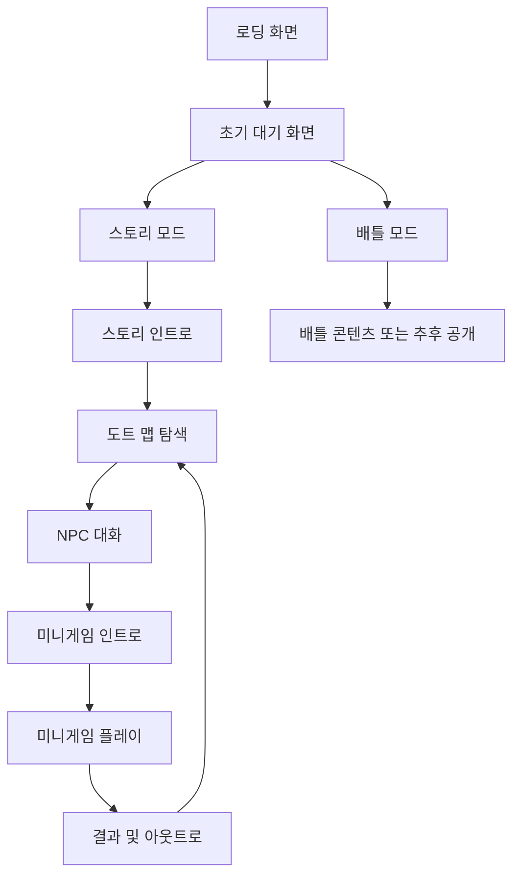

# 인공지능대학 축제 홍보 웹게임 기획서

> 문서 상태: 1차 기획안  
> 작성일: 2026년 8월 16일  
> 게임명: 추후 확정  
> 개발 형태: HTML·CSS·JavaScript 기반 반응형 웹게임

---

## 1. 프로젝트 개요

### 1.1 프로젝트 목적

본 프로젝트는 인공지능대학 축제와 각 학과·전공의 특징을 자연스럽게 홍보하기 위한 도트 그래픽 기반 웹게임이다. 플레이어는 캐릭터를 조작하여 축제 맵을 탐색하고, 맵 곳곳의 NPC와 대화한 뒤 각 학과를 주제로 한 미니게임에 참여한다.

단순한 홍보 페이지가 아니라 직접 탐색하고 플레이하는 경험을 제공하여 축제와 학과에 대한 관심을 높이는 것을 목표로 한다. 축제 종료 후에도 새로운 게임과 스토리를 추가할 수 있도록 처음부터 확장 가능한 구조로 개발한다.

### 1.2 핵심 콘셉트

- 도트 그래픽으로 구현된 인공지능대학 축제 맵 탐색
- 느낌표가 표시된 NPC와 상호작용하여 학과별 스토리 진행
- 짧은 대화 및 인트로 이후 학과별 미니게임 진입
- 미니게임 종료 후 아웃트로를 통해 다시 맵 또는 다음 콘텐츠로 연결
- 초기 화면에서 `스토리`와 `배틀` 콘텐츠를 분리
- 별도 설치 없이 링크 접속만으로 PC·태블릿·모바일에서 실행

### 1.3 목표 사용자

- 인공지능대학 축제에 참여하는 재학생
- 인공지능대학 및 소속 학과에 관심이 있는 학생
- 축제 온라인 홍보물을 통해 처음 게임에 접속하는 사용자

---

## 2. 개발 및 실행 환경

| 구분 | 내용 |
|---|---|
| 개발 기술 | HTML5, CSS3, JavaScript |
| 그래픽 방식 | HTML Canvas 기반 도트 그래픽 권장, 메뉴·대화창은 DOM UI 병행 가능 |
| 지원 기기 | 데스크톱, 노트북, 태블릿, 스마트폰 |
| 지원 브라우저 | Chrome, Safari 등 주요 PC·모바일 브라우저 |
| PC 조작 | 키보드, 마우스 |
| 모바일 조작 | 화면 터치, 가상 이동 패드 |
| 실행 방식 | 별도 프로그램 설치 없이 배포 링크로 즉시 실행 |
| 화면 구성 | 기기 해상도와 화면 방향에 맞추어 조정되는 반응형 레이아웃 |
| 배포 방식 | 정적 웹 호스팅을 통한 URL 배포 |

### 2.1 기술 구현 원칙

- 게임 로직, UI, 스토리 데이터, 미니게임을 서로 분리하여 수정 범위를 최소화한다.
- 게임 화면은 기준 해상도를 중심으로 확대·축소하되 도트 그래픽의 비율이 찌그러지지 않도록 한다.
- 브라우저 크기가 변경되거나 기기 방향이 바뀌어도 플레이 상태를 유지한 채 화면을 다시 배치한다.
- 모바일 브라우저의 주소창, 노치, 하단 홈 바 등 안전 영역을 고려한다.
- 배포 환경에서는 빌드 도구나 별도 설치를 요구하지 않고 정적 파일만으로 실행 가능하도록 구성한다.

---

## 3. 게임 전체 구조

### 3.1 콘텐츠 모드

#### 스토리 모드

축제 맵 탐색과 NPC 대화, 학과별 미니게임을 하나의 흐름으로 연결하는 기본 콘텐츠이다.

1. 스토리 인트로 재생
2. 축제 맵 입장
3. 캐릭터 이동 및 NPC 탐색
4. NPC 대화 진행
5. 학과별 미니게임 인트로
6. 미니게임 플레이
7. 결과 및 아웃트로 확인
8. 맵으로 복귀하거나 다음 콘텐츠 진행

#### 배틀 모드

축제 이후 추가할 사후 콘텐츠를 위한 독립 메뉴이다. 최초 배포 시 콘텐츠가 준비되지 않았다면 `추후 공개` 상태로 노출할 수 있다.

- 스토리 모드와 별도의 진입 경로를 사용한다.
- 향후 보스전, 점수 경쟁, 반복 플레이형 게임 등을 연결할 수 있도록 빈 확장 지점을 마련한다.
- 배틀 콘텐츠 추가 시 기존 스토리 모드의 화면과 로직을 수정하지 않고 등록만으로 연결할 수 있도록 한다.

### 3.2 전체 플레이 흐름



---

## 4. 화면 구성

### 4.1 로딩 화면

게임 실행에 필요한 이미지·맵·음원 등의 리소스를 불러오는 동안 표시한다.

- 게임 로고 또는 축제 로고
- 로딩 진행률 또는 로딩 애니메이션
- 리소스 로딩 실패 시 재시도 안내
- 모든 필수 리소스 로딩 완료 후 초기 대기 화면으로 전환

### 4.2 초기 대기 화면

사용자가 접속 후 가장 먼저 만나는 메인 메뉴이다.

- 게임 로고 및 축제명
- `스토리` 버튼
- `배틀` 버튼
- `게임 방법` 버튼
- `설정` 버튼
- 음소거 또는 음량 설정
- 배틀 미공개 시 `추후 공개` 배지 및 비활성 또는 안내 팝업 표시

### 4.3 스토리 인트로 화면

축제 세계관과 플레이 목적을 간단히 소개한다.

- 배경 이미지 또는 간단한 도트 연출
- 화자명, 대사, 캐릭터 초상화 선택 지원
- 다음 대사, 이전 대사, 전체 건너뛰기 기능
- 스크립트 종료 시 축제 맵으로 이동

### 4.4 도트 맵 탐색 화면

플레이어가 캐릭터를 직접 이동하며 NPC를 찾는 중심 화면이다.

- 도트 맵 및 장애물
- 플레이어 캐릭터
- 상호작용 가능한 NPC
- NPC 머리 위 느낌표 아이콘
- PC와 모바일에 맞게 달라지는 조작 UI
- 설정, 게임 방법, 초기 화면 이동 메뉴
- 필요 시 학과별 진행 상황을 보여 주는 간단한 HUD

### 4.5 NPC 대화 화면

플레이어가 느낌표가 표시된 NPC를 선택했을 때 나타난다.

- NPC 이름 및 초상화
- 짧은 대화 스크립트
- 다음 대사 진행 버튼
- 대화 종료 또는 미니게임 시작 선택지
- 해당 학과의 미니게임 인트로로 이동하는 기능

### 4.6 미니게임 인트로 화면

각 게임의 스토리상 배경과 조작법을 안내한다.

- 학과·전공명 및 미니게임명
- 짧은 도입 스크립트
- 게임 목표
- PC 조작법과 모바일 조작법
- `게임 시작` 및 `맵으로 돌아가기` 버튼

### 4.7 미니게임 플레이 화면

학과별로 독립된 게임 화면을 사용한다.

- 게임 플레이 영역
- 점수, 제한 시간, 생명 등 게임별 HUD
- 일시정지 버튼
- 음소거 버튼
- 게임별 PC·모바일 조작 UI
- 성공, 실패 또는 종료 조건 감지

### 4.8 결과 및 아웃트로 화면

미니게임 종료 결과와 이야기의 마무리를 제공한다.

- 성공·실패 결과
- 최종 점수 또는 플레이 기록
- 결과에 맞는 아웃트로 스크립트
- `다시 하기` 버튼
- `맵으로 돌아가기` 버튼
- 필요 시 다음 학과 또는 다음 콘텐츠 안내

---

## 5. 핵심 게임 시스템

### 5.1 캐릭터 이동

| 환경 | 기본 조작 | 보조 조작 |
|---|---|---|
| PC | 방향키 또는 WASD | 설정에서 키 안내 제공 |
| 모바일·태블릿 | 화면의 가상 이동 패드 | 드래그 또는 길게 눌러 연속 이동 |

- 캐릭터는 맵의 통행 가능 영역에서만 이동한다.
- 건물, 장식물, 맵 경계 등은 충돌 영역으로 처리한다.
- 대화창이나 메뉴가 열린 동안에는 캐릭터 이동 입력을 차단한다.
- 키를 계속 누르거나 이동 패드를 길게 터치하면 연속 이동한다.
- 화면 크기에 따라 캐릭터 속도가 달라지지 않도록 게임 좌표계 기준으로 계산한다.

### 5.2 NPC 상호작용

1. 플레이어가 NPC의 상호작용 범위 안으로 접근한다.
2. NPC 머리 위에 느낌표가 강조되어 상호작용 가능 상태를 알린다.
3. PC에서는 NPC 클릭 또는 상호작용 키로, 모바일에서는 NPC 터치로 대화를 시작한다.
4. 대화가 끝나면 미니게임 인트로로 이동하거나 맵 탐색을 계속한다.

#### 예외 처리

- 상호작용 범위 밖에서 NPC를 선택하면 캐릭터를 강제로 이동시키지 않고 접근 안내를 표시한다.
- 대화 중 중복 입력으로 대사가 여러 번 넘어가지 않도록 짧은 입력 잠금 처리를 적용한다.
- 이미 완료한 NPC는 느낌표의 색상 또는 아이콘을 변경하여 완료 여부를 구분할 수 있다.

### 5.3 대화 및 스크립트 시스템

인트로, NPC 대화, 미니게임 아웃트로의 대사는 코드에 직접 작성하지 않고 별도의 데이터 파일로 관리한다. 이후 대사만 추가하거나 수정해도 게임 로직을 변경하지 않도록 구성한다.

#### 권장 스크립트 데이터 예시

```json
{
  "id": "department_intro_01",
  "type": "dialogue",
  "lines": [
    {
      "speaker": "NPC 이름",
      "portrait": "npc_default.png",
      "text": "추후 작성할 대사입니다."
    }
  ],
  "nextAction": {
    "type": "openMiniGame",
    "target": "mini_game_id"
  }
}
```

#### 필수 지원 기능

- 화자명, 대사, 초상화 설정
- 대사 순차 진행
- 인트로 및 아웃트로 구분
- 스크립트 건너뛰기
- 스크립트 종료 후 실행할 동작 지정
- 동일 NPC의 최초 대화와 재방문 대화 분리
- 필요 시 선택지와 분기 대화 추가 가능

### 5.4 미니게임 연결 시스템

각 미니게임은 공통 게임 화면에 로직을 덧붙이는 방식이 아니라 독립 모듈로 관리한다. 새로운 게임을 추가할 때 공통 메뉴와 맵을 수정하는 범위를 최소화한다.

#### 미니게임 공통 규격

모든 미니게임은 다음 기능을 공통으로 제공한다.

- `init`: 필요한 리소스와 초기 상태 준비
- `start`: 게임 시작
- `pause` / `resume`: 일시정지 및 재개
- `restart`: 현재 게임 다시 시작
- `destroy`: 이벤트와 리소스 정리
- `onComplete`: 성공·실패·점수 등의 결과 전달

#### 미니게임 등록 정보

| 항목 | 설명 |
|---|---|
| `id` | 미니게임을 구분하는 고유값 |
| `department` | 연결된 학과·전공 |
| `title` | 게임명 |
| `introScript` | 인트로 스크립트 ID |
| `outroScript` | 아웃트로 스크립트 ID |
| `module` | 실행할 게임 모듈 경로 |
| `thumbnail` | 선택 화면용 이미지 |
| `status` | 공개, 잠금, 추후 공개 등의 상태 |

### 5.5 진행 상태 저장

- 브라우저의 로컬 저장소를 활용하여 기기 내 진행 상태를 저장한다.
- 저장 대상은 완료한 NPC, 완료한 미니게임, 최고 점수, 음량 설정 등으로 한다.
- 사용자가 원할 경우 설정에서 진행 기록을 초기화할 수 있다.
- 브라우저 데이터 삭제나 다른 기기 접속 시 기록이 유지되지 않을 수 있음을 안내한다.

---

## 6. 반응형 화면 및 조작 설계

### 6.1 공통 원칙

- 게임 화면의 기준 비율을 유지하고 남는 영역은 배경 또는 여백으로 처리한다.
- 도트 이미지 확대 시 흐려지지 않도록 정수 배율 또는 픽셀 렌더링 설정을 우선 적용한다.
- UI는 화면 가장자리와 겹치지 않도록 안전 여백을 둔다.
- 텍스트는 작은 화면에서도 읽을 수 있는 최소 크기를 보장한다.
- 터치 버튼은 손가락으로 누르기 충분한 크기와 간격을 확보한다.
- 화면 크기 변경 시 게임을 재시작하지 않고 Canvas와 UI를 다시 배치한다.

### 6.2 기기별 화면 구성

| 구분 | 화면 구성 |
|---|---|
| PC·노트북 | 게임 화면 중앙 배치, 키보드 이동, 마우스 상호작용, 좌우 여백 활용 |
| 태블릿 | 게임 화면 확대, 터치와 키보드 입력 모두 대응, 화면 방향에 맞춰 HUD 재배치 |
| 모바일 가로 | 게임 영역을 넓게 사용하고 좌측 이동 패드·우측 상호작용 버튼 배치 |
| 모바일 세로 | 맵 가시 영역을 유지하면서 조작 패드와 대화 UI를 상하로 재배치하거나 가로 모드 권장 안내 제공 |

### 6.3 입력 방식 통합

키보드, 마우스, 터치 입력은 각각 별도 게임 로직을 실행하지 않고 공통 명령으로 변환한다.

| 사용자 입력 | 공통 명령 |
|---|---|
| 방향키·WASD·가상 패드 | `MOVE` |
| NPC 클릭·터치·Enter·Space | `INTERACT` |
| ESC·일시정지 버튼 | `PAUSE` |
| 대화창 클릭·터치·Enter | `NEXT_DIALOGUE` |

이 구조를 사용하면 기기별 조작 차이로 인해 게임 결과가 달라지는 문제를 줄일 수 있다.

---

## 7. 권장 프로젝트 구조

```text
project-root/
├── index.html
├── css/
│   ├── common.css
│   ├── responsive.css
│   └── dialogue.css
├── js/
│   ├── app.js
│   ├── router.js
│   ├── core/
│   │   ├── game-loop.js
│   │   ├── input-manager.js
│   │   ├── resize-manager.js
│   │   ├── asset-loader.js
│   │   └── save-manager.js
│   ├── map/
│   │   ├── map-scene.js
│   │   ├── player.js
│   │   └── npc.js
│   ├── story/
│   │   └── dialogue-manager.js
│   └── minigames/
│       ├── registry.js
│       ├── game-a/
│       └── game-b/
├── data/
│   ├── scripts/
│   │   ├── main-story.json
│   │   └── departments.json
│   ├── minigames.json
│   └── map-data.json
├── assets/
│   ├── images/
│   ├── sprites/
│   ├── maps/
│   ├── audio/
│   └── fonts/
├── docs/
│   ├── 실행_및_조작_방법.md
│   └── 리소스_출처_목록.md
└── README.md
```

---

## 8. 세부 기능 요구사항

| ID | 기능 | 요구사항 | 우선순위 |
|---|---|---|---|
| F-01 | 초기 화면 | 스토리·배틀 모드를 분리하여 표시 | 필수 |
| F-02 | 맵 탐색 | 플레이어 캐릭터가 도트 맵을 자유롭게 이동 | 필수 |
| F-03 | 반응형 입력 | 키보드·마우스·터치·가상 패드 지원 | 필수 |
| F-04 | NPC 표시 | 상호작용 가능한 NPC 위에 느낌표 표시 | 필수 |
| F-05 | NPC 대화 | NPC 선택 시 짧은 대화 스크립트 실행 | 필수 |
| F-06 | 미니게임 연결 | 대화 종료 후 해당 학과 미니게임으로 이동 | 필수 |
| F-07 | 인트로·아웃트로 | 각 미니게임 전후에 독립 스크립트 실행 | 필수 |
| F-08 | 스크립트 확장 | 데이터 파일 추가·수정만으로 대사 변경 가능 | 필수 |
| F-09 | 게임 확장 | 신규 미니게임을 모듈 등록 방식으로 추가 | 필수 |
| F-10 | 화면 리사이징 | 창 크기·기기 방향 변경 시 자동 재배치 | 필수 |
| F-11 | 진행 저장 | 완료 여부와 설정을 브라우저에 저장 | 권장 |
| F-12 | 게임 방법 | 기기별 실행 및 조작 방법 제공 | 필수 |
| F-13 | 음량 설정 | 배경음·효과음 음소거 또는 조절 | 권장 |
| F-14 | 배틀 확장 | 이후 배틀 콘텐츠 연결을 위한 메뉴·등록 구조 제공 | 필수 |
| F-15 | 오류 안내 | 로딩 및 실행 오류 발생 시 재시도 방법 표시 | 권장 |

---

## 9. 비기능 요구사항

### 9.1 성능

- 초기 로딩에 필요한 리소스와 미니게임별 추가 리소스를 분리한다.
- 현재 사용하지 않는 미니게임 리소스는 해당 게임 진입 시 불러오는 방식을 권장한다.
- 이미지와 음원은 화질 및 음질을 해치지 않는 범위에서 웹용으로 압축한다.
- 모바일에서도 조작 지연이나 프레임 저하가 심하지 않도록 오브젝트와 애니메이션 수를 관리한다.

### 9.2 호환성

- Chrome과 Safari의 PC·모바일 환경에서 핵심 기능을 직접 검수한다.
- 마우스가 없는 터치 기기에서도 모든 메뉴와 게임을 진행할 수 있어야 한다.
- 키보드가 없는 모바일 환경에서도 뒤로 가기, 일시정지, 대화 진행이 가능해야 한다.
- 브라우저 자동 재생 제한에 대응하여 최초 사용자 입력 후 음원을 재생한다.

### 9.3 사용성 및 접근성

- 대화 텍스트와 배경의 명도 대비를 확보한다.
- 색상만으로 성공·실패·완료 여부를 구분하지 않고 아이콘이나 문구를 함께 사용한다.
- 빠른 애니메이션과 화면 흔들림은 과도하게 사용하지 않는다.
- 소리를 끈 상태에서도 게임 진행에 필요한 정보를 시각적으로 제공한다.
- 중요한 버튼에는 텍스트 라벨 또는 접근 가능한 설명을 제공한다.

### 9.4 오류 및 상태 관리

- 화면 전환 중 중복 클릭으로 동일 장면이 여러 번 실행되지 않도록 한다.
- 미니게임 종료 후 등록한 키보드·터치 이벤트를 해제한다.
- 페이지가 비활성화되면 게임을 자동 일시정지한다.
- 예외 발생 시 전체 페이지가 멈추지 않고 초기 화면 또는 재시도 안내로 복구할 수 있도록 한다.

---

## 10. 리소스 제작 및 출처 관리

### 10.1 필요 리소스

- 게임 및 축제 로고
- 플레이어 캐릭터 스프라이트
- NPC 캐릭터 및 초상화
- 맵 타일과 배경 오브젝트
- 느낌표 및 UI 아이콘
- 학과별 미니게임 이미지
- 인트로·아웃트로 배경 이미지
- 배경음악과 효과음
- 웹폰트

### 10.2 출처 기록 항목

모든 외부 리소스는 다음 항목을 출처 목록에 기록한다.

| 항목 | 기록 내용 |
|---|---|
| 파일명 | 프로젝트에서 사용한 실제 파일명 |
| 리소스 종류 | 이미지, 음원, 폰트 등 |
| 제작자·제공처 | 원작자 또는 배포 사이트 |
| 원본 링크 | 출처를 확인할 수 있는 URL |
| 라이선스 | 사용 허용 범위와 표기 조건 |
| 수정 여부 | 크기, 색상, 편집 등 변경 내용 |
| 사용 위치 | 맵, UI, 특정 미니게임 등 |

직접 제작한 리소스도 `자체 제작`으로 표시하여 외부 리소스와 구분한다.

---

## 11. 개발 단계 제안

### 1단계: 공통 기반 구축

- 초기 화면 및 화면 전환 구조 구현
- 리소스 로더 구현
- 반응형 Canvas와 UI 레이아웃 구현
- 키보드·마우스·터치 입력 통합

### 2단계: 맵 및 대화 구현

- 도트 맵 출력
- 플레이어 이동 및 충돌 처리
- NPC와 느낌표 표시
- 대화 및 스크립트 데이터 구조 구현

### 3단계: 미니게임 연결

- 미니게임 공통 인터페이스 구현
- 학과별 미니게임 모듈 연결
- 인트로, 결과, 아웃트로 화면 연결

### 4단계: 저장 및 확장 기능

- 진행 상태 및 설정 저장
- 배틀 모드 확장 지점 구현
- 추후 공개 콘텐츠 처리

### 5단계: 최적화 및 검수

- PC·태블릿·모바일 화면 검수
- Chrome·Safari 호환성 검수
- 이미지·음원 최적화
- 입력 충돌, 화면 전환, 저장 상태 오류 점검
- 배포 링크 최종 확인

---

## 12. 테스트 체크리스트

### 화면 및 반응형

- [ ] PC, 노트북, 태블릿, 모바일에서 화면이 잘리지 않는다.
- [ ] 브라우저 창 크기를 바꿔도 게임이 정상적으로 재배치된다.
- [ ] 모바일 화면 방향을 바꿔도 진행 상태가 유지된다.
- [ ] 도트 그래픽 비율이 찌그러지거나 과도하게 흐려지지 않는다.
- [ ] 대화창과 버튼이 노치 및 브라우저 UI에 가려지지 않는다.

### 조작

- [ ] 방향키와 WASD로 동일하게 이동할 수 있다.
- [ ] 마우스 클릭과 터치로 NPC 및 버튼을 선택할 수 있다.
- [ ] 모바일 가상 패드로 끊김 없이 이동할 수 있다.
- [ ] 대화창이 열린 동안 캐릭터가 움직이지 않는다.
- [ ] 일시정지 상태에서 게임 시간이 흐르지 않는다.

### 스토리 및 미니게임

- [ ] 각 NPC의 느낌표와 상호작용 범위가 정상적으로 작동한다.
- [ ] 인트로와 아웃트로 대사가 순서대로 표시된다.
- [ ] 스크립트 건너뛰기 후 올바른 화면으로 이동한다.
- [ ] 미니게임 종료 결과가 결과 화면에 정확히 전달된다.
- [ ] 다시 하기와 맵 복귀가 정상적으로 작동한다.
- [ ] 신규 스크립트 및 미니게임을 추가해도 기존 콘텐츠가 영향을 받지 않는다.

### 브라우저 및 배포

- [ ] Chrome PC·모바일에서 정상 작동한다.
- [ ] Safari PC·모바일에서 정상 작동한다.
- [ ] 배포 링크 접속만으로 게임을 실행할 수 있다.
- [ ] 새로고침 후 저장된 진행 상태와 설정이 복원된다.
- [ ] 음소거 상태에서도 모든 필수 정보를 확인할 수 있다.
- [ ] 외부 리소스 출처와 라이선스가 누락되지 않았다.

---

## 13. 최종 제출 자료

1. **최종 기획안**
   - 게임 목적, 구조, 화면, 조작법, 기능 및 테스트 기준 포함
2. **전체 소스 코드**
   - HTML, CSS, JavaScript, 데이터 파일 및 필요한 리소스 포함
3. **실행 링크**
   - 별도 설치 없이 접속 가능한 최종 배포 URL
4. **리소스 출처 목록**
   - 이미지, 음원, 폰트의 출처, 링크, 라이선스, 수정 여부 포함
5. **실행 및 조작 방법**
   - PC와 모바일의 실행 방법 및 조작법을 간단히 정리

---

## 14. 완료 기준

다음 조건을 모두 만족하면 1차 배포가 완료된 것으로 본다.

- 초기 화면에서 스토리와 배틀 메뉴가 분리되어 있다.
- 스토리 모드에서 인트로, 맵 탐색, NPC 대화, 미니게임, 아웃트로의 전체 흐름이 끊김 없이 실행된다.
- PC의 키보드·마우스와 모바일의 터치·가상 패드로 게임을 진행할 수 있다.
- 화면 크기와 기기 방향이 달라져도 주요 UI와 게임 영역이 정상적으로 표시된다.
- Chrome 및 Safari의 주요 PC·모바일 환경에서 치명적인 오류 없이 작동한다.
- 스크립트와 미니게임이 데이터 및 모듈 단위로 분리되어 이후 콘텐츠를 추가할 수 있다.
- 배포 링크로 바로 접속하여 실행할 수 있다.
- 소스 코드, 실행 링크, 출처 목록, 실행 및 조작 방법이 함께 제출된다.

---

## 15. 추후 확정 필요 사항

- 최종 게임명 및 로고
- 축제 세계관과 메인 스토리
- 플레이어 캐릭터 설정
- 맵 크기, 구역 수, NPC 위치
- 학과·전공별 NPC 및 대화 스크립트
- 각 미니게임의 세부 규칙, 성공 조건, 난이도
- 배틀 모드의 구체적인 게임 방식
- 진행 상황 및 보상 표시 방식
- 배경음악과 효과음의 콘셉트
- 세부 일정, 담당자, 우선 개발 대상

