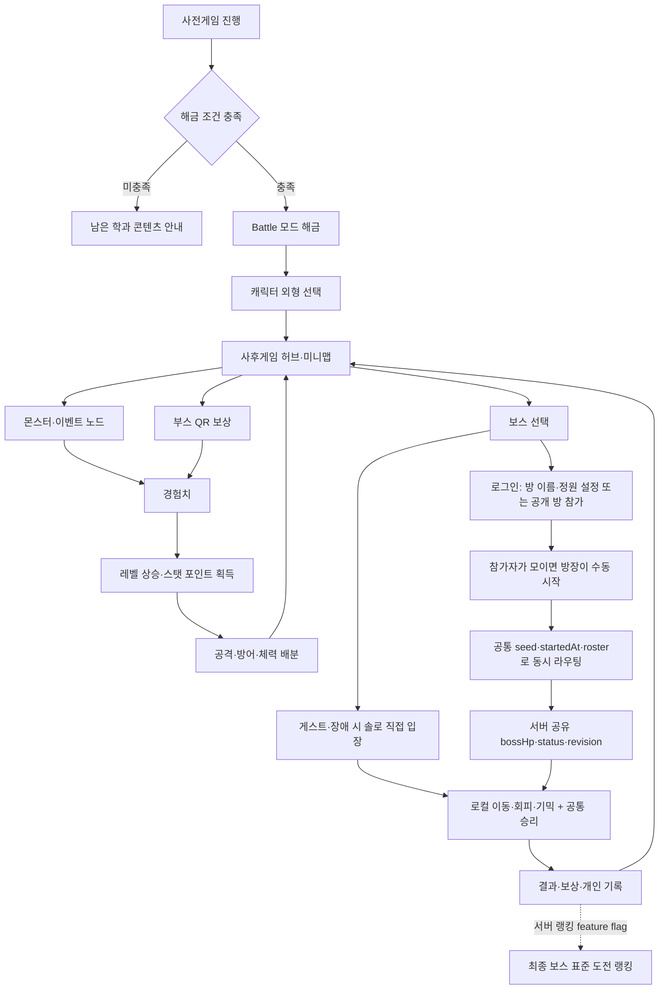

# AI CHANGE 사후게임(Battle) 기획안

> 문서 상태: 현재 구현 정합화본
> 최초 작성일: 2026년 8월 25일 · 구현 기준일: 2026년 9월 19일
> 콘텐츠 위치: 사전게임 이후 해금되는 `Battle` 모드  
> 개발 형태: HTML·CSS·JavaScript 기반 반응형 웹게임

## 0. 문서 사용법

이 문서는 첨부된 회의 메모와 현재 `ai-change` 통합 개발본을 기준으로 사후게임의 목표, 플레이 흐름, 기능 범위와 기술 조건을 한 문서로 재구성한 기획안이다. 첨부 메모에 링크된 별도 Google Drive·Docs 자료는 현재 작업 환경에서 본문을 확인하지 못했으므로, 해당 자료의 세부 내용을 직접 인용하거나 확정 근거로 사용하지 않았다.

의견과 사양이 섞여 보이지 않도록 다음 상태를 사용한다.

| 표시 | 의미 |
| --- | --- |
| **확정 방향** | 회의에서 합의가 강하거나 현재 프로젝트 구조상 이미 정해진 내용 |
| **1차 제안** | 첫 출시 범위를 현실적으로 만들기 위한 권장안 |
| **추후 확정** | 기획·밸런스·서버·운영 논의가 더 필요한 내용 |

### 0.1 현재 구현 범위

최신 팀 기획에서 캐릭터 이동과 기본 전투 연결이 `after/character-move` 담당으로 확정되어 공용 character core를 구현했다. 현재 구현·연동 계약은 [사후게임 공용 캐릭터 시스템](./after-character-system.md)을 기준으로 한다.

- 필드와 모든 보스 화면이 재사용할 이동·방향·충돌·접촉·체력·상태 API 구현
- PC WASD·Space와 모바일 조이스틱·공격 버튼 입력 구현
- 공격은 `character:attack` 명령 전달까지만 구현
- 계정의 공격·방어·체력 값 입력과 원격 캐릭터 snapshot 표시 seam 구현
- `stat-boss`·`data-sphinx`·`control-boss`와 필드 챌린지·최종전까지 공용 Battle lifecycle로 연결
- 로그인 사용자의 입장 필드·광장 presence, 공개 보스방 로비와 방별 공유 보스 상태는 same-origin WebSocket으로 연결
- 방별 Durable Object가 보스 HP·상태·revision·공통 승리를 소유하고 검증된 파티원 hit를 같은 보스에 반영하며, 재접속 시 최신 snapshot을 복원
- 세 보스의 플레이어 이동·회피·HP와 보스 기믹·phase는 각 브라우저의 로컬 상태이며 위치 동기화·완전한 서버 물리 시뮬레이션은 아직 범위 밖
- 4방향별 `idle`·`walk` 최종 이미지가 아직 없어 CSS placeholder를 사용하되, appearance에 8개 상태 이미지 URL을 주입할 수 있는 연결부 구현

현재 Battle registry에는 `stat-boss`, `data-sphinx`, `control-boss`, `xr-egg-trials`, `word-breaker` 5종을 published했다. 앞의 세 보스만 공개 방 로비의 대상이며, `xr-egg-trials`는 필드 랜덤 인카운터, `word-breaker`는 Story 목록에서 실행한다. `캐릭터 시스템 · DEV PREVIEW`는 공용 이동·피격 진단용으로 소스에 남기되 운영 메뉴에서는 숨긴다.

---

## 1. 게임 개요

### 1.1 한 줄 정의

사전게임을 완료한 플레이어가 게임 내 필드와 축제 부스 활동으로 캐릭터를 성장시키고, 혼자 또는 선택적으로 다른 플레이어와 서로 다른 3종 보스에 도전하는 반복형 엔드 콘텐츠이다.

### 1.2 사후게임의 역할

사전게임은 학과와 축제를 누구나 가볍게 경험하는 입문 콘텐츠이다. 사후게임은 그 경험 이후에도 게임을 반복해서 플레이하고, 축제 현장 활동과 연결되며, 자신의 기록을 개선할 이유를 제공하는 콘텐츠이다.

- 사전게임: 학과 탐색, NPC 대화, 학과별 미니게임 중심
- 사후게임: 성장, 보스 공략, 반복 도전, 기록 경쟁 중심
- 현재 메인 메뉴의 published `Battle` 영역에 자유 이동 월드와 보스 3종·필드 챌린지를 연결
- 기존 Story 모드를 수정하지 않고 독립 Battle module을 등록하는 방식으로 확장

### 1.3 핵심 목표

1. 팀원을 구하지 못한 플레이어도 모든 핵심 콘텐츠를 혼자 완료할 수 있게 한다.
2. 라이트 유저는 첫 보스까지 쉽게 진입하고, 숙련 유저는 최종 보스와 기록 단축에서 도전 욕구를 느끼게 한다.
3. 게임 내부 성장과 축제 부스 QR 보상을 함께 제공하되, 오프라인 참여만을 강제하지 않는다.
4. 무작위 장비 운보다 플레이와 선택한 스탯 배분이 결과에 영향을 주게 한다.
5. PC·태블릿·모바일에서 설치 없이 동일한 핵심 경험을 제공한다.

### 1.4 목표 사용자

| 사용자 | 기대 경험 | 설계 대응 |
| --- | --- | --- |
| 가볍게 참여한 축제 방문자 | 짧은 시간 안에 이해하고 보상 획득 | O/X 입문 보스, 자동 조준, 명확한 공격 예고 |
| 사전게임을 즐긴 일반 플레이어 | 성장과 새 콘텐츠 경험 | 필드 이벤트, 스탯 배분, 3종 보스 해금 |
| 반복 플레이를 원하는 숙련자 | 공략 숙련과 기록 경쟁 | 최종 보스, 표준 능력치 도전 모드, 개인 최고 기록 |
| 오프라인 부스 방문자 | 현실 활동이 게임에 반영되는 재미 | 선택형 QR 보상, 부스별 최초 보너스 |

---

## 2. 개발·서비스 기본 조건

다음 항목은 **확정 방향**으로 본다.

| 구분 | 요구사항 |
| --- | --- |
| 개발 기술 | HTML5, CSS3, JavaScript ES Module |
| 실행 방식 | 별도 설치 없이 HTTPS 배포 링크로 즉시 실행 |
| 지원 화면 | PC·태블릿·모바일 반응형 레이아웃 |
| PC 조작 | 키보드와 마우스 |
| 모바일 조작 | 터치 버튼과 가상 이동 패드 |
| 브라우저 | 최신 Chrome·Safari의 PC·모바일 환경 |
| 저장 | 로컬 진행은 브라우저 localStorage, 계정·스탯·사전게임 결과는 D1, 고빈도 위치·공개 방·방별 공유 보스 상태는 SQLite-backed Durable Object |
| 접근성 | 키보드 focus, 텍스트 라벨, 색상 외 상태 표현, reduced motion 고려 |

---

## 3. 핵심 기획 결정 요약

| 항목 | 1차 기획안 | 상태·근거 |
| --- | --- | --- |
| 플레이 인원 | 싱글플레이를 완결형으로 제공 | **확정 방향** |
| 온라인 방 | 보스별 공개 방 이름·정원 설정, 생성·참가, 방장 수동 시작, 정원 1~5명, 공유 보스 HP·공통 승리 | **부분 구현**. presence·로비·시작·공유 보스 상태·재접속 snapshot 완료, 위치·피격·기믹의 완전한 서버 시뮬레이션은 남음 |
| PvP | 1차 범위에서 제외 | 매칭 공정성·동시접속·서버 부담 |
| 캐릭터 | 능력은 동일한 단일 캐릭터, 외형 선택 제공 | **1차 제안** |
| 성장 | 공격력·방어력·체력에 포인트 배분 | 회의에서 가장 강한 방향 |
| 장비 | 무작위 옵션 장비 제외, 외형 또는 고정 단계 보조 보상만 검토 | 밸런스·운 의존도 축소 |
| 필드 | 캐릭터 자유 이동 + 거리 기반 랜덤 인카운터 | **확정**. 모바일 세로 조이스틱 지원 |
| 성장 획득 | 인게임 이벤트와 오프라인 QR을 병행 | **확정 방향** |
| 보스 수 | 서로 다른 3종 | 다보스 선호 투표와 아트 범위 절충 |
| 난이도 | 입문 → 응용 → 최종 순으로 상승 | **확정 방향** |
| 기록·랭킹 | Phase 1은 최종 보스 표준 능력치의 로컬 개인 기록, Phase 2는 같은 모드의 공용 랭킹 | **1차 제안** |
| 마지막 날 레이드 | 이벤트성 확장 콘텐츠 | **추후 확정** |

---

## 4. 전체 플레이 흐름



### 4.1 해금 조건

**1차 제안:** Story 모드의 학과별 사전게임 5종을 모두 CLEAR하면 Battle을 해금한다.

현재 통합본은 Battle 콘텐츠 5종을 published 상태로 연결했다. 로컬 save의 완료 기록과 로그인 session의 서로 다른 완료 게임 ID를 합쳐 필수 5종을 모두 CLEAR했을 때 해금하며, 반복 클리어 합계만으로는 열리지 않는다. 계정 레벨·스탯과 사전게임 결과는 D1에 저장하지만, 별도 Battle 결과·보상 저장은 아직 도입하지 않았다.

### 4.2 첫 진입

1. 사후게임 소개 대사와 기본 조작을 보여 준다.
2. 능력치는 동일한 캐릭터의 외형 또는 학과 테마 색상을 선택한다.
3. 공격력·방어력·체력의 역할을 짧은 체험으로 안내한다.
4. 첫 O/X 보스 또는 튜토리얼 노드를 바로 추천한다.
5. 첫 클리어 보상으로 경험치를 지급하고, 레벨업으로 얻은 스탯 포인트의 배분 과정을 학습시킨다.

---

## 5. 사후게임 허브와 필드

### 5.1 1차 필드: 자유 이동형 랜덤 인카운터 필드

사후게임 허브는 카드 대시보드가 아니라 캐릭터가 직접 이동하는 다중 화면 월드다. 최초 진입 화면은 랜덤 인카운터 필드이며, 필드 왼쪽 끝은 중심 광장의 오른쪽 안전 위치로 이어진다. 광장 오른쪽 끝으로 가면 필드의 왼쪽 안전 위치로 돌아오고, 광장 북쪽의 서로 떨어진 세 문은 각각 데이터 스핑크스·스탯 보스·컨트롤 보스 맵으로 연결된다. 필드와 광장 전환은 같은 scene 안에서 처리해 창을 새로고침하지 않는다. 필드에는 미니게임 버튼을 고정 배치하지 않고, 플레이어가 캐릭터를 움직이는 도중 랜덤 인카운터가 출현한다.

- 정지 시간이나 프레임 수가 아니라 실제 이동 거리를 기준으로 출현을 판정
- 입장 직후 유예 거리, 구간별 확률 판정, 최대 이동 거리 보정을 함께 적용
- 한 번에 인카운터 하나만 출현하며, 캐릭터 접촉 또는 직접 선택으로 입장
- 랜덤 인카운터 거리 누적은 입장 필드에서만 진행하고 광장에서는 정지
- 보스 전투 뒤에는 접촉 중이던 문 좌표가 아니라 해당 문 아래의 안전 위치로 복귀해 즉시 재입장을 방지
- 창 크기나 화면 방향이 바뀌어도 캐릭터와 출현 지점을 필드 비율에 맞춰 재배치
- 현재 운영 연결된 필드 시련은 가위바위보·카드 짝맞추기·연타 3종이며, 서로 다른 6종 구성은 신규 시련 3종을 추가한 뒤 같은 출현 풀에 확장

### 5.2 랜덤 인카운터·구역 종류

| 종류 | 내용 | 기본 보상 |
| --- | --- | --- |
| 전투 인카운터 | 짧은 회피·공격 전투 | 경험치 |
| 데이터 인카운터 | 순서 맞추기, 분류, 간단한 퍼즐 | 경험치 또는 성장 재화 |
| 회복 인카운터 | 다음 보스 도전용 연습·회복 | 체험 보상 |
| 이벤트 인카운터 | 축제·학과 관련 짧은 선택 이벤트 | 외형 조각 또는 경험치 |
| 보스방 | 서로 독립적인 3종 보스 선택 및 상세 정보 | 최초·반복 클리어 보상 |
| 광장·QR 안내 | 부스 방문 보상 내역 확인 | 부스별 최초 보너스 |

### 5.3 반복 파밍 제한

늦게 시작한 사용자와 장시간 플레이한 사용자의 격차가 과도해지지 않도록 다음을 권장한다.

- 최초 완료 보상을 가장 크게 지급
- 같은 인카운터의 반복 보상은 단계적으로 감소
- 성장 레벨에는 제품 상한을 두지 않음
- 레벨과 포인트는 계속 누적하되 외형·칭호·개인 기록 보상을 병행
- 최종 랭킹은 성장 수치가 고정된 별도 도전 모드로 운영

---

## 6. 캐릭터와 성장 시스템

### 6.1 캐릭터

**1차 제안:** 전투 능력은 모든 플레이어가 같은 단일 캐릭터를 사용하고, 외형만 선택할 수 있게 한다.

- 학과별 색상, 머리 장식, 배지 등 외형 선택지 제공 가능
- 외형은 능력치와 분리하여 특정 학과 선택이 유리해지지 않게 함
- 모바일에서 식별 가능한 단순한 실루엣과 큰 피격 표시 사용

### 6.2 성장 스탯

1차 MVP의 능력 성장 재화는 `경험치 → 레벨 → 스탯 포인트` 한 경로로 통일한다. 필드 인카운터·보스·QR은 경험치를 지급하고, 레벨이 오를 때만 스탯 포인트 1을 얻는다. 외형 조각과 칭호는 능력치에 영향을 주지 않는 별도 수집 보상이다.

| 스탯 | 효과 | 플레이 성향 |
| --- | --- | --- |
| 공격력 | 기본 공격 또는 보스 약점 공격의 피해량 증가 | 빠른 클리어 선호 |
| 방어력 | 피격 피해 감소. 상한 적용 | 패턴 학습·안정성 선호 |
| 체력 | 최대 HP 증가 | 입문자·장기 생존 선호 |

### 6.3 1차 밸런스 가설

아래 수치는 구현을 시작하기 위한 가설이며 playtest 후 확정한다.

| 항목 | 초깃값 제안 |
| --- | --- |
| 기본 체력 | 100 |
| 공격력 포인트 | 포인트당 피해량 5% 증가 |
| 방어력 포인트 | 포인트당 피해 3% 감소, 최대 30% |
| 체력 포인트 | 포인트당 최대 HP 10 증가 |
| 레벨 상한 | 없음 |
| 레벨업 보상 | 배분 가능한 스탯 포인트 1 |
| 재분배 | 보스전 밖에서 무료 또는 낮은 비용으로 허용 |

### 6.4 장비 정책

무작위 옵션 장비는 1차 범위에서 제외한다.

- 초반에 최고급 장비를 얻는 운 편차 방지
- 보스마다 유리한 옵션을 맞추기 위한 과도한 밸런스 작업 방지
- 아이템이 필요하면 능력치 없는 외형 보상 또는 `기본 → 강화 → 완성`의 고정 단계만 사용
- 스킬은 별도 복잡한 트리보다 공격·회피 등 공통 행동을 유지

---

## 7. 오프라인 부스 QR 연동

### 7.1 사용자 경험

1. 부스에 비치된 QR을 기본 카메라로 읽는다.
2. 게임과 같은 origin의 `?battleClaim=<claim-id>` 보상 URL이 열린다.
3. bootstrap 단계가 query를 보관하고 Loading·save 초기화 후 QR 보상 화면으로 deep-link한다.
4. 정적 QR claim catalog에서 claim ID, 부스, 지급 경험치·외형, 유효 기간을 조회한다.
5. catalog에 없는 ID, 만료된 ID, query에 임의로 넣은 보상값은 거부한다.
6. 등록된 claim ID를 기준으로 수령 여부를 검사하고 한 번만 보상을 적용한다.
7. 최초 수령이면 경험치 또는 능력치와 무관한 외형 보상을 지급한다.
8. 이미 수령했다면 부스 소개와 수령 완료 상태를 보여 준다.
9. 수령 뒤 query를 제거하고 사후게임 허브 또는 원래 진행 화면으로 이동한다.

별도의 인게임 카메라 스캐너를 만들지 않고 QR 자체가 HTTPS 보상 URL을 열게 하면 권한·호환성·개발 범위를 줄일 수 있다.

현재 router에는 query 기반 보상 route가 없으므로 bootstrap deep-link 처리는 PG-F-07 구현의 일부이다. QR이 새 탭에서 열려 기존 탭과 save revision이 달라질 수 있으므로 `storage` event 또는 저장 revision 확인으로 기존 탭에 새 상태를 반영하고, 안전하게 합칠 수 없으면 진행을 덮어쓰지 않고 새로고침을 안내한다. 카메라가 게임과 다른 브라우저·프로필을 열면 기존 localStorage 진행을 찾지 못할 수 있으므로 동일 브라우저로 열기 안내도 제공한다.

### 7.2 1차 보상 원칙

- QR 없이도 모든 보스를 클리어할 수 있어야 함
- QR은 성장 시간을 줄이거나 외형을 제공하는 보너스
- 부스별 최초 1회 보상을 기본으로 함
- 특정 부스 방문을 강요하지 않도록 보상 총량에 상한 적용
- 실물 상품 당첨과 직접 연결하지 않는 저위험 보상부터 시작

### 7.3 보안 한계

localStorage만 사용하는 정적 웹게임에서는 QR 공유, 브라우저 저장소 수정, 다른 기기에서의 중복 수령을 완전히 막을 수 없다.

- 개인 성장용 저위험 보상: localStorage 방식 허용 가능
- 공용 랭킹·실물 상품·일회용 보상: 서명된 token과 서버 검증 필수
- 서버 도입 시 QR ID, 발급 회차, 수령 계정, 수령 시각, 재사용 여부를 검증
- 같은 claim ID의 중복 callback과 여러 탭 동시 수령은 멱등 처리

---

## 8. 보스 콘텐츠

여러 보스를 선호한 회의 결과와 아트 제작 범위를 함께 고려하여 **서로 다른 3종 보스**를 제안한다. 아래 명칭·기믹·수치는 모두 **1차 제안·Phase 0 승인 필요**이며, 회의에서 확정된 사양으로 간주하지 않는다.

### 8.1 보스 해금 관계

**확정:** 사전게임 5종을 완료해 Battle이 열리면 중심 광장 북쪽의 보스방 문 3개가 동시에 열린다. 캐릭터가 원하는 문까지 걸어가 입장하며 보스 간 선행 클리어 조건은 없다. 아래 순서는 문의 좌우 배치 순서일 뿐 해금 순서가 아니다.

```text
Battle 해금
  ├─ 데이터 스핑크스 자유 입장
  ├─ 스탯 보스 자유 입장
  └─ 컨트롤 보스 자유 입장
```

- 개별 보스방에는 다른 보스의 CLEAR 기록을 요구하지 않는다.
- 세 방 모두 같은 전역 Battle 해금 상태만 확인하고 독립적으로 재도전한다.
- 별도 최종전 `마음의 말 깨부수기`는 사전게임 5종을 모두 완료한 뒤 Story의 사전게임 목록에 추가되는 여섯 번째 카드로 입장한다. 광장에는 최종전 진입 기능을 두지 않는다.
- 사망하면 해당 보스 시도 시작점으로 돌아가는 것을 기본안으로 한다.
- 각 시도가 짧다는 전제이며, phase checkpoint 필요 여부는 PG-D11에서 확정한다.

### 8.2 보스 1: 데이터 스핑크스

> 상태: **1차 제안·승인 필요**

| 항목 | 내용 |
| --- | --- |
| 역할 | 입문·O/X 퀴즈형 보스 |
| 핵심 조작 | 제한 시간 안에 O 또는 X 영역으로 이동 |
| 공격 방식 | 오답·시간 초과 시 플레이어 피해, 정답 시 보스 피해 |
| 학습 요소 | 이동, 공격 예고, 제한 시간, 결과 표시 |
| 보상 | 최초·반복 클리어 경험치. 최초 보상량을 더 크게 설정 |
| 난이도 원칙 | 축제·AI대학 관련 문제와 일반 논리 문제를 섞되 암기만 요구하지 않음 |

보스 체력은 정답 횟수와 연결한다. 문제 수, 제한 시간, 통과 정답 수는 콘텐츠 검수 후 확정한다.

### 8.3 보스 2: 패턴 가디언

> 상태: **1차 제안·승인 필요**

| 항목 | 내용 |
| --- | --- |
| 역할 | 지형지물 활용·패턴 학습형 보스 |
| 핵심 조작 | 이동, 회피, 자동 조준 공격, 보호 장치 활성화 |
| 주요 기믹 | 색·모양으로 예고된 공격을 장애물 뒤에서 회피하고 노출된 코어 공격 |
| 학습 구조 | 같은 패턴을 느리게 소개한 뒤 조합과 속도를 높임 |
| 보상 | 경험치 또는 능력치와 무관한 외형 보상 |

색상만으로 안전 구역을 구분하지 않고 문양, 방향, 텍스트를 함께 표시한다.

### 8.4 보스 3: 카오스 코어

> 상태: **1차 제안·승인 필요**

| 항목 | 내용 |
| --- | --- |
| 역할 | 최종 컨트롤·기록 도전 보스 |
| 핵심 조작 | 이동, 회피, 공격 타이밍, 지형 상호작용 |
| 주요 기믹 | 앞선 두 보스의 이동·예고·약점 공격을 새로운 순서로 결합 |
| 내부 구성 | 짧은 3단계 패턴. 보스 아트는 유지하고 배경·공격 규칙을 변화 |
| 보상 | 엔딩, 칭호·외형, 개인 최고 기록, 표준 능력치 도전 해금. 공용 랭킹은 Phase 2 |

다보스의 차별성을 유지하기 위해 최종 보스의 내부 단계는 새로운 보스를 대체하는 것이 아니라 난이도 상승 장치로만 사용한다.

### 8.5 공통 보스전 규칙

- 한 시도는 2~4분 안에 끝나도록 설계
- 공격 전 충분한 시각·문양·소리 예고 제공
- 최초 패턴은 안전하게 학습하고 후반에 조합
- 실패해도 일부 경험치 또는 연습 기록 제공
- 재도전은 즉시 가능하되 중복 클릭과 결과 중복 저장 차단
- 브라우저가 숨겨지거나 수동 pause 중인 시간은 제한 시간에서 제외
- 일반 성장 모드와 고정 능력치 기록 모드를 분리

---

## 9. 조작과 전투 규칙

### 9.1 공통 조작

| 행동 | PC | 모바일 |
| --- | --- | --- |
| 이동 | 방향키 또는 WASD | 왼쪽 가상 패드 |
| 기본 공격 | 마우스 클릭 또는 Space | 오른쪽 공격 버튼 |
| 회피·상호작용 | Shift 또는 E | 오른쪽 보조 버튼 |
| 일시정지 | Escape 또는 P | 상단 일시정지 버튼 |
| 메뉴 선택 | 마우스, Tab 후 Enter | 터치 |

### 9.2 접근성 중심 전투

- 기본 공격은 가까운 공격 가능 대상을 자동 조준
- 패턴 예고 시간은 보스별 첫 등장 때 더 길게 제공
- 터치 버튼은 최소 44×44 CSS px 이상 확보
- 흔들림·섬광 감소 옵션 제공
- 소리를 끄더라도 공격 방향과 타이밍을 알 수 있게 표시
- 실패 화면에 원인과 다음 시도 팁을 제공

### 9.3 난이도 구성

| 단계 | 대상 | 특징 |
| --- | --- | --- |
| 입문 | 라이트 유저 | 단일 기믹, 긴 예고, 실수 허용 |
| 응용 | 일반 유저 | 두 기믹 조합, 지형 활용 |
| 최종 | 숙련 유저 | 복합 패턴, 제한 시간, 기록 경쟁 |

플레이어가 게임 실력 때문에 영구적으로 막히지 않도록 일반 모드에는 성장 스탯을 적용한다. 공정한 기록 비교가 필요한 도전 모드는 고정 능력치를 사용한다.

---

## 10. 싱글플레이와 협동

### 10.1 솔로 완결과 장애 fallback

- 모든 보스와 엔딩을 혼자 완료 가능
- 보스 module과 필수 asset이 이미 로드된 솔로 시도는 일시적인 network 단절 중에도 계속 진행
- 플레이어 수를 전제로 한 힐러·탱커·딜러 역할 강제 없음
- 공격·방어·체력 배분으로 자신의 부족한 부분을 보완
- 로그인하지 않은 게스트는 기존처럼 보스 문에서 바로 솔로 전투에 입장
- 로그인했더라도 WebSocket 연결이 불가능하거나 끊기면 온라인 방을 필수로 강제하지 않고 솔로 직접 입장을 유지

### 10.2 현재 구현: presence·공개 보스방·공유 보스 상태

로그인 사용자는 같은 origin의 `/api/postgame/socket`에 연결한다. Worker가 session과 `Origin`을 확인한 뒤 모든 연결을 하나의 SQLite-backed Durable Object coordinator로 전달한다.

- 입장 필드와 광장에서 같은 구역에 있는 다른 로그인 캐릭터의 presence를 표시
- `data-sphinx`·`stat-boss`·`control-boss`별 공개 방 목록을 분리
- 방 생성 시 공개 방 이름과 정원을 입력한다. 서버는 방 이름을 NFKC 정규화하고 제어 문자와 연속 공백을 제거한 뒤 1~32자만 허용한다.
- 정원은 1명 이상 5명 이하로 선택하며, 참가 상한일 뿐 시작에 필요한 최소 인원은 1명
- 방장만 시작할 수 있고 방장이 나가면 남은 첫 참가자에게 방장을 위임하며, 마지막 참가자가 나가면 방을 삭제
- 정원이 차도 자동 시작하지 않고, 방장이 현재 참가자 명단을 확인한 뒤 원하는 시점에 직접 시작
- 같은 계정의 여러 탭이 방 좌석을 중복 점유하지 못하게 차단
- 방장은 1명만 있어도 시작할 수 있으며, 참가자 모두에게 같은 `seed`·`startedAt`·`roster`를 보내 같은 보스로 라우팅
- 방별 Durable Object가 `bossHp`·`bossMaxHp`·`status`·`revision`과 공통 승리를 소유
- 각 기기의 전투 module 로딩이 끝나 현재 연결된 파티원 전원이 준비된 뒤에만 hit 허용
- 파티원의 hit 보고는 보스별 허용 종류, 서버 고정 피해량, cooldown, action ID 중복 제거를 통과한 뒤 같은 보스 HP에 반영
- WebSocket의 연결별 상태는 Hibernation attachment, 공개 방 목록과 공유 battle 상태는 Durable Object storage에 보존하며 재접속 참가자에게 최신 snapshot을 전송
- 전원이 끊긴 실행 중 방은 15분 동안 재접속을 기다리고, 종료된 방은 5분 뒤 자동 정리

고빈도 위치와 방 이름·정원·참가자·공유 battle 상태는 D1에 기록하지 않는다. D1은 계정·스탯·session·사전게임 결과를 담당하고, Durable Object는 일시적인 월드 presence·방 디렉터리·공유 보스 상태를 담당한다.

### 10.3 현재 동기화 경계와 남은 완전 동기화

현재 온라인 방은 참가자 모두가 **서버가 소유한 하나의 보스 HP와 공통 승리**를 공유한다. 클라이언트는 성공한 전투 행동을 hit로 보고하고, 서버는 허용 종류·고정 피해량·cooldown·action ID 멱등성을 검증한 뒤 HP와 revision을 갱신해 방 전체에 알린다. 진행 중 연결을 복구한 참가자는 최신 snapshot에서 이어 간다.

다만 플레이어 이동·회피·HP와 보스 기믹·phase는 각 브라우저가 로컬로 계산한다. 다른 파티원의 위치·피격을 동기화하거나 모든 입력과 물리를 서버에서 시뮬레이션하는 구조는 아니며, 팀 보상과 개인 기여 판정도 별도 범위다. 현재 고정 보스 HP를 방 인원에 따라 임의 배율 조정하지 않는다.

### 10.4 PvP

PvP는 다음 이유로 초기 범위에서 제외한다.

- 성장 격차가 있는 사용자 간 공정 매칭이 어려움
- 늦게 시작한 사용자에게 불리함
- 같은 시간대의 충분한 동시 접속자가 필요함
- 치팅 방지, 매칭 서버, 신고·운영 기능까지 범위가 확대됨

---

## 11. 결과, 보상과 랭킹

### 11.1 결과 화면

- CLEAR·FAIL·QUIT·ERROR 상태
- 클리어 시간, 받은 피해, 명중 또는 정답 수, 사용한 재도전 수
- 획득 경험치와, 레벨이 오른 경우 신규 스탯 포인트
- 개인 최고 기록 갱신 여부
- 다시 도전, 스탯 배분, 허브 복귀 버튼
- 실패 원인과 다음 시도에서 활용할 기믹 팁

### 11.2 보상 구조

| 보상 | 획득처 | 용도 |
| --- | --- | --- |
| 경험치 | 필드 인카운터, 보스, QR | 레벨 상승 |
| 스탯 포인트 | 레벨업 | 공격·방어·체력 배분 |
| 외형 조각 | 이벤트, 도전 과제, 최종 보스 | 캐릭터 외형 해금 |
| 칭호 | 보스별 특별 조건 | 프로필·결과 화면 표시 |

### 11.3 표준 도전·랭킹 1차 제안

보스별 여러 랭킹을 동시에 운영하기보다 최종 보스의 `표준 능력치 도전` 한 개를 우선한다. Phase 1은 이 모드의 개인 최고 기록을 localStorage에 저장하고, Phase 2에서 같은 규칙의 서버 검증 공용 랭킹을 연다.

- 모든 참가자의 공격·방어·체력을 동일하게 고정
- 점수 예시: 기본 클리어 점수 + 남은 시간 보너스 - 피격·실패 페널티
- 일반 성장 모드 기록은 개인 최고 기록으로만 저장
- 동점은 클리어 시간, 피격 횟수 순으로 정렬
- 공용 랭킹과 실물 보상을 연결하려면 서버 검증 필수

정확한 점수 공식, 닉네임 정책, 시즌 초기화 주기, 상품 연계는 **추후 확정**한다.

---

## 12. 화면 구성

| 화면 | 주요 요소 |
| --- | --- |
| Battle 해금 안내 | 해금 조건, 완료 학과, 남은 콘텐츠 |
| 사후게임 인트로 | 세계관, 성장·보스 목표, 건너뛰기 |
| 캐릭터 설정 | 외형·학과 테마 선택, 능력 차이 없음 안내 |
| 사후게임 허브 | 레벨, 경험치, 스탯, 보스 진행도, QR·표준 도전 진입. 공용 랭킹은 feature flag |
| 자유 이동 필드 | 캐릭터 이동, 랜덤 인카운터 출현, 모바일 조이스틱 |
| 이벤트 화면 | 짧은 전투·퍼즐·선택, 결과와 보상 |
| 스탯 배분 | 공격·방어·체력 설명, 미리보기, 적용·초기화 |
| QR 보상 | 부스명, 보상, 수령·중복 상태, 오류 안내 |
| 보스 선택 | 난이도, 추천 스탯, 최고 기록, 조작·기믹 안내 |
| 온라인 보스방 | 공개 방 이름·정원 설정, 목록·생성·참가·이탈, 참가자 명단, 방장 수동 시작, 정원 1~5명, 공유 보스 HP·공통 승리와 재접속 snapshot. 비공개 방·개별 준비 상태는 남은 범위 |
| 보스전 | HP, 콘텐츠별 타이머, 플레이어 상태, 공격 예고, pause. 스탯 보스의 전체 제한 시간은 없음 |
| 결과 | 기록, 보상, 실패 원인, 재도전·허브 복귀 |
| 표준 도전·개인 기록 | 고정 능력치 설명, 기기 내 최고 기록 |
| 공용 랭킹 | 서버 검증 순위, 내 기록, 시즌·운영 정책. 확장 범위 |

---

## 13. 기능 요구사항

| ID | 기능 | 요구사항 | 단계 |
| --- | --- | --- | --- |
| PG-F-01 | Battle 해금 | 승인된 Story 완료 조건을 만족하면 Battle 공개 | MVP |
| PG-F-02 | 솔로 완결 | 팀원 없이 3종 보스와 엔딩 완료 가능 | MVP |
| PG-F-03 | 허브·미니맵 | 성장, 이벤트, 보스, QR로 이동 | MVP |
| PG-F-04 | 캐릭터 외형 | 능력과 분리된 외형 선택·저장 | MVP |
| PG-F-05 | 스탯 성장 | 공격·방어·체력 배분·미리보기·재분배 | MVP |
| PG-F-06 | 인게임 성장 | 전투·퍼즐·이벤트로 경험치 획득 | MVP |
| PG-F-07 | QR 성장 | deep-link·claim ID·멀티탭을 포함한 보상 URL 처리 | MVP·저위험 보상·출시 차단 |
| PG-F-08 | 3종 보스 | Phase 0에서 승인된 서로 다른 3종 기믹 제공 | MVP |
| PG-F-09 | 결과·기록 | 상태, metrics, 보상, 개인 최고 기록 표시 | MVP |
| PG-F-10 | 일시정지 | 수동·비가시성 pause 시간을 결과에서 제외 | MVP |
| PG-F-11 | 로컬 저장 | 성장·보스·외형·개인 기록 versioned 저장 | MVP |
| PG-F-12 | 표준 도전 | 고정 능력치 최종 보스와 로컬 개인 최고 기록 | MVP |
| PG-F-13 | 서버 랭킹 | 검증된 공용 점수·닉네임·시즌 운영 | 확장 |
| PG-F-14 | 온라인 보스방 | 공개 방 이름·1~5명 정원 설정, 참가자 명단, 방장 위임·수동 시작, 공유 보스 HP·공통 승리·재접속 snapshot 구현. 비공개 방·개별 준비·완전한 위치/물리 동기화는 확장 | 부분 구현 |
| PG-F-15 | 마지막 날 레이드 | 시간 한정 공동 이벤트 | 확장 |
| PG-F-16 | 오류 복구 | 저장·QR·전투·network 오류에서 재시도·복귀 | MVP |

---

## 14. 현재 프로젝트와의 연결

### 14.1 현재 상태

- `data/battles.json`: 보스 3종·필드 챌린지·최종전 5종 published, 필수 사전게임 5종 해금 조건 등록
- `data/app-config.json`: `features.battleContent=true`
- `js/battle/registry.js`: 정적 allowlist에 published 5종 loader 등록
- 메인 메뉴와 `battle` route: 잠금 진행도·목록·플레이·결과·재도전 연결
- 저장: localStorage 완료 기록과 로그인 계정의 `completedGameIds`를 해금에 사용; Battle 결과·보상은 아직 D1에 저장하지 않음
- 온라인: 로그인 사용자의 필드·광장 presence, 공개 보스방 1~5명 로비·동시 라우팅, 서버 공유 보스 HP·공통 승리·재접속 snapshot 구현; 이동·회피·플레이어 HP·기믹·phase는 각 클라이언트 로컬

### 14.2 route·메뉴 연결

운영 Battle 연결은 다음 공통 작업을 한 묶음으로 구현한다.

1. `data/battles.json`에 BattleDefinition을 등록한다.
2. `js/battle/registry.js`의 정적 allowlist에 module loader를 추가한다.
3. Battle module은 `createBattle(context)`를 export한다.
4. `battle` route가 항상 Coming Soon으로 가는 현재 동작을 `BattleEntryScene` 또는 Battle 선택 scene으로 교체한다.
5. entry scene이 해금 조건을 검사하고 `loadBattleModule()`로 module을 불러온 뒤 config·asset과 함께 mount한다.
6. 메인 메뉴의 `COMING SOON` 문구와 badge를 published 콘텐츠 유무와 feature flag에 따라 전환한다.
7. published 콘텐츠가 없거나 load에 실패하면 기존 Coming Soon 또는 복구 화면으로 안전하게 돌아간다.
8. 실행 가능한 published 콘텐츠와 route가 함께 있을 때만 `battleContent=true`를 허용한다.

### 14.3 validation 확장

현재 build와 runtime validator는 다음 Battle 계약을 함께 검사한다. QR claim 관련 항목은 해당 기능을 도입할 때 추가한다.

- `id`, `title`, `module`, `status`, `configAssetId`, `assetGroup`, `unlockCondition` 필수값과 type
- status allowlist와 published module의 정적 loader 존재 여부
- asset manifest의 config·asset group 참조 존재 여부
- unlock 대상 miniGame stable ID의 존재와 중복 여부
- QR claim catalog의 ID uniqueness, 허용 보상 type·상한, 유효 기간 형식
- `features.battleContent`와 실행 가능한 published entry 유무 일치
- 같은 Battle ID·module key·asset ID 중복 금지
- production data에서 draft·TBD·개발 전용 module 참조 금지
- 잘못된 definition이 menu badge만 켜거나 Coming Soon을 우회하지 않는 runtime 방어

### 14.4 Battle lifecycle·결과 계약

`createBattle(context)`가 반환하는 instance는 다음 공통 계약을 따른다.

```text
init(config, { signal })
start({ attemptId })
pause(reason)
resume()
restart({ attemptId })
destroy()
getState()
```

- module은 attempt ID가 일치할 때 한 번만 `onComplete(attemptId, candidate)`를 호출한다.
- candidate는 `status`, `score`, `failureReason`, `metrics`, `reward`만 반환한다.
- host는 `sessionId`, `battleId`, active `durationMs`를 채우고 schema를 검증한다.
- reward는 승인된 config와 결과를 기준으로 host가 다시 검증하며 module의 임의 save write를 허용하지 않는다.
- Battle 결과, 경험치, 레벨, 스탯 포인트와 최초 클리어는 `applyBattleResult` 한 transaction으로 적용한다.
- QR은 attempt 결과와 분리된 `claimQrReward` command로 적용하되, 두 command 모두 내부의 원자적 `applyProgressionTransaction`을 사용한다.
- 같은 attempt·claim의 callback은 각각 멱등 처리하고 retry·QUIT·ERROR는 보상을 중복 지급하지 않는다.

### 14.5 권장 파일 구조

```text
js/battle/
  registry.js
  postgame/
    index.js
    state.js
    progression.js
    scoring.js
    qr-reward.js
    bosses/
      data-sphinx.js
      pattern-guardian.js
      chaos-core.js
js/scenes/
  battle-entry-scene.js
  battle-play-scene.js
  battle-result-scene.js
css/
  battle.css
data/
  battles.json
  battle/
    postgame.json
    bosses.json
    qr-claims.json
assets/battle/
  characters/
  field/
  bosses/
  ui/
data/asset-manifest.json
tests/
  contract/battle-lifecycle.test.mjs
  unit/battle-progression.test.mjs
  integration/battle-flow.test.mjs
```

Battle config와 모든 Battle asset은 `data/asset-manifest.json`에 등록하고, Battle 전용 loading·error 상태도 공통 복구 흐름에 연결한다.

### 14.6 BattleDefinition 예시

```json
{
  "id": "ai-change-after-battle",
  "title": "AI CHANGE: AFTER BATTLE",
  "module": "ai-change-after-battle",
  "status": "published",
  "configAssetId": "after-battle-config",
  "assetGroup": "battle-after-game",
  "unlockCondition": {
    "type": "ALL_MINIGAMES_CLEAR",
    "miniGameIds": [
      "data-number-baseball",
      "cyber-click-to-purify",
      "computer-code-heart",
      "ai-ball-classification",
      "ai-data-egg-sort"
    ]
  }
}
```

---

## 15. 저장·서버 범위

### 15.1 로컬 MVP 저장

현재 SaveManager가 알 수 없는 field를 정규화 과정에서 제거하므로, Battle 출시는 명시적인 save schema 변경으로 처리한다.

```text
save v2
├── 기존 story·minigames·settings
└── battle
    ├── unlocked
    ├── appearance
    ├── level·experience·unspentStatPoints
    ├── stats.attack·defense·health
    ├── completedNodes·completedBosses
    ├── claimedQrIds
    └── personalRecords
```

- `SaveManager`에 Battle slice 정규화와 조회·변경 API 추가
- v1 → v2 migration에서 기존 Story, 미니게임 CLEAR, 최고 기록과 설정을 그대로 보존
- migration 후 보존된 미니게임 완료 기록으로 Battle 해금 조건을 다시 계산
- 알 수 없는 미래 version만 별도 backup 후 안전한 복구 흐름으로 이동
- Battle 결과와 성장·보상은 한 번의 revision write로 적용
- 여러 탭의 revision 충돌 시 무조건 덮어쓰지 않고 reload·재시도 안내

브라우저 데이터 삭제와 다른 기기 접속 시 기록이 유지되지 않을 수 있음을 안내한다.

### 15.2 현재 서버 저장 경계

```text
D1
├── users · sessions
├── stats(level · experience · unspent_points 포함)
└── game_results(사전게임 CLEAR · 점수 · attempt 멱등성)

단일 SQLite-backed Durable Object coordinator
├── entry-field · plaza presence
├── 공개 보스방 디렉터리와 방장·참가자·정원
├── Hibernation WebSocket attachment의 연결별 상태
└── Durable Object storage의 방 목록과 공유 bossHp · status · revision 복구
```

- 로그인 WebSocket만 coordinator에 들어가며, Worker가 same-origin과 session을 먼저 검증한다.
- 위치처럼 자주 바뀌는 presence와 대기실 방 상태를 D1에 쓰지 않는다.
- 방 시작 시 같은 `seed`·`startedAt`·`roster`를 전달하고, coordinator가 검증된 hit를 하나의 보스 HP에 반영해 공통 승리를 판정하며 재접속 snapshot을 저장한다.
- 플레이어 이동·회피·HP와 보스 기믹·phase는 브라우저 로컬 상태이며 coordinator가 위치나 전체 물리를 시뮬레이션하지 않는다.
- 게스트와 실시간 연결 장애 사용자는 기존 솔로 직접 입장 경로를 계속 사용한다.

### 15.3 서버 확장이 더 필요한 기능

- 여러 기기에서 유지되는 Battle 결과·보상·개인 기록
- 공용 랭킹과 실물 상품 연계
- 일회용·서명형 QR 보상
- 플레이어 위치·회피·피격·보스 기믹·phase까지 포함하는 완전한 서버 물리 동기화
- 마지막 날 전체 레이드
- 어뷰징 탐지, 운영자 제재, 장애 모니터링

서버 기능을 확장할 경우 닉네임·식별자·로그의 수집 목적, 보유 기간, 삭제 정책과 개인정보 안내를 함께 정의한다.

---

## 16. 반응형·접근성·성능 기준

### 16.1 반응형

- PC·태블릿·모바일 세로·가로에서 핵심 HUD와 버튼이 잘리지 않음
- notch, 주소창, home indicator의 safe area 고려
- resize·orientation change에도 전투와 타이머 상태 유지
- PC는 중앙 게임 영역과 키 안내, 모바일은 이동·공격 버튼을 양손 영역에 배치
- 세로 화면에서 전투 가시성이 부족하면 가로 모드를 권장하되 진행 자체를 막지 않음

### 16.2 접근성

- 모든 메뉴와 성장 화면은 키보드만으로 이용 가능
- modal open 시 배경 inert, 초기 focus와 복귀 focus 제공
- 색 외에 아이콘·문양·텍스트로 공격과 성공·실패 표현
- 화면 흔들림, 섬광, 빠른 배경 이동을 줄이는 옵션 제공
- BGM·SFX를 꺼도 필수 패턴을 시각적으로 확인 가능
- 시간 제한이 있는 퀴즈와 전투에 충분한 사전 안내 제공

### 16.3 성능·안정성

- 중급 모바일 기기에서 안정적인 조작 응답과 최소 30fps 확보, 가능하면 60fps 목표
- frame rate와 무관한 delta time·게임 clock 사용
- 비활성 탭 자동 pause
- boss별 asset lazy load와 종료 시 listener·timer·object URL 정리
- 중복 결과·중복 보상·stale attempt callback 차단
- 필수 asset 실패 시 retry와 허브 복귀 제공

---

## 17. 운영 및 QA 계획

### 17.1 출시 전 필수 검증 환경

| 구분 | 최소 검증 환경 |
| --- | --- |
| PC | Windows Chrome, macOS Chrome·Safari |
| 태블릿 | iPad Safari 또는 동급 태블릿 |
| 모바일 | Android Chrome, iPhone Safari |
| 화면 | 세로·가로, 작은 화면, 고해상도 화면 |
| 입력 | 키보드, 마우스, touch, 화면 방향 전환 |
| network | 정상, 느린 연결, 중간 연결 해제, 재접속 |

현재 통합본은 자동 validation·unit·HTTP smoke 검사는 통과했지만 실제 Chrome·Safari·모바일의 전체 수동 QA는 완료되지 않았다. 사후게임 공개 전 Story와 Battle을 함께 회귀 검증해야 한다.

### 17.2 플레이테스트 항목

- 첫 사용자가 설명 없이 3분 안에 첫 보스에 진입하는가
- O/X 영역과 공격 예고를 색 없이도 이해하는가
- 모바일에서 이동과 공격을 동시에 수행할 수 있는가
- 각 보스의 실패 원인을 사용자가 설명할 수 있는가
- 스탯 선택이 체감되지만 특정 스탯만 정답이 되지 않는가
- QR 없이도 일반 보스 클리어가 가능한가
- 늦게 시작한 사용자도 합리적인 시간 안에 최종 보스에 도달하는가
- 반복 보상이 무한 파밍이나 랭킹 불공정을 만들지 않는가

### 17.3 운영 지표

정확한 목표치는 예상 참가자 수와 행사 운영안 확정 후 입력한다.

| 지표 | 확인 목적 |
| --- | --- |
| Story 완료 대비 Battle 진입률 | 사후게임 전환 효과 |
| 첫 보스 진입·클리어율 | 온보딩 난이도 |
| 보스별 평균 시도·이탈 구간 | 난이도·패턴 문제 |
| 스탯 분포 | 특정 스탯 편중 여부 |
| QR 부스별 수령률 | 오프라인 연동 효과 |
| 재방문·재도전율 | 엔드 콘텐츠 반복성 |
| 오류·강제 종료율 | 브라우저·기기 안정성 |

---

## 18. 콘텐츠·아트 범위

### 18.1 1차 필수 리소스

- 단일 플레이어 캐릭터 1종과 외형 변형
- 이동·피격·공격·회피 animation
- 자유 이동 필드 배경과 랜덤 인카운터 표식
- 보스 3종과 공격·피격·클리어 animation
- 보스별 전투 배경 3종 또는 재사용 가능한 공통 arena
- 공격 예고, 안전 구역, 보호 장치, 약점 코어 effect
- HUD, 스탯, 보상, 결과, QR UI
- BGM과 보스별 핵심 SFX

### 18.2 제작 범위 절감 원칙

- 각 보스의 재미는 sprite 수보다 규칙과 패턴 차이에서 확보
- 공통 arena와 effect를 색·문양·배치 변경으로 재사용
- 외형은 캐릭터 전체를 다시 그리지 않고 palette·accessory 중심으로 제작
- 최종 보스 내부 단계는 동일 sprite에 공격 패턴과 배경 상태를 변경
- 외부 asset 사용 시 `docs/asset-sources.md`에 출처·license 기록
- 사전게임 AI MVP의 `assets/images/sample.png`는 원본 URL과 사용 권한이 확인되지 않은 기능 브랜치 placeholder이므로, production 전 권리를 확인하거나 최종 아트로 교체

---

## 19. 단계별 개발 범위

### Phase 0. 기획 확정

- 보스 3종 기믹, 제한 시간, 성공·실패 조건 확정
- 성장 곡선과 스탯별 효과 상한 확정. 제품 레벨 상한은 두지 않음
- QR 보상과 실물 상품 연계 여부 확정
- 싱글 MVP와 서버 확장의 경계 승인
- wireframe과 art list 승인

### Phase 1. 싱글플레이 MVP

- published Battle에 따른 menu·route·loader·Coming Soon fallback 전환
- BattleDefinition build/runtime validation과 공통 lifecycle·결과 계약
- Battle 해금·인트로·허브·자유 이동 필드
- 캐릭터 외형과 공격·방어·체력 성장
- 인게임 이벤트 노드
- 3종 보스와 개인 최고 기록
- 결과·경험치·최초 클리어의 원자적 `applyBattleResult`
- v1 Story·미니게임 기록을 보존하는 localStorage v2 migration
- bootstrap deep-link·멱등 claim·멀티탭 동기화를 포함한 저위험 QR 보상
- 반응형·접근성·오류 복구
- 확정된 `publicBasePath`의 HTTPS static host 배포와 same-origin QR URL smoke 검증

### Phase 2. 운영형 기능

- server-verified QR
- 계정 또는 행사 세션
- 표준 능력치 공용 랭킹
- 운영 dashboard·로그·어뷰징 대응

### Phase 3. 온라인 로비와 협동·이벤트

- 구현: 로그인 사용자의 월드 presence, 보스별 공개 방 이름, 1~5명 정원, 참가자 명단, 방장 위임·수동 시작, 공통 시작 payload, 공유 보스 HP·공통 승리·진행 중 재접속 snapshot
- 남음: 플레이어 위치·회피·HP와 보스 기믹·phase의 완전한 서버 동기화, 팀 보상·개인 기여
- 남음: 비공개 방·준비 상태와 축제 마지막 날 시간 한정 레이드

### Phase 4. 장기 확장

- 자유 이동형 필드
- 시즌별 보스·외형·도전 과제
- PvP는 동시접속과 운영 여건 검증 후 별도 기획

---

## 20. 주요 위험과 대응

| 위험 | 영향 | 대응 |
| --- | --- | --- |
| 보스·필드·협동을 동시에 개발 | 일정 지연·품질 저하 | 싱글 3보스 MVP와 서버 확장 분리 |
| 보스 3종 아트 부담 | 리소스 미완성 | 공통 arena·effect·sprite 구조 재사용 |
| 스탯 무한 성장 | 늦은 참가자 불리·랭킹 왜곡 | 제품 레벨 상한을 다시 두지 않고 반복 보상 감소·고정 능력치 랭킹으로 경쟁 규칙 분리 |
| 무작위 장비 편차 | 밸런스·운 의존 | 초기 제외, 고정 단계 또는 외형만 사용 |
| QR 공유·조작 | 보상 공정성 훼손 | 저위험 로컬 보상 또는 서버 서명 token |
| 모바일 조작 난이도 | 라이트 유저 이탈 | 자동 조준, 큰 버튼, 긴 예고, 짧은 시도 |
| 실시간 협동 장애 | 전체 콘텐츠 접근 불가 | 솔로 완결 보장, network 실패 시 솔로 복귀 |
| 브라우저별 viewport·audio 차이 | 화면 잘림·소리 미재생 | 실제 Chrome·Safari·기기 조기 QA |

---

## 21. 출시 전 결정표

| ID | 결정 항목 | 1차 권장안 | 상태 |
| --- | --- | --- | --- |
| PG-D01 | 정식 게임명·세계관 | `AI CHANGE: AFTER BATTLE` 가칭 | 추후 확정 |
| PG-D02 | 정확한 Battle 해금 | Story 5종 CLEAR | Story 완성 후 확정 |
| PG-D03 | 캐릭터 외형 범위 | 단일 능력 + 학과 테마 외형 | 추후 확정 |
| PG-D04 | 레벨·스탯 곡선 | 레벨 상한 없음, CLEAR당 100 XP·레벨 1·포인트 1, 포인트당 5%/고정 방어/HP 10 | playtest 필요 |
| PG-D05 | 필드 형태 | 자유 이동 중 거리 기반 랜덤 인카운터 | 확정 |
| PG-D06 | QR 보상 | 부스별 최초 경험치·외형 | 운영안 필요 |
| PG-D07 | 보스 1 세부 규칙 | O/X 입문 보스 | 문제·시간 확정 필요 |
| PG-D08 | 보스 2 세부 규칙 | 지형·패턴 보스 | 패턴·피해 확정 필요 |
| PG-D09 | 보스 3 세부 규칙 | 복합 최종 보스 | 단계·점수 확정 필요 |
| PG-D10 | 보스 해금·엔딩 | Story 5종 CLEAR 후 보스 3방 동시 해금·독립 입장 | 확정 |
| PG-D11 | 사망·재시작 | 보스 시작부터 재도전, 짧은 시도 | 확정 필요 |
| PG-D12 | 랭킹 | 최종 보스 표준 모드 1개 | 서버·운영 결정 필요 |
| PG-D13 | 온라인 방·협동 범위 | 공개 로비·방장 수동 시작·동시 진입과 서버 공유 보스 HP·공통 승리·재접속 snapshot 구현, 위치·피격·기믹의 완전 동기화는 후속 | 부분 구현 |
| PG-D14 | 마지막 날 레이드 | Phase 3 이벤트 | 참가자·서버 추정 필요 |
| PG-D15 | 실물 보상 연결 | 서버 검증 전에는 연결하지 않음 | 운영 결정 필요 |
| PG-D16 | 지원 browser 기준 | Chrome·Safari 최소 version과 기준 기기 명시 | 출시 환경 확정 필요 |
| PG-D17 | 공개 배포 주소 | HTTPS host·subpath·QR same-origin 규칙 | 배포 환경 확정 필요 |

---

## 22. 1차 출시 완료 기준

- [ ] Story와 독립된 published Battle entry로 진입한다.
- [ ] published Battle에 따라 menu badge·route·Coming Soon fallback이 정확히 전환된다.
- [ ] BattleDefinition의 module·asset·unlock·feature flag를 build/runtime 양쪽에서 검증한다.
- [ ] 팀원을 구하지 않아도 모든 보스와 엔딩을 완료할 수 있다.
- [ ] 로그인 사용자는 same-origin WebSocket에서 필드·광장 presence와 이름·정원 설정이 가능한 보스별 공개 방 1~5명을 이용하고, 장애 시 솔로로 복귀한다.
- [ ] 방은 정원이 차도 자동 시작하지 않으며 1명 이상일 때 방장만 수동으로 시작한다.
- [ ] 온라인 방 시작이 모든 참가자에게 같은 `seed`·`startedAt`·`roster`를 전달하고, 검증된 hit가 동일한 보스 HP·revision과 공통 승리에 반영되며 재접속 시 최신 snapshot을 복원한다.
- [ ] 공유 보스 상태와 로컬 이동·회피·플레이어 HP·기믹·phase의 경계를 UI·운영 문서가 과장하지 않는다.
- [ ] 공격·방어·체력 선택이 저장되고 전투에 일관되게 반영된다.
- [ ] QR 없이도 최종 보스까지 진행 가능하다.
- [ ] 3종 보스가 서로 다른 핵심 조작과 공략을 제공한다.
- [ ] 각 보스는 입문 안내, pause, 실패 원인, 즉시 재도전을 지원한다.
- [ ] 비활성 탭과 pause 시간이 제한 시간·기록에 포함되지 않는다.
- [ ] PC·태블릿·모바일에서 키보드·마우스·touch로 핵심 흐름을 완료한다.
- [ ] Chrome·Safari의 실제 기기 수동 QA를 통과한다.
- [ ] v1 → v2 저장 migration이 기존 Story·미니게임 완료 기록을 보존한다.
- [ ] QR deep-link, 멀티탭 revision, 중복 claim·결과, 오류 복구가 테스트된다.
- [ ] 실제 HTTPS 공개 URL에서 root/subpath asset, 새로고침, QR same-origin deep-link smoke QA를 통과한다.
- [ ] 외부 asset의 출처와 license가 기록되고, AI sample placeholder의 권리를 확인했거나 최종 아트로 교체한다.
- [ ] 서버 권위 검증이 없는 Battle 결과를 공식 공용 랭킹·실물 보상에 사용하지 않는다.

---

## 23. 결론

사후게임의 목표는 규모가 큰 온라인 RPG를 한 번에 만드는 것이 아니라, 사전게임 이후에도 혼자 반복해서 즐길 수 있는 성장형 보스 콘텐츠를 유지하면서 온라인 경험을 단계적으로 확장하는 것이다. 현재는 자유 이동 월드의 presence와 1~5명 공개 보스방, 방별 서버 공유 보스 HP·공통 승리·재접속 snapshot까지 연결했다. 다만 이동·회피·플레이어 HP·보스 기믹·phase는 로컬이므로, 다음 단계는 필요에 따라 위치·피격·전체 물리의 서버 동기화와 팀 보상·개인 기여를 확장하는 것이다.
